# Database Structure

This document describes the PostgreSQL schema currently deployed in the database configured by `DATABASE_URL`. It was verified from PostgreSQL system catalogs on 24 July 2026. The checked-in migrations are implementation history and do not contain every deployed schema.

## Connection

The application reads the database connection from the `DATABASE_URL` environment variable. Do not commit the value of that variable or any database credentials to this repository.

## Source Of Truth

The live database is authoritative. Re-run catalog queries when the database changes; do not assume that the files in `database/migrations/` describe every deployed table.

## Schemas

| Schema | Purpose |
|---|---|
| `audit` | Import lineage, status, and source workbook metadata |
| `cashflow` | Treasury, liquidity, payables, collections timing, FX, and recommendations |
| `collections` | Customer credit, aging, risk, DSO, recovery worklists, and recommendations |
| `chat` | Conversations, messages, alerts, and agent actions |
| `financial_performance` | Finance KPIs, profitability, variance drivers, products, and simulations |
| `payment_leakage` | Payment transactions, anomaly detection, leakage summaries, and action worklists |
| `app` | Reserved application schema; no tables were returned by the live catalog query |

## Relationship Overview

Most imported domain tables use `import_batch_id` to reference `audit.import_batches(id)` with `ON DELETE CASCADE`. Chat tables use their own UUID relationships.

```mermaid
erDiagram
    audit_import_batches ||--o{ cashflow_assumptions : contains
    audit_import_batches ||--o{ cashflow_ar_collections : contains
    audit_import_batches ||--o{ cashflow_ap_payables : contains
    audit_import_batches ||--o{ cashflow_other_outflows : contains
    audit_import_batches ||--o{ cashflow_weekly_forecast : contains
    audit_import_batches ||--o{ cashflow_fx_scenarios : contains
    audit_import_batches ||--o{ cashflow_recommendations : contains
    audit_import_batches ||--o{ collections_assumptions : contains
    audit_import_batches ||--o{ customer_credit_aging : contains
    audit_import_batches ||--o{ risk_scores : contains
    audit_import_batches ||--o{ dso_cash_impact : contains
    audit_import_batches ||--o{ risk_tier_exposure : contains
    audit_import_batches ||--o{ collections_worklist : contains
    audit_import_batches ||--o{ collections_recommendations : contains
    chat_conversations ||--o{ chat_messages : contains
    chat_alerts ||--o{ chat_actions : triggers
    chat_monitoring_runs ||--o{ chat_alerts : wrote
    chat_monitoring_runs ||--o{ chat_actions : wrote
```

## Shared Audit Schema

### `audit.import_batches`

One row represents one attempted workbook import. Domain records are scoped to this batch.

| Column | Type | Null | Default / constraints |
|---|---|---:|---|
| `id` | `BIGSERIAL` | No | Primary key |
| `agent_name` | `VARCHAR(100)` | No | Indexed |
| `workbook_name` | `VARCHAR(255)` | No | |
| `workbook_version` | `VARCHAR(100)` | Yes | |
| `workbook_path` | `VARCHAR(500)` | Yes | |
| `import_status` | `VARCHAR(30)` | No | `STARTED`; allowed: `STARTED`, `COMPLETED`, `FAILED`, `CANCELLED` |
| `imported_by` | `VARCHAR(255)` | Yes | |
| `imported_at` | `TIMESTAMPTZ` | No | `CURRENT_TIMESTAMP`; indexed descending |
| `completed_at` | `TIMESTAMPTZ` | Yes | |
| `total_sheets` | `INTEGER` | No | `0` |
| `total_rows` | `INTEGER` | No | `0` |
| `error_message` | `TEXT` | Yes | |
| `metadata` | `JSONB` | No | `'{}'` |

Indexes: `agent_name`, `imported_at DESC`, and `import_status`.

## Cashflow Schema

All cashflow tables have a `BIGSERIAL` primary key named `id`, a required `import_batch_id` foreign key, a `source_sheet` column, and a `created_at TIMESTAMPTZ DEFAULT CURRENT_TIMESTAMP` column unless noted otherwise below.

### `cashflow.assumptions`

| Column | Type | Null | Default / constraints |
|---|---|---:|---|
| `id` | `BIGSERIAL` | No | Primary key |
| `import_batch_id` | `BIGINT` | No | FK to `audit.import_batches` |
| `assumption_group` | `VARCHAR(100)` | No | |
| `assumption_name` | `VARCHAR(255)` | No | |
| `numeric_value` | `NUMERIC(20,6)` | Yes | |
| `text_value` | `TEXT` | Yes | |
| `date_value` | `DATE` | Yes | |
| `unit` | `VARCHAR(50)` | Yes | |
| `notes` | `TEXT` | Yes | |
| `source_sheet` | `VARCHAR(100)` | No | `02 Assumptions` |

Unique key: (`import_batch_id`, `assumption_group`, `assumption_name`).

### `cashflow.ar_collections`

AR collection timing and invoice-level balances. Amount columns ending in `_idr_mn` are IDR millions.

| Column | Type | Null | Default / constraints |
|---|---|---:|---|
| `id` | `BIGSERIAL` | No | Primary key |
| `import_batch_id` | `BIGINT` | No | FK to `audit.import_batches` |
| `invoice_number` | `VARCHAR(50)` | No | |
| `customer_name` | `VARCHAR(255)` | No | |
| `customer_segment` | `VARCHAR(100)` | Yes | |
| `invoice_date` | `DATE` | Yes | |
| `payment_terms_days` | `INTEGER` | Yes | |
| `due_date` | `DATE` | Yes | |
| `original_week` | `INTEGER` | Yes | `1`-`13` when present |
| `expected_week` | `INTEGER` | Yes | `1`-`13` when present; indexed |
| `currency` | `VARCHAR(10)` | No | |
| `amount_idr_mn` | `NUMERIC(20,2)` | Yes | |
| `usd_amount` | `NUMERIC(20,2)` | Yes | |
| `idr_value_mn` | `NUMERIC(20,2)` | Yes | |
| `delay_flag` | `VARCHAR(100)` | Yes | |
| `notes` | `TEXT` | Yes | |
| `source_sheet` | `VARCHAR(100)` | No | `03 AR Collections` |

Unique key: (`import_batch_id`, `invoice_number`).

### `cashflow.ap_payables`

Accounts payable and payment timing. Amount columns ending in `_idr_mn` are IDR millions.

| Column | Type | Null | Default / constraints |
|---|---|---:|---|
| `id` | `BIGSERIAL` | No | Primary key |
| `import_batch_id` | `BIGINT` | No | FK to `audit.import_batches` |
| `bill_number` | `VARCHAR(50)` | No | |
| `vendor_name` | `VARCHAR(255)` | No | |
| `category` | `VARCHAR(255)` | Yes | |
| `payment_terms_days` | `INTEGER` | Yes | |
| `due_date` | `DATE` | Yes | |
| `payment_week` | `INTEGER` | Yes | `1`-`13` when present; indexed |
| `currency` | `VARCHAR(10)` | No | |
| `amount_idr_mn` | `NUMERIC(20,2)` | Yes | |
| `usd_amount` | `NUMERIC(20,2)` | Yes | |
| `idr_value_mn` | `NUMERIC(20,2)` | Yes | |
| `is_deferrable` | `BOOLEAN` | No | `FALSE` |
| `notes` | `TEXT` | Yes | |
| `source_sheet` | `VARCHAR(100)` | No | `04 AP USD Payables` |

Unique key: (`import_batch_id`, `bill_number`).

### `cashflow.other_outflows`

| Column | Type | Null | Default / constraints |
|---|---|---:|---|
| `id` | `BIGSERIAL` | No | Primary key |
| `import_batch_id` | `BIGINT` | No | FK to `audit.import_batches` |
| `category` | `VARCHAR(255)` | No | |
| `week_number` | `INTEGER` | No | `1`-`13` |
| `amount_idr_mn` | `NUMERIC(20,2)` | No | `0`; IDR millions |
| `source_sheet` | `VARCHAR(100)` | No | `05 Other Outflows` |

Unique key: (`import_batch_id`, `category`, `week_number`).

### `cashflow.weekly_forecast`

Thirteen-week cash forecast. Monetary columns are IDR millions.

| Column | Type | Null | Default / constraints |
|---|---|---:|---|
| `id` | `BIGSERIAL` | No | Primary key |
| `import_batch_id` | `BIGINT` | No | FK to `audit.import_batches` |
| `week_number` | `INTEGER` | No | `1`-`13` |
| `week_start` | `DATE` | Yes | |
| `week_end` | `DATE` | Yes | |
| `customer_collections_idr_mn` | `NUMERIC(20,2)` | No | `0` |
| `total_inflows_idr_mn` | `NUMERIC(20,2)` | No | `0` |
| `vendor_payments_idr_mn` | `NUMERIC(20,2)` | No | `0` |
| `vendor_payments_usd_idr_mn` | `NUMERIC(20,2)` | No | `0` |
| `payroll_idr_mn` | `NUMERIC(20,2)` | No | `0` |
| `rent_utilities_opex_idr_mn` | `NUMERIC(20,2)` | No | `0` |
| `taxes_idr_mn` | `NUMERIC(20,2)` | No | `0` |
| `loan_repayment_idr_mn` | `NUMERIC(20,2)` | No | `0` |
| `total_outflows_idr_mn` | `NUMERIC(20,2)` | No | `0` |
| `net_cash_flow_idr_mn` | `NUMERIC(20,2)` | No | `0` |
| `opening_cash_idr_mn` | `NUMERIC(20,2)` | No | `0` |
| `closing_cash_idr_mn` | `NUMERIC(20,2)` | No | `0` |
| `minimum_buffer_idr_mn` | `NUMERIC(20,2)` | No | `0` |
| `headroom_idr_mn` | `NUMERIC(20,2)` | No | `0` |
| `status` | `VARCHAR(30)` | No | Allowed: `OK`, `SHORTAGE`, `RISK` |
| `source_sheet` | `VARCHAR(100)` | No | `06 Cash Forecast 13W` |

Unique key: (`import_batch_id`, `week_number`).

### `cashflow.fx_scenarios`

| Column | Type | Null | Default / constraints |
|---|---|---:|---|
| `id` | `BIGSERIAL` | No | Primary key |
| `import_batch_id` | `BIGINT` | No | FK to `audit.import_batches` |
| `scenario_name` | `VARCHAR(255)` | No | |
| `action_description` | `TEXT` | Yes | |
| `usd_exposure` | `NUMERIC(20,2)` | Yes | |
| `fx_rate_idr_per_usd` | `NUMERIC(20,4)` | Yes | |
| `movement_vs_spot` | `NUMERIC(20,4)` | Yes | |
| `fx_cash_impact_idr_mn` | `NUMERIC(20,2)` | Yes | IDR millions |
| `downside_avoided_idr_mn` | `NUMERIC(20,2)` | Yes | IDR millions |
| `premium_idr_mn` | `NUMERIC(20,2)` | Yes | IDR millions |
| `liquidity_effect` | `TEXT` | Yes | |
| `confidence_label` | `VARCHAR(100)` | Yes | |
| `notes` | `TEXT` | Yes | |
| `is_recommended` | `BOOLEAN` | No | `FALSE` |
| `source_sheet` | `VARCHAR(100)` | No | `07 FX Scenarios` |

Unique key: (`import_batch_id`, `scenario_name`).

### `cashflow.recommendations`

| Column | Type | Null | Default / constraints |
|---|---|---:|---|
| `id` | `BIGSERIAL` | No | Primary key |
| `import_batch_id` | `BIGINT` | No | FK to `audit.import_batches` |
| `recommendation_type` | `VARCHAR(50)` | No | `LIQUIDITY`, `FX`, or `GOVERNANCE` |
| `recommendation_order` | `INTEGER` | No | `1` |
| `action_title` | `VARCHAR(255)` | No | |
| `action_description` | `TEXT` | No | |
| `expected_impact` | `TEXT` | Yes | |
| `assumptions` | `JSONB` | No | `'[]'` |
| `risks` | `JSONB` | No | `'[]'` |
| `requires_approval` | `BOOLEAN` | No | `TRUE` |
| `approval_route` | `VARCHAR(255)` | Yes | |
| `source_sheet` | `VARCHAR(100)` | No | `08 Recommendation` |

## Collections Schema

All collections tables have a `BIGSERIAL` primary key named `id`, a required `import_batch_id` foreign key, a `source_sheet` column, and a `created_at TIMESTAMPTZ DEFAULT CURRENT_TIMESTAMP` column unless noted otherwise below.

### `collections.assumptions`

| Column | Type | Null | Default / constraints |
|---|---|---:|---|
| `id` | `BIGSERIAL` | No | Primary key |
| `import_batch_id` | `BIGINT` | No | FK to `audit.import_batches` |
| `assumption_group` | `VARCHAR(100)` | No | |
| `assumption_name` | `VARCHAR(255)` | No | |
| `numeric_value` | `NUMERIC(24,8)` | Yes | |
| `text_value` | `TEXT` | Yes | |
| `unit` | `VARCHAR(50)` | Yes | |
| `notes` | `TEXT` | Yes | |
| `source_sheet` | `VARCHAR(100)` | No | `01 Assumptions` |

Unique key: (`import_batch_id`, `assumption_group`, `assumption_name`).

### `collections.customer_credit_aging`

Customer-level credit exposure and aging buckets. Amount columns ending in `_idr_mn` are IDR millions; percentage values are stored as numeric fractions or percentages according to the imported workbook convention.

| Column | Type | Null | Default / constraints |
|---|---|---:|---|
| `id` | `BIGSERIAL` | No | Primary key |
| `import_batch_id` | `BIGINT` | No | FK to `audit.import_batches` |
| `customer_id` | `VARCHAR(50)` | No | |
| `customer_name` | `VARCHAR(255)` | No | |
| `customer_segment` | `VARCHAR(100)` | Yes | |
| `payment_terms` | `VARCHAR(50)` | Yes | |
| `currency` | `VARCHAR(10)` | No | `IDR` or `USD` |
| `credit_limit_idr_mn` | `NUMERIC(20,2)` | Yes | Non-negative when present |
| `days_beyond_terms` | `INTEGER` | No | `0` or greater |
| `payment_trend` | `VARCHAR(30)` | Yes | `Improving`, `Stable`, or `Worsening` |
| `has_dispute` | `BOOLEAN` | No | `FALSE` |
| `on_time_percentage` | `NUMERIC(12,8)` | Yes | |
| `current_idr_mn` | `NUMERIC(20,2)` | No | `0`; non-negative |
| `overdue_1_30_idr_mn` | `NUMERIC(20,2)` | No | `0`; non-negative |
| `overdue_31_60_idr_mn` | `NUMERIC(20,2)` | No | `0`; non-negative |
| `overdue_61_90_idr_mn` | `NUMERIC(20,2)` | No | `0`; non-negative |
| `overdue_90_plus_idr_mn` | `NUMERIC(20,2)` | No | `0`; non-negative |
| `total_ar_idr_mn` | `NUMERIC(20,2)` | No | `0`; non-negative |
| `overdue_idr_mn` | `NUMERIC(20,2)` | No | `0`; non-negative |
| `overdue_percentage` | `NUMERIC(12,8)` | Yes | |
| `credit_utilization` | `NUMERIC(12,8)` | Yes | |
| `source_sheet` | `VARCHAR(100)` | No | `02 Customer Credit & Aging` |

Unique key: (`import_batch_id`, `customer_id`).

### `collections.risk_scores`

| Column | Type | Null | Default / constraints |
|---|---|---:|---|
| `id` | `BIGSERIAL` | No | Primary key |
| `import_batch_id` | `BIGINT` | No | FK to `audit.import_batches` |
| `customer_id` | `VARCHAR(50)` | No | |
| `customer_name` | `VARCHAR(255)` | No | |
| `balance_idr_mn` | `NUMERIC(20,2)` | No | `0` |
| `utilization_percentage` | `NUMERIC(12,8)` | Yes | |
| `overdue_61_plus_idr_mn` | `NUMERIC(20,2)` | No | `0` |
| `overdue_severity_percentage` | `NUMERIC(12,8)` | Yes | |
| `days_beyond_terms` | `INTEGER` | No | `0` |
| `payment_trend` | `VARCHAR(30)` | Yes | |
| `has_dispute` | `BOOLEAN` | No | `FALSE` |
| `dbt_points` | `NUMERIC(12,6)` | No | `0` |
| `severity_points` | `NUMERIC(12,6)` | No | `0` |
| `utilization_points` | `NUMERIC(12,6)` | No | `0` |
| `trend_points` | `NUMERIC(12,6)` | No | `0` |
| `dispute_points` | `NUMERIC(12,6)` | No | `0` |
| `risk_score` | `NUMERIC(12,6)` | No | `0`-`100` |
| `risk_tier` | `VARCHAR(20)` | No | `Low`, `Medium`, or `High` |
| `risk_rank` | `INTEGER` | No | Greater than `0` |
| `source_sheet` | `VARCHAR(100)` | No | `03 Risk Scoring` |

Unique key: (`import_batch_id`, `customer_id`).

### `collections.dso_cash_impact`

One aggregate DSO and cash-impact row per import batch. Amount columns ending in `_idr_mn` are IDR millions.

| Column | Type | Null | Default / constraints |
|---|---|---:|---|
| `id` | `BIGSERIAL` | No | Primary key |
| `import_batch_id` | `BIGINT` | No | FK; unique per batch |
| `total_ar_idr_mn` | `NUMERIC(20,2)` | No | Non-negative |
| `current_ar_idr_mn` | `NUMERIC(20,2)` | No | Non-negative |
| `overdue_ar_idr_mn` | `NUMERIC(20,2)` | No | Non-negative |
| `overdue_percentage` | `NUMERIC(12,8)` | No | |
| `annual_credit_sales_idr_mn` | `NUMERIC(20,2)` | No | Non-negative |
| `daily_credit_sales_idr_mn` | `NUMERIC(20,8)` | No | Non-negative |
| `current_dso_days` | `NUMERIC(12,6)` | No | Non-negative |
| `target_dso_days` | `NUMERIC(12,6)` | No | Non-negative |
| `dso_gap_days` | `NUMERIC(12,6)` | No | |
| `cash_freed_at_target_idr_mn` | `NUMERIC(20,8)` | No | Non-negative |
| `high_risk_provision_idr_mn` | `NUMERIC(20,2)` | Yes | |
| `source_sheet` | `VARCHAR(100)` | No | `04 DSO & Cash Impact` |

### `collections.risk_tier_exposure`

| Column | Type | Null | Default / constraints |
|---|---|---:|---|
| `id` | `BIGSERIAL` | No | Primary key |
| `import_batch_id` | `BIGINT` | No | FK to `audit.import_batches` |
| `risk_tier` | `VARCHAR(20)` | No | `Low`, `Medium`, or `High` |
| `customer_count` | `INTEGER` | No | Non-negative |
| `exposure_idr_mn` | `NUMERIC(20,2)` | No | Non-negative; IDR millions |
| `percentage_of_ar` | `NUMERIC(12,8)` | No | Non-negative |
| `notes` | `TEXT` | Yes | |
| `source_sheet` | `VARCHAR(100)` | No | `04 DSO & Cash Impact` |

Unique key: (`import_batch_id`, `risk_tier`).

### `collections.worklist`

Prioritized recovery actions. Amount columns ending in `_idr_mn` are IDR millions.

| Column | Type | Null | Default / constraints |
|---|---|---:|---|
| `id` | `BIGSERIAL` | No | Primary key |
| `import_batch_id` | `BIGINT` | No | FK to `audit.import_batches` |
| `priority_rank` | `INTEGER` | No | Greater than `0` |
| `customer_name` | `VARCHAR(255)` | No | |
| `customer_segment` | `VARCHAR(100)` | Yes | |
| `overdue_idr_mn` | `NUMERIC(20,2)` | No | Non-negative |
| `oldest_aging_bucket` | `VARCHAR(50)` | Yes | |
| `risk_tier` | `VARCHAR(20)` | No | `Low`, `Medium`, or `High` |
| `risk_score` | `NUMERIC(12,6)` | No | `0`-`100` |
| `recommended_action` | `TEXT` | No | |
| `recovery_percentage` | `NUMERIC(12,8)` | No | `0`-`1` |
| `expected_recovery_idr_mn` | `NUMERIC(20,2)` | No | Non-negative |
| `source_sheet` | `VARCHAR(100)` | No | `05 Collections Worklist` |

Unique key: (`import_batch_id`, `priority_rank`).

### `collections.recommendations`

| Column | Type | Null | Default / constraints |
|---|---|---:|---|
| `id` | `BIGSERIAL` | No | Primary key |
| `import_batch_id` | `BIGINT` | No | FK to `audit.import_batches` |
| `recommendation_type` | `VARCHAR(30)` | No | `ACCELERATE`, `CONTAIN`, or `PREVENT` |
| `recommendation_order` | `INTEGER` | No | Greater than `0` |
| `action_title` | `VARCHAR(255)` | No | |
| `action_description` | `TEXT` | No | |
| `expected_impact` | `TEXT` | Yes | |
| `requires_approval` | `BOOLEAN` | No | `TRUE` |
| `approval_route` | `VARCHAR(255)` | Yes | |
| `source_sheet` | `VARCHAR(100)` | No | `06 Recommendation` |

Unique key: (`import_batch_id`, `recommendation_order`).

## Index Summary

| Table | Index coverage |
|---|---|
| `audit.import_batches` | `agent_name`, `imported_at DESC`, `import_status` |
| `cashflow.assumptions` | `import_batch_id` |
| `cashflow.ar_collections` | `import_batch_id`, `expected_week` |
| `cashflow.ap_payables` | `import_batch_id`, `payment_week` |
| `cashflow.other_outflows` | `import_batch_id` |
| `cashflow.weekly_forecast` | `import_batch_id` |
| `cashflow.fx_scenarios` | `import_batch_id` |
| `cashflow.recommendations` | `import_batch_id` |
| `collections.assumptions` | `import_batch_id` |
| `collections.customer_credit_aging` | `import_batch_id`, `overdue_idr_mn DESC` within batch |
| `collections.risk_scores` | `import_batch_id`, `risk_tier` within batch, `risk_rank` within batch |
| `collections.dso_cash_impact` | `import_batch_id` |
| `collections.risk_tier_exposure` | `import_batch_id` |
| `collections.worklist` | `import_batch_id`, `priority_rank` within batch |
| `collections.recommendations` | `import_batch_id` |
| `chat.messages` | `conversation_id`, `created_at` |
| `financial_performance.*` | Every table has an `import_batch_id` index; business uniqueness is enforced per batch for metrics, products, recommendations, simulator rows, and variance drivers |
| `payment_leakage.*` | Every table has an `import_batch_id` index; additional indexes cover invoice, vendor, severity, flagged status, and worklist priority; business uniqueness is enforced per batch |
| `chat.conversations` | `id`, `title`, `created_at`, `updated_at` |
| `chat.messages` | `id`, `conversation_id`, `sender`, `channel`, `message`, `created_at` |
| `chat.alerts` | `id`, `name`, `subagent`, `agent`, `issue`, `date_created`, `run_id`, `(agent, date_created DESC)` |
| `chat.actions` | `id`, `action`, `agent`, `routes`, `alert_id`, `status`, `spec`, `impact`, `simulation_summary`, `created_at`, `run_id`, `(agent, created_at DESC)` |
| `chat.monitoring_runs` | `id`, `(agent, started_at DESC)` |
| `financial_performance.assumptions` | `id`, `import_batch_id`, `assumption_group`, `assumption_name`, `numeric_value`, `text_value`, `unit`, `notes`, `source_sheet`, `created_at` |
| `financial_performance.kpis` | `id`, `import_batch_id`, `metric_name`, `metric_order`, `budget_value`, `actual_value`, `change_value`, `unit`, `notes`, `source_sheet`, `created_at` |
| `financial_performance.operating_expenses` | `id`, `import_batch_id`, `cost_line`, `cost_line_order`, `budget_amount_idr_mn`, `actual_amount_idr_mn`, `variance_idr_mn`, `source_sheet`, `created_at` |
| `financial_performance.product_margins` | `id`, `import_batch_id`, `product_name`, `product_order`, `actual_revenue_idr_mn`, `actual_gross_margin_idr_mn`, `actual_gross_margin_percentage`, `notes`, `source_sheet`, `created_at` |
| `financial_performance.product_performance` | `id`, `import_batch_id`, `product_name`, `product_order`, budget and actual quantity, price, unit cost, revenue, COGS, and gross margin fields, `source_sheet`, `created_at` |
| `financial_performance.profit_summary` | `id`, `import_batch_id`, `metric_name`, `metric_order`, `budget_value`, `actual_value`, `variance_value`, `unit`, `source_sheet`, `created_at` |
| `financial_performance.variance_drivers` | `id`, `import_batch_id`, `driver_name`, `driver_order`, `impact_idr_mn`, `impact_direction`, `driver_description`, `source_sheet`, `created_at` |
| `financial_performance.recommendations` | `id`, `import_batch_id`, `recommendation_type`, `recommendation_order`, `action_title`, `action_description`, `expected_impact`, `requires_approval`, `approval_route`, `source_sheet`, `created_at` |
| `financial_performance.simulator_levers` | `id`, `import_batch_id`, six scenario percentage lever fields, `source_sheet`, `created_at` |
| `financial_performance.simulator_product_results` | `id`, `import_batch_id`, `product_name`, `product_order`, scenario quantity, price, unit cost, revenue, COGS, and gross margin fields, `source_sheet`, `created_at` |
| `financial_performance.simulator_summary` | `id`, `import_batch_id`, scenario/base EBITDA, revenue, gross margin, operating cost, target, status, and price-rise fields, `source_sheet`, `created_at` |
| `payment_leakage.assumptions` | `id`, `import_batch_id`, `assumption_group`, `assumption_name`, `numeric_value`, `text_value`, `unit`, `notes`, `source_sheet`, `created_at` |
| `payment_leakage.ap_transactions` | `id`, `import_batch_id`, transaction, vendor, invoice, date, amount, purchase-order, goods-received, payment, discount, bank-account, approver, and status fields, `source_sheet`, `created_at` |
| `payment_leakage.anomaly_detections` | `id`, `import_batch_id`, transaction, vendor, invoice, duplicate, three-way-gap, discount, bank-change, split-invoice, anomaly, severity, risk, action, and payment-status fields, `source_sheet`, `created_at` |
| `payment_leakage.category_breakdowns` | `id`, `import_batch_id`, `category_name`, `item_count`, `amount_at_risk_idr_mn`, `recommended_action`, `notes`, `is_direct_loss`, `source_sheet`, `created_at` |
| `payment_leakage.summary` | `id`, `import_batch_id`, invoice/flag counts and rates, at-risk, blocked, recoverable, recovered, lost, protected, and discount-leakage amounts, `source_sheet`, `created_at` |
| `payment_leakage.action_worklist` | `id`, `import_batch_id`, `priority_rank`, transaction/vendor/invoice/anomaly/severity/payment fields, `amount_at_risk_idr_mn`, `recommended_action`, `action_owner`, `source_sheet`, `created_at` |
| `payment_leakage.recommendations` | `id`, `import_batch_id`, `recommendation_type`, `recommendation_order`, `action_title`, `action_description`, `expected_impact`, `requires_approval`, `approval_route`, `source_sheet`, `created_at` |

## Chat Schema

The live chat history is stored in PostgreSQL, not only in frontend state. The backend writes user and assistant messages through `src/chatflow/repository.py`.

### `chat.conversations`

| Column | Type | Null | Default |
|---|---|---:|---|
| `id` | `UUID` | No | |
| `title` | `VARCHAR` | No | |
| `created_at` | `TIMESTAMPTZ` | No | `now()` |
| `updated_at` | `TIMESTAMPTZ` | No | `now()` |

### `chat.messages`

| Column | Type | Null | Default |
|---|---|---:|---|
| `id` | `UUID` | No | |
| `conversation_id` | `UUID` | No | References the conversation identifier used by the chat repository |
| `sender` | `VARCHAR` | No | `user` or `chatbot` in the HTML chat flow |
| `channel` | `VARCHAR` | No | Frontend agent identifier such as `finance` or `collections` |
| `message` | `TEXT` | No | User text or serialized assistant blocks |
| `created_at` | `TIMESTAMPTZ` | No | `now()` |

### `chat.alerts`

One row is one issue raised by a monitoring agent. Append-only: a monitoring
run never deletes a row here, it only inserts new ones (the one exception is
the explicit, human-confirmed "Delete all alerts" action, scoped to one
domain). Verified from the live catalog on 24 July 2026; `run_id` added by
`scripts/migrate_monitoring_runs.py`.

| Column | Type | Null | Notes |
|---|---|---:|---|
| `id` | `UUID` | No | Primary key |
| `name` | `VARCHAR` | Yes | Short alert title |
| `subagent` | `VARCHAR` | Yes | Raising subagent, such as `finance_margin_monitoring_agent` |
| `agent` | `VARCHAR` | Yes | Owning agent, such as `finance`, `cashflow`, or `collection` |
| `issue` | `TEXT` | Yes | Quantified description of the issue |
| `date_created` | `TIMESTAMPTZ` | Yes | |
| `run_id` | `BIGINT` | Yes | FK to `chat.monitoring_runs(id)`, `ON DELETE SET NULL`; null for rows written before this column existed |

### `chat.actions`

One row is one proposed action. `routes` is a PostgreSQL array of owner names, and `alert_id` associates the action with an alert when present. Append-only, same as `chat.alerts` above.

| Column | Type | Null | Notes |
|---|---|---:|---|
| `id` | `UUID` | No | Primary key |
| `action` | `VARCHAR` | No | Action title |
| `agent` | `VARCHAR` | No | Agent that proposed the action |
| `routes` | `ARRAY` | No | Approval and execution owners |
| `alert_id` | `UUID` | Yes | Alert the action addresses |
| `status` | `VARCHAR` | Yes | Workflow state: `planned`, `approved` (default `planned`) |
| `spec` | `TEXT` | Yes | Execution detail and success metrics |
| `impact` | `TEXT` | Yes | Expected impact statement |
| `simulation_summary` | `JSONB` | Yes | Supporting simulation values when present |
| `created_at` | `TIMESTAMPTZ` | Yes | |
| `run_id` | `BIGINT` | Yes | FK to `chat.monitoring_runs(id)`, `ON DELETE SET NULL`; null for rows written before this column existed |

`src/llm/tools/finance_data.py:get_alert_action_plan` reads both tables and groups actions under their alert.

### `chat.monitoring_runs`

One row per `populate_alerts` call, added by `scripts/migrate_monitoring_runs.py`. Mirrors `audit.import_batches`: it is what makes "the previous alerts/actions batch is saved, not overwritten" a queryable fact, and what a Postgres advisory lock (`pg_try_advisory_lock(hashtext(agent)::bigint)`) guards one domain from running twice at once.

| Column | Type | Null | Notes |
|---|---|---:|---|
| `id` | `BIGSERIAL` | No | Primary key |
| `agent` | `VARCHAR(60)` | No | Domain agent the run populated |
| `run_status` | `VARCHAR(30)` | No | `STARTED`, `COMPLETED`, or `FAILED`; default `STARTED` |
| `started_at` | `TIMESTAMPTZ` | No | Default `now()` |
| `completed_at` | `TIMESTAMPTZ` | Yes | Set when the run reaches `COMPLETED` or `FAILED` |
| `monitoring_passes` | `INTEGER` | No | How many specialized monitoring passes ran; default `0` |
| `alerts_created` | `INTEGER` | No | Alerts inserted by this run; default `0` |
| `actions_created` | `INTEGER` | No | Actions inserted by this run; default `0` |
| `error_message` | `TEXT` | Yes | Set when `run_status = 'FAILED'` |

## Live Table Count

The catalog query returned 37 application tables as of 24 July 2026, before `scripts/migrate_monitoring_runs.py` added `chat.monitoring_runs`:

- `audit`: 1 table
- `cashflow`: 7 tables
- `chat`: 4 tables (5 once `chat.monitoring_runs` is applied)
- `collections`: 7 tables
- `financial_performance`: 11 tables
- `payment_leakage`: 7 tables

## Data Loading Rules

- Import records should be written under a new `audit.import_batches` row.
- Domain queries should select a completed batch before reading its related records.
- Deleting an import batch deletes all related domain records through cascading foreign keys.
- `source_sheet` preserves the workbook sheet that produced each record.
- Monetary fields named with `_idr_mn` represent IDR millions; fields named `usd_amount` or `usd_exposure` represent USD values.
- Week fields constrained to `1` through `13` represent the thirteen-week cashflow horizon.

## Maintenance

Update this document from the live database when tables, columns, constraints, or indexes change. Keep credentials only in local environment configuration.
