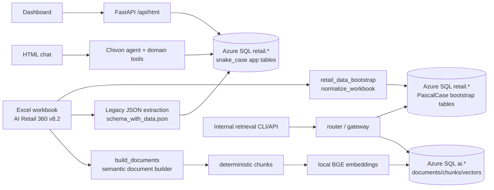
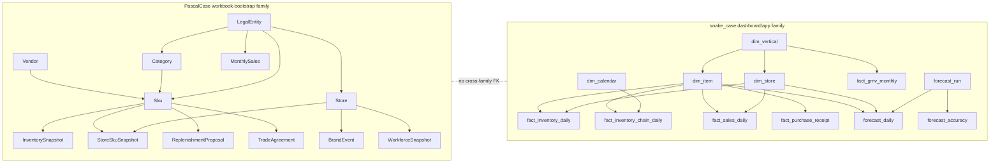
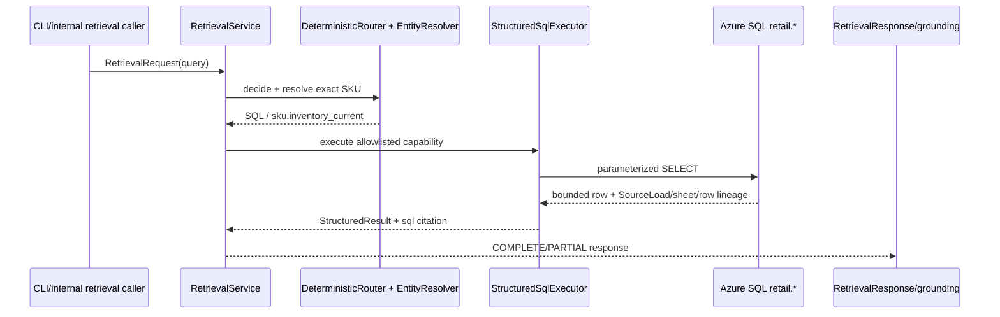
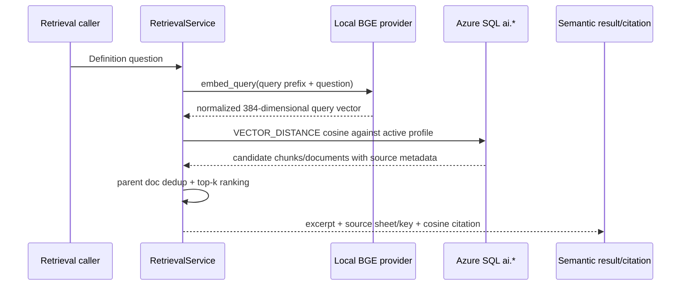
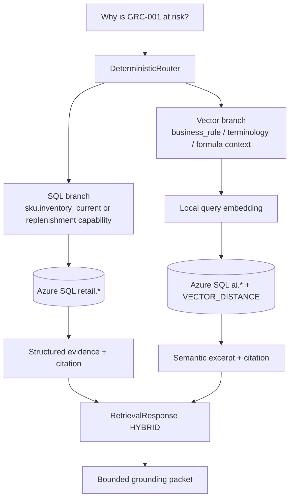
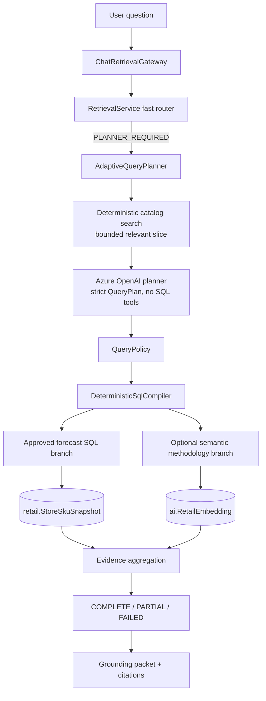
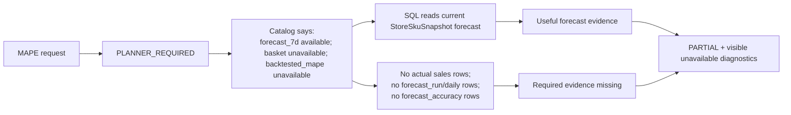

# AI Retail 360 — Current Database & Data Flow Audit

Audit date: 2026-08-18 UTC  
Scope: read-only repository review, source inspection, and safe Azure SQL metadata/count queries.

This report describes the system that is actually present. Current code and live Azure SQL metadata take precedence over older plans, fixtures, and migration comments. No application code, configuration, schema, or database rows were changed during this audit. Credentials and connection-string values were not printed.

## 1. Executive Summary

- The repository currently has one Azure SQL database with five inspected application schemas: `retail`, `ai`, `audit`, `chat`, and `dbo`. There are 47 tables and no views in those schemas.
- `retail` contains two parallel table families. PascalCase tables are the newer workbook-bootstrap foundation and are the source for the approved adaptive retrieval catalog. snake_case tables are the application/dashboard layer and are the source for the Demand Forecasting dashboard and direct Retail agent tools. They overlap in meaning but are not joined to each other.
- The structured data is a workbook demonstration snapshot, not a transaction warehouse. The PascalCase normalized business tables contain 21,571 rows; `retail.SourceLoad` contains one lineage row. The populated snake_case Retail tables contain 38,891 rows, much of which duplicates or reshapes the same workbook snapshot.
- No individual POS transaction rows are present. `retail.fact_sales_daily` exists as a future-facing table but has zero rows. The populated inventory facts contain only one date, 2026-07-01.
- `MonthlySales` and `fact_gmv_monthly` are workbook-relative/model-profile data, not verified calendar sales history. The 24-month workbook series repeats year one in year two, and its labels are relative such as `Apr-Y1`, not dates.
- The stored seven-day forecast is a baked workbook calculation (`ENGINE_STORE` → `StoreSkuSnapshot` or `fact_inventory_daily.forecast_7d`). It is not a historical forecast run. `forecast_run`, `forecast_daily`, and `forecast_accuracy` are empty.
- The dashboard’s 92.4% “forecast accuracy” is a typed workbook reference value, not a backtest. There are no actual-versus-forecast pairs, so true backtested MAPE cannot currently be calculated. Forecast basket composition is also absent.
- The semantic layer contains 1,350 generated documents, 1,361 chunks, and 1,361 current embeddings. It embeds generated business/context text and formulas—not raw numeric SQL rows, whole workbook sheets, or operational snapshot rows.
- Current vector retrieval uses a local CPU SentenceTransformers provider, `BAAI/bge-small-en-v1.5`, normalized 384-dimensional vectors, and Azure SQL `VECTOR_DISTANCE('cosine', ...)`. No Azure Foundry embedding provider is implemented in the inspected code.
- The dashboard/API and normal HTML chat do not currently use the adaptive retrieval gateway automatically. Dashboards call SQL-backed builders; Retail chat calls its configured read-only domain tools. The adaptive SQL/vector/planner gateway exists as a separate CLI/internal retrieval API path, with the automatic call in `pipeline.py` commented out.

## 2. Current System at a Glance



The important architectural fact is the split between `R1` and `R2`. They are both under the `retail` schema, but current consumers do not treat them as one canonical model.

## 3. Source Data and Workbook Ingestion

### 3.1 Source workbook

The current source workbook is:

`resources/Copy of AI_360_Retail_Dataset_v8.2_General_20260806.xlsx`

The current repository inventory reports 49 worksheets. The live `retail.SourceLoad` row records a completed Excel load with 21,571 normalized business rows. The older `resources/dbtemp/schema_with_data.json` is also derived from this workbook and records 30 extracted legacy tables and 21,939 source rows; it is not the same row-count contract as the newer 14-table normalizer.

### 3.2 Two structured ingestion paths

#### Path A — current workbook-bootstrap loader

Code:

- `backend/src/retail_data_bootstrap/source.py` — `ExcelSourceAdapter`
- `backend/src/retail_data_bootstrap/classification.py` — `SHEET_SPECS`
- `backend/src/retail_data_bootstrap/normalization.py` — `normalize_workbook`
- `backend/src/retail_data_bootstrap/database.py` — `ingest_structured`, `_source_load`, `_upsert_table`
- CLI: `python -m src.retail_data_bootstrap ingest-structured`

`ExcelSourceAdapter` opens the workbook with `openpyxl.load_workbook(..., data_only=True, read_only=True)`. It uses the configured header row for each sheet, normalizes headers with Unicode normalization/lowercase/non-alphanumeric replacement, drops all-empty rows, and adds `_source_sheet` and `_source_row` to every extracted record.

The normalized source sheets are:

| Normalized table | Workbook source | What the loader does |
|---|---|---|
| `LegalEntity` | `Verticals` | Renames the vertical id and preserves entity-level configuration fields. |
| `Store` | `Stores` | Maps store and vertical fields. |
| `Category` | `Categories` | Maps category and perishability fields. |
| `Vendor` | `Main Vendor` | Keeps vendor account/code and commercial/service fields. |
| `Brand` | first occurrences in `SKU_Master` | Creates one row per distinct brand. |
| `Sku` | `SKU_Master` | Maps product master fields and vendor/brand references. |
| `TradeAgreement` | `Trade Agreement` | Parses dates and maps SKU/vendor price-break rows. |
| `Promotion` | `Promotion & Discount Detail` | Maps vertical labels through explicit aliases and parses dates. |
| `InventorySnapshot` | `ENGINE` | Loads workbook-calculated chain-SKU values. |
| `StoreSkuSnapshot` | `ENGINE_STORE` | Loads workbook-calculated store-SKU values, including `forecast_7d`. |
| `ReplenishmentProposal` | `Replenishment Detail` | Loads workbook-calculated proposed-order values. |
| `BrandEvent` | `Brand Events` | Maps store/event context. |
| `WorkforceSnapshot` | `Workforce` | Excludes the `TOTAL` row and loads store rows. |
| `MonthlySales` | `Time Series 24mo` | Expands each workbook row to one row per legal entity using the entity-specific amount column; preserves the relative period label. |

The loader does not load every workbook sheet into these tables. Presentation/reporting sheets are not duplicated as row-level semantic or structured records by `normalize_workbook`.

#### Path B — application/dashboard seed path

Code:

- `scripts/extract_workbook_schema.py` — legacy workbook-to-JSON extraction
- `resources/dbtemp/schema_with_data.json` — checked-in extracted source representation
- `scripts/seed_retail_dims_from_json.py` — populates `dim_*` and generated `dim_calendar`
- `scripts/seed_retail_facts_from_json.py` — populates inventory, GMV, proposal, promotion, and KPI reference tables
- `backend/src/db/db.py` — SQLAlchemy `mssql+pyodbc` Azure SQL engine used by the dashboard path

This path intentionally reads the extracted JSON rather than reopening the workbook. The dimension seeder creates an `audit.import_batches` row. The fact seeder maps `ENGINE_STORE` to one date in `fact_inventory_daily`, `ENGINE` to one date in `fact_inventory_chain_daily`, and the relative `Time Series 24mo` sheet to `fact_gmv_monthly`. The fact-builder code explicitly sets `import_batch_id` to `NULL`; the live counts confirm that the populated inventory/GMV/KPI rows are not tied to an audit batch.

The dimension seeder also generates `dim_calendar` from 2024-01-01 through 2027-12-31. The workbook does not provide those calendar dates. Ramadan and Idul Fitri flags in that generated calendar are explicitly described by the script as estimates, not authoritative source dates.

### 3.3 Workbook classification

`backend/src/retail_data_bootstrap/classification.py` classifies all 49 sheets as follows:

| Classification | Count | Meaning in current code |
|---|---:|---|
| `BOTH` | 8 | Structured source plus a semantic document source. |
| `DERIVED` | 20 | Formula/reporting output retained as structured source where needed; not emitted as one document per row. |
| `IGNORE` | 11 | Navigation, chart backing ranges, or presentation script. |
| `SEMANTIC` | 9 | Documentation, rules, mappings, governance, or agent context. |
| `STRUCTURED` | 1 | Exact relational records only; currently `Trade Agreement`. |

The `BOTH` sheets are `Constants`, `Verticals`, `Stores`, `Categories`, `Main Vendor`, `SKU_Master`, `Promotion & Discount Detail`, and `Brand Events`.

The semantic-only sheets are `Cover & Storyline`, `Formulas`, `Terminology`, `Data Sources`, `D365 Table Reference`, `D365 Field Mapping`, `D365 Worked Example`, `ERP Approval Matrix`, and `Agentic Prompts`.

The ignored sheets are `LISTING`, the command-center/agent chart sheets, and `Demo Script`.

### 3.4 Keys, idempotency, and lineage

The normalized relational loader defines deterministic primary keys in `normalization.py`. Examples are:

- `Sku`: `sku_id`
- `StoreSkuSnapshot`: `(sku_id, store_id)`
- `TradeAgreement`: `(sku_id, vendor_account, valid_from, min_quantity)`
- `BrandEvent`: `(store_id, event_name)`
- `MonthlySales`: `(period_label, legal_entity_id)`

`database.py` computes a SHA-256 hash over the complete workbook bytes. `retail.SourceLoad` is merged by that workbook hash. Each normalized row carries `source_load_id`, `source_sheet`, `source_row`, and `loaded_at`. Each table is loaded through a temporary bounded-text staging table and an Azure SQL `MERGE ... WITH (HOLDLOCK)` keyed by the table’s business key.

The relational loader is upsert/idempotent for matching keys, but it does not delete rows that disappear from a later workbook. That means it is not a strict replace-the-world snapshot unless a separate reconciliation policy is added.

The legacy snake_case loader uses SQLAlchemy `INSERT ... ON CONFLICT DO UPDATE` semantics in the historical script. Its current rows have weaker lineage: table schemas include nullable `import_batch_id` on fact-like tables, but the live populated inventory, chain-inventory, GMV, and KPI rows have `NULL` batch ids. There is no cross-family foreign key between PascalCase and snake_case objects.

### 3.5 Semantic-document IDs and re-embedding rules

Code: `backend/src/retail_data_bootstrap/documents.py`, `chunking.py`, and `vector_store.py`.

- `document_key(doc_type, source_key)` slugifies both values and forms keys such as `sku:grc-001`.
- `canonical_content` trims the document and right-strips each line.
- `content_hash` is SHA-256 of canonical semantic `content` only. Metadata, source-load IDs, timestamps, and embedding configuration are not part of the document content hash.
- A chunk key is `<doc_key>#<three-digit chunk index>`; `chunk_hash` is SHA-256 of canonical chunk content.
- A document is inserted, updated, or inactivated by `doc_key` during sync. Missing incoming documents become inactive rather than being hard-deleted.
- A chunk is re-created when its deterministic chunk content changes. An embedding is generated when the profile has no vector for that chunk or when `RetailEmbedding.embedded_chunk_hash != RetailChunk.chunk_hash`.
- A metadata-only document change with unchanged chunk text reuses its embedding.
- Changes only to structured `retail.*` rows do not trigger semantic re-embedding, because the semantic corpus is generated separately and intentionally excludes volatile operational facts.

### 3.6 Ingestion lineage diagram

```mermaid
flowchart TD
    X[Workbook sheet/row]
    X -->|openpyxl data_only read_only| N[ExcelSourceAdapter + normalize_workbook]
    N -->|business key + source_sheet/source_row| P[retail PascalCase table]
    P -->|SourceLoad workbook hash| PL[retail.SourceLoad]

    X -->|extract_workbook_schema.py| J[resources/dbtemp/schema_with_data.json]
    J -->|seed_retail_dims_from_json.py| S1[retail.dim_* + dim_calendar]
    J -->|seed_retail_facts_from_json.py| S2[retail.fact_* / trade_agreement / replenishment_proposal]
    S1 -->|audit batch; fact lineage currently nullable| AB[audit.import_batches]

    X -->|build_documents| SD[SemanticDocument<br/>natural-language content + metadata]
    SD -->|canonical content SHA-256| RD[ai.RetailDocument]
    RD -->|logical/token chunking| RC[ai.RetailChunk]
    RC -->|local SentenceTransformers BGE| RE[ai.RetailEmbedding<br/>VECTOR(384)]
    EP[ai.EmbeddingProfile] --> RE
```

### 3.7 One concrete lineage example

For the real workbook SKU key `GRC-001`:

```text
SKU_Master row 6, sku_id=GRC-001
  -> normalize_workbook() -> Sku row keyed by sku_id=GRC-001
  -> build_documents() -> SemanticDocument
       doc_key       = sku:grc-001
       doc_type      = sku
       domain        = business_entity
       source_sheet  = SKU_Master
       source_key    = GRC-001
       content       = generated prose joining SKU, category, entity, vendor,
                        brand, UOM/pack, lead/safety, and agreement context
       metadata      = stable identifiers and source row/sheet references
  -> chunk_document() -> chunk key sku:grc-001#000
  -> embed_required_chunks() -> one normalized 384-float vector
  -> ai.RetailEmbedding(profile_id, chunk_id, embedded_chunk_hash, vector)
```

The exact business prose is generated in `documents.py`; it is not a copy of the raw SQL row. The source-row identity and document/chunk hash are the lineage controls.

## 4. Azure SQL Object Inventory

### 4.1 Live schema/object totals

The read-only catalog query inspected `sys.schemas`, `sys.tables`, `sys.views`, `sys.columns`, `sys.types`, primary-key indexes, foreign keys, and indexes. Repository inspection found no application-defined stored-procedure calls; the one procedure reference is the built-in `sp_releaseapplock` used for application locking. A separate live `sys.procedures` query was attempted but hit a login timeout after the successful object/count inspection, so a complete non-system procedure inventory is **UNKNOWN**.

| Schema | Tables | Views | Live row note |
|---|---:|---:|---|
| `retail` | 37 | 0 | Two parallel structured table families. |
| `ai` | 4 | 0 | Documents, chunks, embeddings, profile. |
| `audit` | 1 | 0 | Import-batch audit records. |
| `chat` | 5 | 0 | Conversations/messages/monitoring/action persistence. |
| `dbo` | 0 | 0 | No user tables/views found in the inspected object set. |
| **Total** | **47** | **0** | **5 application schemas inspected.** |

No separate `raw`, `staging`, `fact`, `dim`, `mart`, `forecast`, or `analytics` schema exists. There are `fact_*`, `dim_*`, and `forecast_*` named tables inside `retail`, but the schema names themselves are not separated into data layers.

### 4.2 `retail` inventory

The table below uses `D` for current Demand Forecasting dashboard use, `T` for direct Retail agent/tool use, `R` for approved adaptive/fast retrieval use, and `M` for a serving/mart-like role. A blank consumer cell means no current primary consumer was identified in the inspected application paths.

| Object | Approx. rows | Grain / purpose | Important PK | Source / lineage | Consumers / classification |
|---|---:|---|---|---|---|
| `SourceLoad` | 1 | One row per workbook content hash | `source_load_id` | Direct workbook loader; workbook hash/status/count | Lineage / audit |
| `LegalEntity` | 8 | One legal entity/vertical | `legal_entity_id` | `Verticals`; `SourceLoad` + sheet/row | R; reference |
| `Store` | 160 | One store | `store_id` | `Stores`; `SourceLoad` + sheet/row | R; reference |
| `Category` | 160 | One entity/category | `category_id` | `Categories`; `SourceLoad` + sheet/row | R; reference |
| `Vendor` | 8 | One vendor account | `vendor_account` | `Main Vendor`; `SourceLoad` + sheet/row | R; reference |
| `Brand` | 12 | One distinct brand | `brand_name` | First brand occurrence in `SKU_Master` | R; reference |
| `Sku` | 800 | One SKU master record | `sku_id` | `SKU_Master`; `SourceLoad` + sheet/row | R; reference/master |
| `TradeAgreement` | 2,400 | One SKU/vendor/valid-from/minimum-quantity price break | `(sku_id, vendor_account, valid_from, min_quantity)` | `Trade Agreement`; `SourceLoad` + sheet/row | R; exact commercial fact |
| `Promotion` | 48 | One promotion configuration | `promotion_id` | `Promotion & Discount Detail`; `SourceLoad` + sheet/row | R; configuration |
| `InventorySnapshot` | 800 | One chain-SKU current snapshot per source load | `sku_id` | `ENGINE`; `SourceLoad` + sheet/row | R; precomputed snapshot/M |
| `StoreSkuSnapshot` | 16,000 | One store-SKU current snapshot per source load | `(sku_id, store_id)` | `ENGINE_STORE`; `SourceLoad` + sheet/row | R; precomputed snapshot/M |
| `ReplenishmentProposal` | 800 | One SKU proposal per source load | `sku_id` | `Replenishment Detail`; `SourceLoad` + sheet/row | R; precomputed derived/M |
| `BrandEvent` | 23 | One store/event context row | `(store_id, event_name)` | `Brand Events`; `SourceLoad` + sheet/row | Reference/context |
| `WorkforceSnapshot` | 160 | One store staffing snapshot per source load | `store_id` | `Workforce` excluding `TOTAL`; `SourceLoad` + sheet/row | R; precomputed snapshot/M |
| `MonthlySales` | 192 | One legal entity and workbook-relative period | `(period_label, legal_entity_id)` | `Time Series 24mo`; `SourceLoad` + sheet/row | R; relative-series serving table/M |
| `dim_vertical` | 8 | Application vertical dimension | `vertical_id` | Legacy JSON seed | D/T; dimension |
| `dim_vendor` | 8 | Application vendor dimension | `vendor_account` | Legacy JSON seed | D/T; dimension |
| `dim_store` | 160 | Application store dimension | `store_id` | Legacy JSON seed | D/T; dimension |
| `dim_item` | 800 | Application item dimension and stable item attributes | `item_id` | Legacy JSON seed | D/T; dimension |
| `dim_calendar` | 1,461 | Generated calendar from 2024-01-01 to 2027-12-31 | `cal_date` | Generated, not workbook source | D/T; reference calendar |
| `assortment` | 16,000 | One item/store assortment validity row | `(item_key, store_key, valid_from)` | Derived from `ENGINE_STORE` | M-like current assortment |
| `fact_sales_daily` | 0 | Intended one item/store/calendar-date sales fact | `(item_key, store_key, cal_date)` | Deliberately not seeded; no workbook history | Future raw/transaction-adjacent fact; empty |
| `fact_inventory_daily` | 16,000 | One item/store/day inventory snapshot | `(item_key, store_key, cal_date)` | `ENGINE_STORE` mapped to 2026-07-01 | D/T; current snapshot/M |
| `fact_price_daily` | 0 | Intended item/store/day price fact | `(item_key, store_key, cal_date)` | No loaded rows | Future fact; empty |
| `fact_promotion` | 0 | Intended item/store promotion fact | `promo_id` | No loaded rows | Future fact; empty |
| `fact_purchase_receipt` | 0 | Intended purchase-receipt event fact | `receipt_id` | No loaded rows | Future fact; empty |
| `fact_inventory_chain_daily` | 800 | One item/chain/day inventory snapshot | `(item_key, cal_date)` | `ENGINE` mapped to 2026-07-01 | D/T; current snapshot/M |
| `fact_gmv_monthly` | 192 | One vertical/relative year/month workbook GMV profile | `(vertical_id, year_index, month_index)` | `Time Series 24mo`; batch currently null | D; derived seasonal profile/M |
| `agent_kpi_reference` | 184 | One agent/vertical/metric workbook KPI reference | `(agent_id, vertical_id, metric)` | A-sheet rows from legacy JSON; batch currently null | D; reference/constant |
| `trade_agreement` | 2,400 | One item/vendor/valid-from agreement | `(item_key, vendor_account, valid_from)` | `Trade Agreement` via legacy JSON | T; exact commercial fact/M |
| `replenishment_proposal` | 800 | One item/as-of-date proposal | `(item_key, as_of_date)` | `Replenishment Detail` via legacy JSON | D/T; precomputed derived/M |
| `promotion_detail` | 48 | One promotion configuration/detail row | `promo_id` | `Promotion & Discount Detail` via legacy JSON | Other Retail boards; configuration |
| `promotion_vertical_kpi` | 8 | One vertical promotion KPI reference row | `vertical_label` | `A4 Promotion` via legacy JSON | Other Retail board; reference |
| `forecast_run` | 0 | One model/as-of/horizon forecast run | `run_id` | No loaded runs | Future forecast history; empty |
| `forecast_daily` | 0 | One run/item/store/target-date forecast | `(run_id, item_key, store_key, target_date)` | No loaded forecasts | Future forecast fact; empty |
| `forecast_accuracy` | 0 | One run/horizon error summary (`wape`, `bias`, `mape`, `n_obs`) | `(run_id, horizon)` | No loaded accuracy rows | Future accuracy mart; empty |
| `formula` | 22 | One stored business formula | `id`; unique `number` | Formula repository/import | D/T; rule/reference |

All inspected foreign keys were enabled and trusted. The PascalCase family has `SourceLoad`-based lineage; the snake_case family uses dimension FKs and nullable audit-batch FKs. There is no FK between the two families, even where `Sku` and `dim_item`, or `StoreSkuSnapshot` and `fact_inventory_daily`, represent related concepts.

### 4.3 `ai`, `audit`, and `chat` inventory

| Schema/object | Rows | Grain / purpose | Important columns and relationships | Classification |
|---|---:|---|---|---|
| `ai.EmbeddingProfile` | 1 | One embedding contract/profile | `embedding_profile_id`, `profile_key`, provider/model/revision, dimensions, normalization, instructions, chunk settings, status | Semantic configuration |
| `ai.RetailDocument` | 1,350 | One semantic parent document | `document_id`, unique `doc_key`, `doc_type`, `retrieval_domain`, `source_sheet`, `source_key`, `content`, `metadata_json`, `content_hash`, `is_active` | Semantic document |
| `ai.RetailChunk` | 1,361 | One deterministic chunk per document segment | `chunk_id`, `document_id`, `chunk_index`, unique `chunk_key`, `content`, `chunk_hash`, `token_count` | Semantic chunk |
| `ai.RetailEmbedding` | 1,361 | One profile/chunk vector | `(embedding_profile_id, chunk_id)`, native `VECTOR(384)`, `embedded_chunk_hash` | Vector index data |
| `audit.import_batches` | 7 | One legacy seed/import event | `id`, agent/workbook/status/timestamps, sheet/row totals, metadata | Load audit |
| `chat.conversations` | 15 | One persisted chat conversation | `id`, title, timestamps | Application state |
| `chat.messages` | 26 | One conversation message | `id`, conversation FK, sender/channel/message/timestamp | Application state |
| `chat.monitoring_runs` | 109 | One monitoring execution | identity, agent/status/timestamps, pass/alert/action counts | Application state |
| `chat.alerts` | 0 | One stored alert | identity, agent/subagent/issue/date/run FK | Empty application worklist |
| `chat.actions` | 0 | One stored action plan | identity, action/routes/spec/status/impact/simulation/run FKs | Empty application worklist |

## 5. Structured Data Model

### 5.1 What one row means today

The structured model is a mixture of master data, current snapshots, workbook-derived serving tables, and empty future-facing fact tables. It is not a coherent historical star schema yet.

| Data role | Current objects | What the live data proves |
|---|---|---|
| Source/reference dimensions | `LegalEntity`, `Store`, `Category`, `Vendor`, `Brand`, `Sku`; `dim_vertical`, `dim_store`, `dim_item`, `dim_vendor` | 8 entities, 160 stores/categories, 8 vendors, 12 brands, 800 SKUs. |
| Current operational snapshot | `InventorySnapshot`, `StoreSkuSnapshot`, `WorkforceSnapshot`; `fact_inventory_daily`, `fact_inventory_chain_daily` | Current-looking values exist, but the populated daily facts have only 2026-07-01 and the PascalCase snapshots have no business-effective date column. |
| Configured commercial/reference data | `TradeAgreement`, `Promotion`, `BrandEvent`, `trade_agreement`, `promotion_detail`, `agent_kpi_reference` | Exact workbook configurations and published KPI references, not observed transaction outcomes. |
| Precomputed derived output | `ReplenishmentProposal`, `replenishment_proposal`, `fact_gmv_monthly`, `MonthlySales`, `promotion_vertical_kpi`, `formula` | Values are derived or copied from workbook calculations and report sheets. |
| Historical transaction facts | `fact_sales_daily`, `fact_purchase_receipt`, `fact_price_daily`, `fact_promotion` | The tables exist as schema, but current row counts are zero. |
| Historical forecast facts | `forecast_run`, `forecast_daily`, `forecast_accuracy` | The tables exist as schema, but all are empty. |

### 5.2 Direct answers to the data-history questions

1. **Do we have individual POS/transaction rows?** No, not in the inspected Azure SQL database. There is no populated receipt-line or POS transaction table. `fact_sales_daily` is empty and is daily aggregate grain even by design, not individual receipt-line grain.

2. **What is the closest current data?** The closest operational records are the 16,000 store-SKU inventory rows in `fact_inventory_daily` and the 800 chain-SKU rows in `fact_inventory_chain_daily`, both at one date. `StoreSkuSnapshot` is the parallel workbook-bootstrap version. These are snapshots, not events.

3. **Is `MonthlySales` actual calendar history?** No. `MonthlySales.period_label` is a workbook-relative label, not a calendar date. Live values use labels such as `Apr-Y1` through `Sep-Y2`. The source loader expands an entity-specific column into rows, but does not create a real date dimension or source-system period key.

4. **Does `StoreSkuSnapshot` contain a calculated/baked seven-day forecast?** Yes. It has `forecast_7d`, sourced from `ENGINE_STORE`, and the dashboard’s equivalent `fact_inventory_daily` also has `forecast_7d`. The value is a current workbook calculation; there is no forecast-run/as-of history attached to it.

5. **Do historical forecasts made at prior points in time exist?** No. `forecast_run` and `forecast_daily` are empty, and the snapshot tables do not carry a forecast as-of date.

6. **Do actual-versus-forecast pairs exist?** No. There are no populated actual sales rows and no populated forecast-run rows. A snapshot `ads`/`forecast_7d` pair is not a backtest pair.

7. **Can true backtested MAPE be calculated?** No. The schema has a nullable `forecast_accuracy.mape` column, but the table has zero rows and there are no actual/forecast evaluation pairs. The catalog correctly marks `forecast.backtested_mape` and forecast accuracy unavailable.

8. **Do we have forecast basket composition?** No. There is a forecast-units field and a UI preview/worklist built from ranked snapshot rows, but no approved forecast-basket fact or persisted basket composition. The adaptive catalog explicitly marks it unavailable.

9. **Which values are workbook constants versus current SQL facts?**

   - `Constants` contains model parameters and What-If inputs.
   - The A-sheet KPI values, including 92.4% accuracy, trend percentages, stockout-risk counts, trending counts, and seasonality indexes, are stored in `agent_kpi_reference` as workbook reference values. They are not backtest results.
   - `ENGINE` and `ENGINE_STORE` contain workbook-calculated values read with `data_only=True`; SQL receives their displayed results, not their Excel formula definitions.
   - `retail.formula` stores the named business-rule expressions used by the browser and formula tools.
   - `fact_inventory_*`, `InventorySnapshot`, `StoreSkuSnapshot`, and replenishment tables are current/demo snapshot outputs derived from workbook inputs.
   - `fact_gmv_monthly`/`MonthlySales` preserve a relative seasonal profile; they do not prove historical sales.

### 5.3 Relationship picture

The two structured families look conceptually similar but are physically separate:



## 6. Semantic / Vector Data Model

### 6.1 Semantic documents

The semantic model is defined by `SemanticDocument` and built by `documents.build_documents()`.

Each parent document has:

`doc_key`, `doc_type`, `retrieval_domain`, `source_sheet`, `source_key`, `content`, `metadata`, and `content_hash`.

Current document count by type:

| Document type | Count | Typical source |
|---|---:|---|
| `sku` | 800 | Joined product/business context from `SKU_Master` and related masters |
| `store` | 160 | `Stores` |
| `category` | 160 | `Categories` |
| `promotion` | 48 | `Promotion & Discount Detail` |
| `brand_event` | 23 | `Brand Events` |
| `formula` | 19 | `Formulas` |
| `terminology` | 13 | `Terminology` |
| `model_parameter` | 12 | `Constants` |
| `brand` | 12 | `SKU_Master` |
| `agent_spec` | 9 | `Agentic Prompts` |
| `vertical` | 8 | `Verticals` |
| `vendor` | 8 | `Main Vendor` |
| `d365_field_mapping` | 29 | `D365 Field Mapping` grouped sections |
| `d365_table` | 33 | `D365 Table Reference` |
| `approval_rule` | 4 | `ERP Approval Matrix` |
| `d365_worked_example` | 1 | `D365 Worked Example` |
| `workbook_overview` | 1 | `Cover & Storyline` |
| **Total** | **1,350** | |

The generated corpus has these retrieval domains:

`agent_configuration` 9, `business_entity` 1,148, `business_rule` 44, `documentation` 1, `governance` 4, `integration` 73, `operational_context` 23, and `operational_policy` 48.

### 6.2 Chunking

`chunking.py` preserves the full document as one chunk when its token count is within the model’s 512-token limit. Oversized documents are split at logical boundaries with a target of 384 tokens and 48-token overlap. Current live state:

- 1,350 active documents
- 1,361 chunks
- 1,344 documents with one chunk
- 6 documents with more than one chunk
- no active document without a chunk

### 6.3 Embedding profile and provider

The live `ai.EmbeddingProfile` is `ACTIVE` and matches the code configuration:

| Property | Current value |
|---|---|
| Provider key | `local_sentence_transformers` |
| Model | `BAAI/bge-small-en-v1.5` |
| Dimensions | 384 |
| Normalization | L2-normalized document and query vectors |
| Device | CPU |
| Maximum sequence length | 512 tokens |
| Document instruction | Empty; stored content is embedded as-is |
| Query instruction | `Represent this sentence for searching relevant passages: ` |
| Chunk target / overlap | 384 / 48 tokens |
| Profile key | `local-bge-small-en-v1.5-384-v1` |
| Profile status | `ACTIVE` |

`embedding_provider.py` loads SentenceTransformers with `local_files_only=True`, validates the model width and sequence length, calls `encode(..., normalize_embeddings=True)`, and rejects non-finite, wrong-width, or non-normalized output. The inspected code only accepts the local SentenceTransformers provider. No Azure Foundry embedding implementation is present.

The schema permits multiple profiles to coexist because embeddings are keyed by `(embedding_profile_id, chunk_id)` and profiles can be `BUILDING`, `ACTIVE`, or `RETIRED`. A filtered unique index permits only one `ACTIVE` profile. Current live state has one profile and one active profile.

### 6.4 Exact vector retrieval behavior

`backend/src/retail_data_bootstrap/vector_store.py::semantic_search` performs the following:

1. Validate `top_k` in the range 1–100 and validate the optional retrieval-domain/document-type pair against the semantic contract.
2. Select the current `ACTIVE` profile, unless a validation-only caller explicitly allows the configured `BUILDING` profile.
3. Assert that the database profile matches the local `EmbeddingConfig`.
4. Embed the query with the query instruction above. Stored document/chunk content has no document instruction prefix.
5. Search only rows whose profile matches, parent document is active, and `embedded_chunk_hash = chunk_hash`.
6. Apply optional exact `retrieval_domain` and `doc_type` filters.
7. Ask Azure SQL to compute:

   ```sql
   VECTOR_DISTANCE('cosine', e.embedding, CAST(? AS VECTOR(384)))
   ```

8. Retrieve a candidate window of `min(max(top_k * 10, 50), 1000)` chunks, ordered by ascending cosine distance.
9. Deduplicate by parent `doc_key`, keeping the closest chunk per document, then return the closest `top_k` parent documents. Similarity is reported as `1 - cosine_distance`.

The current database has no vector index object. The implementation deliberately uses exact filtered cosine-distance evaluation, which is appropriate for the current 1,361-chunk corpus but is a performance consideration at much larger scale.

Every live `RetailDocument` has at least one chunk. Every active chunk has a matching current embedding, and every live embedding’s recorded chunk hash matches its current chunk hash. One active profile is selected by retrieval; the query does not choose an arbitrary profile.

## 7. What We Currently Embed

The exact input to the embedding provider is `ai.RetailChunk.content`, passed by `embed_required_chunks()` as a list of strings. That content is generated natural-language text from `SemanticDocument.content` and then deterministically chunked.

Current embedded scope includes:

- SKU, store, category, vendor, brand, vertical, promotion, and brand-event context.
- Business formulas and terminology.
- Workbook model-parameter descriptions and stable parameter values where the semantic contract permits them.
- D365 table/field mappings and a worked example.
- Data-source descriptions, governance/approval rules, agent configuration, and workbook overview.

The semantic contract intentionally excludes volatile operational values such as current inventory position, ROP, days of supply, order quantities, price/value snapshots, forecast outputs, staffing counts, and mutable performance/count fields from semantic prose. Those values remain in structured SQL and should be retrieved exactly.

### Real document/chunk example

```text
Workbook: SKU_Master, source row 6, sku_id GRC-001
  -> document key: sku:grc-001
  -> document type/domain: sku / business_entity
  -> generated content: prose describing the SKU's product/category/entity,
     perishable flag, brand/vendor relationship, UOM/pack, lead/safety terms,
     and agreement context
  -> chunk key: sku:grc-001#000
  -> vector: one normalized VECTOR(384) value in ai.RetailEmbedding
     for profile local-bge-small-en-v1.5-384-v1
```

The generated document retains source-sheet/source-row metadata for citation and traceability. The vector itself contains no separate source-row field; the relation is through profile → embedding → chunk → document.

## 8. What We Do Not Embed

- Raw numeric SQL rows from `InventorySnapshot`, `StoreSkuSnapshot`, `fact_inventory_daily`, or `fact_inventory_chain_daily`.
- Individual POS transactions, receipt lines, or sales facts. None are present to embed anyway.
- Whole workbook sheets as one large text blob.
- Every row of `ENGINE`, `ENGINE_STORE`, A1–A9, or chart backing ranges as separate semantic documents.
- The current dashboard payload, KPI JSON, frontend fixture, or dashboard-generated forecast series.
- The vector itself in the document JSONL. JSONL contains no embedding/vector field; vectors are stored separately in `ai.RetailEmbedding`.
- Forecast basket composition, historical forecast runs, actual-versus-forecast pairs, or backtested MAPE evidence. Those capabilities do not exist as current structured facts or semantic substitutes.

This division is deliberate: semantic retrieval can explain a term such as Days of Supply or a D365 mapping, while SQL remains the source for exact current inventory values.

## 9. Dashboard Data Lineage

### 9.1 Endpoint and frontend selection

The backend endpoint is:

`GET /api/html/dashboard/retail.demand_forecasting`

Code path:

```text
frontend/src/agents/retail/demand_forecasting/DemandForecastingDashboard.jsx
  -> data/dashboardData.js::loadDemandForecastingDashboard
  -> api/dashboard.js::fetchDashboard
  -> GET /api/html/dashboard/{agent}
  -> backend/src/api/agents_html.py::get_agent_dashboard
  -> descriptor.build_dashboard(scope)
  -> backend/src/llm/agents/retail/demand_forecasting/dashboard.py::build
  -> src.db.db::get_engine() / SQLAlchemy / Azure SQL
```

`frontend/src/agents/retail/common/dataSource.js` defaults ordinary Vite builds to `DATA_SOURCE = "api"`; tests use the fixture and a standalone build can explicitly select the fixture. The repository does not prove which build-time `VITE_DATA_SOURCE` value a separately deployed artifact used, so that deployment-specific fact is **UNKNOWN**. In API mode, the frontend receives rows and then runs the common JavaScript selectors; the backend does not return finished KPI/chart objects.

### 9.2 Widget-by-widget lineage

| Dashboard element | Frontend field/calculation | API payload field | Backend function and SQL source | Provenance classification |
|---|---|---|---|---|
| Forecast Next 7 Days | `dashboard.kpis` entry `forecast_next_7d`; `selectors.computeKpis` sums `items[].forecast_7d` | `items[].forecast_7d`; `stores[].forecast_7d`; backend also sends `reference_by_vertical` | Store scope: `fact_inventory_daily.forecast_7d`. All-store scope: `fact_inventory_chain_daily` supplies `ads`, and `dashboard.py` falls back to `ads * 7.45` because the chain table has no `forecast_7d` column. | Calculated from one snapshot and workbook factor; not historical forecast output |
| Forecast Accuracy | `kpis.forecast_accuracy`, weighted by forecast volume across verticals | `reference_by_vertical[].accuracy_pct` | `agent_reference()` reads `retail.agent_kpi_reference`, seeded from A1 `accuracy_pct`; source workbook A1 says 92.4 for all verticals. | Workbook typed constant; not backtest/MAPE |
| Demand Trend | `kpis.demand_trend`, weighted by forecast volume | `reference_by_vertical[].trend_pct` | Same `agent_kpi_reference` A1 reference rows | Workbook typed constant; not observed change |
| Stockout-risk SKUs | Counts `items` where `position < rop` | `items[].position`, `items[].rop` | `fact_inventory_chain_daily` for all stores or `fact_inventory_daily` for store scope, filtered to `SNAPSHOT_DATE` | Derived current snapshot comparison |
| Predicted to Trend | Counts `items[].is_trending` | `items[].is_trending`, `growth`, `signals`; reference count from A1 | `agent_reference()` supplies the vertical count; `allocate_trending()` ranks items by `growth_index` and marks the top N because workbook gives a count, not membership | Modelled membership constrained by a workbook count; not time-series trend |
| Seasonality Index tile | `kpis.seasonality_index` weighted from reference rows | `reference_by_vertical[].seasonality_idx` | A1 reference rows in `agent_kpi_reference` | Workbook typed constant/reference |
| Seasonality curve | `dimensions.seasonality` and `seasonality.by_legal_entity` | `seasonality` generated by backend | `fact_gmv_monthly` grouped by vertical/month; `seasonal_indices()` computes month GMV divided by profile mean | Derived seasonal profile; source year labels are relative and repeated |
| Demand forecast actual-vs-AI chart | `dashboard.forecast` / `dashboard.confidence`; `buildForecastSeries()` produces points | `forecast` and `confidence` are created client-side in API mode after row fetch | Frontend uses ADS, DOW profile, seasonal curve, trend reference, and 92.4% value. `actual` is explicitly `null` for every point. | Modelled projection; no actual series |
| Confidence band | `confidence.points[].confidence_low/high` | Same client-built series | `band = forecast * 1.645 * (1 - accuracy/100) * sqrt(period)` | Synthetic prediction interval based on a typed constant, not empirical confidence/backtest |
| Horizon total | `forecast.summary[id=horizon_total]` | Client-built `forecast.summary` | Sum of generated forecast periods for selected horizon; default UI horizon is eight weeks | Derived projection |
| Next period | `forecast.summary[id=next_period]` | Client-built `forecast.summary` | First generated forecast period | Derived projection |
| Peak day | `forecast.summary[id=peak]` | Client-built constant label | Fixed DOW profile in selectors; current label is `Saturday ×1.35` | Workbook/model factor, not observed peak sales |
| Forecast detail per SKU | `dashboard.details.rows` | Client-built from `items` | Sorts and paginates items by `forecast_7d`; uses ADS, position, ROP, signals, and state | Derived serving view |
| Category/store/legal-entity panels | `dashboard.dimensions` | Client-built from `items` and `stores` | Grouping and share calculations in `selectors.js`; rows came from `fact_inventory_daily` and dimensions | Derived serving view |
| What-If simulator | `dashboard.simulation` and frontend lever state | Formulas plus row payload | Browser evaluates formulas from `retail.formula`; levers change assumptions locally; no persisted simulation row is required for the dashboard | Scenario, not fact |

### 9.3 Important dashboard limitations

- `SNAPSHOT_DATE` is hard-coded in `warehouse.py` as `2026-07-01`; it is not selected from a latest-business-effective-date table.
- The backend response envelope marks the data as `is_mock: true` and says it is workbook demonstration data, not a live ERP position.
- All-stores demand uses chain-net `fact_inventory_chain_daily`; store scope uses store-SKU `fact_inventory_daily`. The two grains intentionally answer different questions.
- The chain inventory fact has no stored `forecast_7d` field. The dashboard computes the chain forecast from `ads * 7.45`; store scope reads the stored store-SKU forecast field.
- `fact_gmv_monthly` has no store key. A store-filtered dashboard uses its owning vertical’s seasonality curve.
- The frontend chart component supports an “Actual” series, but the current selector sets `actual: null`; a displayed actual line cannot be treated as measured sales.

## 10. Retrieval Query Paths

There are two separate concepts in the current repository:

1. The normal HTML chat path, which invokes the configured Chivon Retail agent and its domain tools.
2. The Phase 6 retrieval service/gateway, which exposes deterministic SQL/vector/hybrid/adaptive evidence retrieval through CLI and an internal API.

The second is not automatically inserted into the first today.

### SQL

Example: “What is the current inventory position for GRC-001?”



Actual code:

- `src/retrieval/routing.py::DeterministicRouter.decide`
- `src/retrieval/entities.py::EntityResolver`
- `src/retrieval/service.py::RetrievalService.retrieve`
- `src/retrieval/capabilities.py::StructuredSqlExecutor.execute`

For the exact inventory capability, the SQL is a fixed parameterized join between PascalCase `retail.InventorySnapshot` and `retail.Sku`. SQL capabilities have explicit selected fields, entity parameters, and bounded row limits. Exact retrieval returns a citation containing the capability, business key, and any available source lineage.

This is separate from a normal Demand Forecasting HTML chat turn. That turn enters `agents_html.py`, calls `pipeline.render_agent_response`, and Chivon invokes tools named in the agent config, such as `get_demand_forecast_snapshot` and `query_retail_demand`. Those direct tools use the snake_case dashboard/app tables.

### VECTOR

Example: “What does Days of Supply mean?”



Actual code:

- `src/retrieval/routing.py::_semantic_intent`
- `src/retrieval/service.py` vector branch
- `src/retail_data_bootstrap/embedding_provider.py::LocalBgeEmbeddingProvider.embed_query`
- `src/retail_data_bootstrap/vector_store.py::semantic_search`

The example routes to the `business_rule`/`terminology` semantic domain. Vector retrieval does not return authoritative current numeric facts; `grounding.py` explicitly tells the downstream model that semantic evidence is context and SQL evidence is authoritative for exact numbers.

### HYBRID

Example: “Why is GRC-001 at replenishment risk?”

The deterministic router sees an exact/current inventory capability plus an explanation signal. It selects `HYBRID`, executes the SQL branch for the current state, and executes the vector branch for business-rule/context evidence. The service aggregates both result types and citations into one `RetrievalResponse`.



If one branch fails but the other returns evidence, the response is `PARTIAL` and the branch failure remains visible. If both fail or no evidence is returned, the response is `FAILED`.

### ADAPTIVE

Example: “Forecast demand for the next 7 days, including forecast basket and forecast accuracy using backtested MAPE.”



Actual code:

- `src/retrieval/gateway.py::ChatRetrievalGateway.retrieve`
- `src/retrieval/orchestrator.py::AdaptiveRetrievalOrchestrator.retrieve/execute_plan`
- `src/retrieval/planner.py::AdaptiveQueryPlanner`
- `src/retrieval/policy.py::QueryPolicy`
- `src/retrieval/compiler.py::DeterministicSqlCompiler`
- `src/retrieval/grounding.py::build_grounding_packet`

The planner describes evidence requirements, not SQL. The policy validates metrics, tables, columns, dimensions, filters, time windows, row limits, and authorization scope. The compiler emits a fixed-shape, parameterized, read-only `SELECT TOP (?)` against an approved `retail.*` table. Independent SQL/vector branches can execute in parallel. Useful evidence plus missing required evidence produces `PARTIAL`; no evidence produces `FAILED`.

The planner receives a bounded `CatalogSearchResult` from the JSON catalog, not the complete database schema and not a vector search over catalog definitions. The catalog’s relationships are descriptive metadata. Current policy rejects dependency/join plans because no typed join compiler exists.

## 11. MAPE Query Walkthrough

### 11.1 What the request asks for

The request contains four different evidence needs:

1. A seven-day forecast total.
2. Forecast basket composition.
3. Forecast accuracy.
4. Specifically, backtested MAPE.

The current catalog contains only the first one as an approved exact metric: `demand.forecast_7d` from `retail.StoreSkuSnapshot.forecast_7d`.

### 11.2 What exists and what does not

| Requested evidence | Current evidence | Result |
|---|---|---|
| Seven-day forecast units | `StoreSkuSnapshot.forecast_7d` has 16,000 rows; the dashboard/app equivalent also has one-day snapshot forecast values | Available as a current snapshot/projection |
| Forecast basket | No approved basket metric/table; UI preview is a ranked worklist, not a persisted basket | Unavailable |
| Forecast accuracy | A1 `accuracy_pct` reference value exists in `agent_kpi_reference`, but it is a typed constant | Not a measured accuracy result |
| Backtested MAPE | `forecast_accuracy.mape` column exists but table is empty; no actual/forecast pairs exist | Unavailable; cannot calculate |

### 11.3 Current status behavior

With Azure SQL available and a valid planner plan, the adaptive path executes the available forecast requirement, records the basket and MAPE requirements as unavailable, and returns `PARTIAL`. The missing requirements remain errors so the result cannot be mislabeled `COMPLETE`.

If the planner, policy/compiler, or SQL path fails before any evidence is returned, the response is `FAILED`. If a caller requests only MAPE, there is no available structured result to accompany the missing requirement, so the data capability cannot produce `COMPLETE`; it is either `FAILED` or, if optional methodology context is successfully retrieved, `PARTIAL`.

The narrow fallback in `gateway.py` is limited to the known forecast request shape. It does not invent basket or MAPE values; it creates the same available-forecast plus unavailable-basket/MAPE plan.



## 12. Catalog / Planner / Policy / Compiler Relationship

### 12.1 Catalog contents

`backend/src/retrieval/catalog.json` is version `2026-08-13.1`. It describes 15 approved PascalCase `retail.*` tables, eight approved metrics, table grain, keys, columns/data types, approved filters, allowed aggregations, metric dimensions, and nine descriptive relationships. It also contains explicit known-unavailable entries for forecast accuracy/backtested MAPE and forecast basket.

The eight approved metrics are:

- `demand.forecast_7d`
- `sales.monthly_amount`
- `inventory.inventory_position`
- `inventory.days_of_supply`
- `inventory.at_risk_value`
- `replenishment.order_buy_units`
- `promotion.expected_uplift_pct`
- `workforce.gap_fte`

The catalog covers structured facts and metadata only. It is not itself a vector catalog. `catalog.py::search_catalog` performs deterministic token-overlap matching and returns a bounded slice of matching tables, metrics, relationships, and known-unavailable items. `cached_search_catalog` caches that deterministic result in process memory.

### 12.2 Planner input and execution boundary

`AdaptiveQueryPlanner.build_input()` passes the user request, at most six conversation items, bounded entities, agent context, and a catalog search result to a strict planner model. The planner model is constructed through `create_planner_model()` and Azure OpenAI configuration, but it has no database connection and no SQL tool.

The planner emits a typed `QueryPlan` containing structured requirements, semantic requirements, optional dependencies, and unavailable requirements. It is normalized to the active catalog version and rejects executable SQL/control syntax. Unknown metrics and invalid dimensions are marked unavailable before execution.

`QueryPolicy.validate()` then:

- checks the active catalog version;
- restricts metrics to approved sources/columns;
- restricts dimensions and filters to catalog entries;
- validates aggregation, date windows, parameter sizes, and row limits;
- enforces internal-principal and legal-entity scope hooks;
- rejects dependencies until a typed join compiler exists;
- rejects adaptive semantic branches when a legal-entity scope cannot be enforced by the current vector contract.

`DeterministicSqlCompiler.compile()` turns each approved `QuerySpec` into a fixed-shape parameterized `SELECT TOP (?)`. It quotes validated identifiers and never treats model/user text as SQL. For row-grain results it selects the four lineage fields (`source_load_id`, `source_sheet`, `source_row`, `loaded_at`) when the source table has them; aggregate rows use a deterministic query/row citation identity.

Therefore the catalog is currently:

- **A deterministic metadata catalog:** yes. This is its primary role.
- **A vector/semantic catalog:** no. Its own descriptions are not embedded or searched through `ai.*` today.
- **Both:** no, not in the current implementation. The semantic corpus is a separate generated document corpus containing business definitions, rules, mappings, and context.

## 13. Current Mart-Like Tables

There is no explicit `mart` schema and no object named `mart.*`. There are, however, several `retail` tables that behave like serving-layer aggregates or marts.

| Table | Grain | Precomputed? | Direct dashboard query? | Direct retrieval query? | Classification |
|---|---|---|---|---|---|
| `retail.StoreSkuSnapshot` | SKU/store/source-load | Yes; workbook `ENGINE_STORE` values are loaded | Not the current Demand Forecasting dashboard source; the dashboard uses snake_case equivalent | Yes; `store_sku.snapshot` capability | Precomputed current snapshot / mart-like serving table |
| `retail.InventorySnapshot` | SKU/source-load at chain grain | Yes; workbook `ENGINE` values are loaded | Not the current Demand Forecasting dashboard source | Yes; `sku.inventory_current` and `inventory.at_risk` | Precomputed current snapshot / mart-like serving table |
| `retail.ReplenishmentProposal` | SKU/source-load | Yes; workbook `Replenishment Detail` values | Other direct tools/boards use the snake_case equivalent | Yes; replenishment capabilities | Precomputed operational proposal / mart-like serving table |
| `retail.MonthlySales` | Legal entity/relative period | Yes; expanded from workbook `Time Series 24mo` | Not the current Demand Forecasting dashboard chart | Yes; `sales.monthly` | Small relative-period analytical serving table, not raw history |
| `retail.fact_inventory_daily` | Item/store/day, but one loaded day | Yes; workbook grid mapped to `2026-07-01` | Yes | Direct Retail tools | Snapshot fact-shaped table / mart-like |
| `retail.fact_inventory_chain_daily` | Item/day, but one loaded day | Yes; workbook chain grid mapped to `2026-07-01` | Yes | Direct Retail tools | Chain snapshot fact-shaped table / mart-like |
| `retail.fact_gmv_monthly` | Vertical/year-index/month-index | Yes; seasonal profile from relative workbook series | Yes for seasonality curve | Not in the Phase 6 catalog | Derived seasonal profile / mart-like |
| `retail.agent_kpi_reference` | Agent/vertical/metric | Yes; A-sheet reconciliation values | Yes | No as an approved metric source | Reference/constant serving table |
| `retail.forecast_accuracy` | Forecast run/horizon | Schema supports a metric mart | No current rows | Catalog explicitly does not approve it | Empty future accuracy fact/mart |

The correct architectural labels for the current database are therefore:

- **RAW FACT:** no populated raw transaction fact was verified.
- **CURRENT SNAPSHOT:** `InventorySnapshot`, `StoreSkuSnapshot`, `WorkforceSnapshot`, `fact_inventory_daily`, and `fact_inventory_chain_daily`.
- **REFERENCE/DIMENSION:** entity/store/category/vendor/brand/item dimensions, calendar, trade/promotion configuration.
- **PRECOMPUTED DERIVED TABLE:** replenishment proposals, KPI reference, relative GMV/monthly series, promotion KPI, formula store.
- **ANALYTICAL MART:** no explicit analytical mart layer was verified. Several serving tables are mart-like.
- **SEMANTIC DOCUMENT:** `ai.RetailDocument` and `ai.RetailChunk`.
- **VECTOR INDEX:** `ai.RetailEmbedding` with exact cosine evaluation; no physical vector-index object was verified.

## 14. Current Performance-Relevant Design

### Relational access

- PascalCase tables have primary keys, source-lineage indexes, and domain indexes such as entity/category, vendor, brand, inventory state, store/state, and replenishment status.
- snake_case tables have primary-key indexes and ordinary nonclustered indexes on sales dates, inventory dates, forecast targets/item-store-target, trade-agreement vendor, and replenishment as-of/reorder fields.
- The live inspection found ordinary rowstore indexes; no columnstore index and no partitioned table were found in the inspected object set.
- Dashboard engine pooling is SQLAlchemy-based with pool size 10, max overflow 10, a 15-second pool timeout, and 900-second connection recycling. The dashboard builder itself has no identified result cache.
- The dashboard returns row payloads and performs much of the aggregation in the browser. The Demand Forecasting API call can therefore return the current item/store serving rows rather than a small KPI-only result.

### Retrieval bounds and safety

- Fast SQL capabilities have explicit selected fields, exact entity parameters, and capability-specific maximum rows; the general service caps requests at 50 for these capabilities.
- Adaptive policy caps requirements, filters, `IN` values, query complexity, date windows, and rows; SQL execution uses a 10-second query-time policy bound.
- Grounding bounds the downstream evidence packet to at most 12 structured results, 8 semantic results, 32 citations, bounded scalar sizes, and a 14,000-character packet.
- The adaptive compiler prevents arbitrary SQL, joins not represented by a typed compiler, and unapproved table/column use.

### Vector access

- The vector table uses native `VECTOR(384)` values and profile/chunk hash gating.
- The current search scans exact cosine distance over a bounded candidate window. This is deterministic and appropriate for the current corpus size, but it is not an ANN/vector-index design.
- The local embedding model is lazy-loaded and process-cached. `RetrievalService` protects provider/model calls with a lock, so concurrent vector requests in one process are serialized around model use.
- Embedding synchronization is incremental: unchanged chunk hashes reuse vectors; changed/new chunks are the only embedding work.

### Ingestion

- Structured bootstrap loading uses temporary NVARCHAR staging to work around driver binding issues, then lets Azure SQL convert into typed tables in a transaction.
- Workbook bootstrap upserts are key-based and hold-locked, but missing source rows are not deleted.
- Legacy application seed scripts are idempotent for their own tables but do not provide complete source-load lineage for populated facts.

## 15. Confirmed Gaps and Unknowns

### Confirmed gaps

| Finding | Evidence | Classification |
|---|---|---|
| No raw POS/transaction fact | No transaction/receipt rows; `fact_sales_daily` and `fact_purchase_receipt` are empty | **CONFIRMED GAP** |
| No populated actual sales history | `fact_sales_daily` count is 0; `MonthlySales` is relative workbook data | **CONFIRMED GAP** |
| No historical forecast snapshots | `forecast_run` and `forecast_daily` counts are 0; snapshot forecast has no business as-of date | **CONFIRMED GAP** |
| No actual-vs-forecast backtest pairs | No populated actuals and no populated forecast runs | **CONFIRMED GAP** |
| True backtested MAPE unavailable | `forecast_accuracy` count is 0 and no evaluation grain exists in current data | **CONFIRMED GAP** |
| Forecast basket composition unavailable | No approved basket table/metric; UI preview is a ranked worklist | **CONFIRMED GAP** |
| Workbook-relative time model | `MonthlySales`/`fact_gmv_monthly` use year/month indexes or labels, not actual source calendar dates | **CONFIRMED GAP** for calendar history |
| Snapshot tables are being used as serving facts | One loaded date and workbook-derived fields serve dashboard/tools | **CONFIRMED GAP** for historical/event semantics |
| Two parallel structured `retail` families | Live catalog and code show PascalCase bootstrap plus snake_case app tables with no cross-family FK | **CONFIRMED GAP** for canonical-model clarity |
| Incomplete legacy fact lineage | Populated snake_case fact-like rows have nullable `import_batch_id` set to `NULL` | **CONFIRMED GAP** for audit lineage |
| No explicit SQL mart layer | No `mart` schema/table; no columnstore/partitioning in inspected objects | **CONFIRMED GAP** if an explicit mart layer is expected |
| Local embedding only | Provider factory accepts only `local_sentence_transformers`; current active profile is local BGE | **CONFIRMED GAP** relative to a Foundry-embedding requirement |
| Adaptive retrieval is not the normal HTML chat path | Auto gateway block in `pipeline.py` is commented out; internal retrieval API is separately gated | **CONFIRMED GAP** for end-to-end chat integration |
| Semantic legal-entity filtering is unavailable | Vector filters only support domain/doc type; adaptive policy refuses scoped semantic plans | **CONFIRMED GAP** for scoped semantic retrieval |
| Dashboard constants can look like measured KPIs | `agent_kpi_reference` carries typed A-sheet values, including 92.4% accuracy | **CONFIRMED GAP** in evidence provenance, mitigated by warnings |

### Not a gap in the current proof-of-concept

| Finding | Evidence | Classification |
|---|---|---|
| Current vector corpus consistency | 1,350 active documents, 1,361 chunks, 1,361 embeddings; hashes and profile linkage match | **NOT A GAP** for the current frozen corpus |
| Current relational referential integrity | Live foreign keys inspected as enabled and trusted | **NOT A GAP** for current loaded rows |
| Current SQL/vector retrieval boundaries | Allowlisted capabilities, bounded compiler, profile checks, active-document/hash filters, and citation validation exist | **NOT A GAP** for the current POC safety contract |
| A calendar table exists | `dim_calendar` has 1,461 generated rows | **NOT A GAP** as an object; it is not a substitute for source transaction dates |
| Direct workbook bootstrap has source lineage and idempotent upsert logic | `SourceLoad`, source sheet/row, workbook hash, and key-based `MERGE` are implemented | **NOT A GAP** in that loader path; it does not repair legacy snake_case lineage |

### Unknown or requiring a product/data decision

- Whether a production deployment actually built the frontend with `VITE_DATA_SOURCE=api` or the standalone fixture value; repository defaults are clear, deployment artifact settings are not.
- Whether the CRM/ERP or another external system contains raw transactions outside this Azure SQL database. This audit proves only the inspected repository/database state.
- Whether `MonthlySales` is intended to remain a seasonality profile or is being treated by stakeholders as true history.
- Whether the approximate calendar holiday flags are acceptable for any production decision.
- Whether `Sku`/`dim_item` and the other parallel table families are intentionally transitional or have different ownership contracts.
- Whether legal-entity authorization is required for every dashboard, direct tool, vector result, and adaptive planner branch. The current internal authorization policy is an internal-marker POC hook, not enterprise authorization.
- Whether the current exact-vector scan is acceptable at the expected future corpus size.

## 16. Questions Before the Next Architecture

These are questions to answer before redesigning the data platform; they are not implementation recommendations.

- What raw transaction volume is expected per day, per store, per SKU, and over the retention period?
- What are the source update frequencies and lateness/correction rules?
- What dashboard and chat latency targets must be met at peak concurrency?
- How much historical retention is required for sales, inventory, forecasts, and forecast evaluations?
- Is transaction-level drilldown required, or are daily aggregates sufficient for users?
- Is CRM/ERP/D365 the source of truth, and which system owns corrections and effective dates?
- Is Microsoft Fabric, ADLS, or another lakehouse already planned as the landing/history layer?
- Must Azure Foundry embeddings replace the local BGE provider, or must both coexist during migration?
- When higher-ups say “CRM queries the Vector DB,” do they mean semantic lookup of CRM records, semantic lookup of definitions/metadata, or retrieval-augmented answer generation over exact CRM facts?
- Exactly which data should be semantically searchable: product/master context, policies, formulas, transaction narratives, documents, or operational numeric facts?
- What is the required point-in-time forecast evaluation definition: forecast creation timestamp, target date, horizon, cold-start treatment, stockout censoring, and MAPE/WAPE rules?
- What legal-entity/store authorization boundaries must be enforced in SQL, vector filters, dashboard payloads, and citations?
- Should the two current `retail` table families converge on one ownership contract, or do they represent intentionally different serving products?

## Appendix A — Table/Column Inventory

The following is a compact live column inventory. Type families are shown to keep the table readable: `NVARCHAR`/`CHAR` for identifiers/text, `DECIMAL`/`FLOAT` for numeric metrics, `BIT` for flags, `DATE`/`DATETIME2` for dates/timestamps, `BIGINT` for identities, and native `VECTOR(384)` for vectors. Exact precision/scale and nullability were read from `sys.columns`/`sys.types` and are also declared in `sql/retail/001_create_retail_schema.sql`, `sql/retail/002_create_orm_schema.sql`, and `sql/ai/001_create_ai_vector_schema.sql`.

### A.1 PascalCase workbook-bootstrap tables

| Object | Columns (key/metric columns first; lineage columns included) |
|---|---|
| `retail.SourceLoad` | `source_load_id BIGINT`, `workbook_name NVARCHAR`, `workbook_sha256 CHAR(64)`, `source_type NVARCHAR`, `load_status NVARCHAR`, `loaded_at DATETIME2`, `completed_at DATETIME2`, `row_count INT` |
| `retail.LegalEntity` | `legal_entity_id NVARCHAR`, `legal_entity_name NVARCHAR`, `short_name NVARCHAR`, `workforce_base_per_size DECIMAL`, `sales_per_fte DECIMAL`, `peak_season_factor DECIMAL`, `total_store_size DECIMAL`, `source_load_id BIGINT`, `source_sheet NVARCHAR`, `source_row INT`, `loaded_at DATETIME2` |
| `retail.Store` | `store_id NVARCHAR`, `legal_entity_id NVARCHAR`, `store_name NVARCHAR`, `cluster NVARCHAR`, `size_factor DECIMAL`, `health_factor DECIMAL`, `footfall_index DECIMAL`, `channel NVARCHAR`, `source_load_id BIGINT`, `source_sheet NVARCHAR`, `source_row INT`, `loaded_at DATETIME2` |
| `retail.Category` | `category_id NVARCHAR`, `legal_entity_id NVARCHAR`, `category_name NVARCHAR`, `is_perishable BIT`, `source_load_id BIGINT`, `source_sheet NVARCHAR`, `source_row INT`, `loaded_at DATETIME2` |
| `retail.Vendor` | `vendor_account NVARCHAR`, `vendor_code NVARCHAR`, `vendor_name NVARCHAR`, `vendor_group NVARCHAR`, `currency NVARCHAR`, `payment_terms NVARCHAR`, `delivery_terms NVARCHAR`, `lead_time_days INT`, `moq_units DECIMAL`, `otif_pct DECIMAL`, `fill_pct DECIMAL`, `defect_pct DECIMAL`, `lead_adherence_pct DECIMAL`, plus source lineage |
| `retail.Brand` | `brand_name NVARCHAR`, plus `source_load_id`, `source_sheet`, `source_row`, `loaded_at` |
| `retail.Sku` | `sku_id NVARCHAR`, `legal_entity_id NVARCHAR`, `category_id NVARCHAR`, `item_name NVARCHAR`, `is_perishable BIT`, `base_ads DECIMAL`, `price DECIMAL`, `margin_pct DECIMAL`, `cost DECIMAL`, `lead_time_days INT`, `on_hand_days DECIMAL`, `open_po_units DECIMAL`, `safety_days DECIMAL`, `expiry_days DECIMAL`, `growth_factor DECIMAL`, `elasticity DECIMAL`, `competitor_index DECIMAL`, `funding_pct DECIMAL`, `cannibalization_pct DECIMAL`, `is_promo BIT`, `is_viral BIT`, `sales_uom NVARCHAR`, `buy_uom NVARCHAR`, `pack_factor DECIMAL`, `channel NVARCHAR`, `seasonality_factor DECIMAL`, `stock_factor DECIMAL`, `sales_per_fte DECIMAL`, `vendor_account NVARCHAR`, `brand_name NVARCHAR`, plus source lineage |
| `retail.TradeAgreement` | `sku_id NVARCHAR`, `vendor_account NVARCHAR`, `valid_from DATE`, `min_quantity DECIMAL`, `item_name NVARCHAR`, `unit_price DECIMAL`, `currency NVARCHAR`, `lead_time_days INT`, `discount_pct DECIMAL`, `valid_to DATE`, `is_designated BIT`, plus source lineage |
| `retail.Promotion` | `promotion_id NVARCHAR`, `promotion_name NVARCHAR`, `discount_type NVARCHAR`, `scope NVARCHAR`, `legal_entity_id NVARCHAR`, `target_category NVARCHAR`, `season NVARCHAR`, `peak_month NVARCHAR`, `mechanism NVARCHAR`, `discount_pct DECIMAL`, `value_rule NVARCHAR`, `min_quantity_threshold NVARCHAR`, `supplier_funding_pct DECIMAL`, `expected_uplift_pct DECIMAL`, `prebuy_uplift_units DECIMAL`, `valid_from DATE`, `valid_to DATE`, `d365_construct NVARCHAR`, plus source lineage |
| `retail.InventorySnapshot` | `sku_id NVARCHAR`, `ads DECIMAL`, `inventory_position DECIMAL`, `reorder_point DECIMAL`, `max_inventory DECIMAL`, `days_of_supply DECIMAL`, `inventory_state NVARCHAR`, `price DECIMAL`, `inventory_value DECIMAL`, `at_risk_value DECIMAL`, `expiry_units DECIMAL`, `order_units DECIMAL`, `order_value DECIMAL`, `weekly_gmv DECIMAL`, `margin_amount DECIMAL`, `funding_amount DECIMAL`, `open_po_units DECIMAL`, plus source lineage |
| `retail.StoreSkuSnapshot` | `sku_id NVARCHAR`, `store_id NVARCHAR`, `ads DECIMAL`, `on_hand_units DECIMAL`, `open_po_units DECIMAL`, `inventory_position DECIMAL`, `reorder_point DECIMAL`, `max_inventory DECIMAL`, `days_of_supply DECIMAL`, `inventory_state NVARCHAR`, `price DECIMAL`, `inventory_value DECIMAL`, `at_risk_value DECIMAL`, `forecast_7d DECIMAL`, `order_sales_units DECIMAL`, `pack_factor DECIMAL`, `order_buy_units DECIMAL`, `order_value DECIMAL`, `promo_incremental_margin DECIMAL`, `contribution_per_day DECIMAL`, `labour_fte DECIMAL`, plus source lineage |
| `retail.ReplenishmentProposal` | `sku_id NVARCHAR`, `reorder_required BIT`, `order_sales_units DECIMAL`, `buy_uom NVARCHAR`, `order_buy_units DECIMAL`, `designated_vendor_account NVARCHAR`, `designated_unit_price DECIMAL`, `amount DECIMAL`, `best_price_vendor_account NVARCHAR`, `best_price DECIMAL`, `saving_vs_designated DECIMAL`, plus source lineage |
| `retail.BrandEvent` | `store_id NVARCHAR`, `event_name NVARCHAR`, `legal_entity_id NVARCHAR`, `demand_lift DECIMAL`, plus source lineage |
| `retail.WorkforceSnapshot` | `store_id NVARCHAR`, `event_name NVARCHAR`, `event_lift DECIMAL`, `workforce_base DECIMAL`, `peak_factor DECIMAL`, `scheduled_fte DECIMAL`, `required_fte DECIMAL`, `gap_fte DECIMAL`, `surplus_fte DECIMAL`, `coverage_pct DECIMAL`, plus source lineage |
| `retail.MonthlySales` | `period_label NVARCHAR`, `legal_entity_id NVARCHAR`, `sales_amount DECIMAL`, plus source lineage |

### A.2 snake_case application/dashboard tables

| Object | Columns |
|---|---|
| `retail.dim_vertical` | `vertical_id NVARCHAR`, `name NVARCHAR`, `dashboard_label NVARCHAR`, `sales_per_fte DECIMAL`, `d365_data_area NVARCHAR`, `sort_order INT` |
| `retail.dim_vendor` | `vendor_account NVARCHAR`, `vendor_short NVARCHAR`, `vendor_name NVARCHAR`, `vendor_group NVARCHAR`, `currency NVARCHAR`, `payment_terms NVARCHAR`, `delivery_terms NVARCHAR`, `lead_time_days DECIMAL`, `moq_units DECIMAL`, `otif_pct DECIMAL`, `fill_pct DECIMAL`, `defect_pct DECIMAL`, `lead_adherence_pct DECIMAL` |
| `retail.dim_store` | `store_id NVARCHAR`, `vertical_id NVARCHAR`, `name NVARCHAR`, `cluster NVARCHAR`, `channel NVARCHAR`, `size_index DECIMAL`, `health_index DECIMAL`, `footfall_index DECIMAL`, `invent_location_id NVARCHAR`, `opened_at DATE`, `closed_at DATE` |
| `retail.dim_item` | `item_id NVARCHAR`, `vertical_id NVARCHAR`, `category_id NVARCHAR`, `category_name NVARCHAR`, `name NVARCHAR`, `brand NVARCHAR`, `vendor_account NVARCHAR`, `is_perishable BIT`, `shelf_life_days INT`, `sales_uom NVARCHAR`, `buy_uom NVARCHAR`, `pack_factor DECIMAL`, `lead_time_days DECIMAL`, `safety_days DECIMAL`, `base_ads FLOAT`, `price DECIMAL`, `unit_cost DECIMAL`, `margin_pct DECIMAL`, `seasonality_index DECIMAL`, `lifecycle NVARCHAR`, `growth_index DECIMAL`, `is_promo_eligible BIT`, `cannibalisation_pct DECIMAL`, `elasticity DECIMAL`, `is_viral BIT`, `funding_pct DECIMAL`, `onhand_days FLOAT`, `stock_factor FLOAT` |
| `retail.dim_calendar` | `cal_date DATE`, `dow SMALLINT`, `iso_week SMALLINT`, `month SMALLINT`, `year SMALLINT`, `is_weekend BIT`, `is_payday_window BIT`, `is_ramadan_est BIT`, `is_idulfitri_est BIT` |
| `retail.assortment` | `item_key NVARCHAR`, `store_key NVARCHAR`, `valid_from DATE`, `valid_to DATE` |
| `retail.fact_sales_daily` | `item_key NVARCHAR`, `store_key NVARCHAR`, `cal_date DATE`, `qty_sold DECIMAL`, `revenue DECIMAL`, `is_stockout BIT`, `import_batch_id BIGINT` |
| `retail.fact_inventory_daily` | `item_key NVARCHAR`, `store_key NVARCHAR`, `cal_date DATE`, `on_hand_qty FLOAT`, `open_po_qty FLOAT`, `position_qty FLOAT`, `rop_qty DECIMAL`, `max_qty DECIMAL`, `days_cover FLOAT`, `state NVARCHAR`, `is_stockout BIT`, `ads FLOAT`, `forecast_7d FLOAT`, `order_qty_sales FLOAT`, `order_qty_buy FLOAT`, `order_value DECIMAL`, `import_batch_id BIGINT` |
| `retail.fact_price_daily` | `item_key NVARCHAR`, `store_key NVARCHAR`, `cal_date DATE`, `unit_price DECIMAL`, `unit_cost DECIMAL`, `is_promo BIT`, `import_batch_id BIGINT` |
| `retail.fact_promotion` | `promo_id NVARCHAR`, `item_key NVARCHAR`, `store_key NVARCHAR`, `start_date DATE`, `end_date DATE`, `discount_pct DECIMAL`, `mechanic NVARCHAR`, `import_batch_id BIGINT` |
| `retail.fact_purchase_receipt` | `receipt_id NVARCHAR`, `item_key NVARCHAR`, `store_key NVARCHAR`, `vendor_account NVARCHAR`, `ordered_date DATE`, `received_date DATE`, `ordered_qty DECIMAL`, `received_qty DECIMAL`, `import_batch_id BIGINT` |
| `retail.fact_inventory_chain_daily` | `item_key NVARCHAR`, `cal_date DATE`, `ads FLOAT`, `on_hand_qty DECIMAL`, `open_po_qty DECIMAL`, `position_qty DECIMAL`, `rop_qty DECIMAL`, `max_qty DECIMAL`, `days_cover FLOAT`, `state NVARCHAR`, `unit_price DECIMAL`, `inventory_value DECIMAL`, `at_risk_value DECIMAL`, `expiry_units FLOAT`, `order_units DECIMAL`, `order_value DECIMAL`, `weekly_gmv DECIMAL`, `margin_rp DECIMAL`, `funding_rp DECIMAL`, `import_batch_id BIGINT` |
| `retail.fact_gmv_monthly` | `vertical_id NVARCHAR`, `year_index SMALLINT`, `month_index SMALLINT`, `gmv DECIMAL`, `import_batch_id BIGINT` |
| `retail.agent_kpi_reference` | `agent_id NVARCHAR`, `vertical_id NVARCHAR`, `metric NVARCHAR`, `value FLOAT`, `import_batch_id BIGINT` |
| `retail.trade_agreement` | `item_key NVARCHAR`, `vendor_account NVARCHAR`, `unit_price DECIMAL`, `currency NVARCHAR`, `min_qty_break DECIMAL`, `lead_time_days INT`, `discount_pct DECIMAL`, `valid_from DATE`, `valid_to DATE`, `is_designated BIT`, `import_batch_id BIGINT` |
| `retail.replenishment_proposal` | `item_key NVARCHAR`, `as_of_date DATE`, `qty_on_hand DECIMAL`, `open_po_qty DECIMAL`, `demand_per_day DECIMAL`, `rop_qty DECIMAL`, `max_qty DECIMAL`, `is_reorder BIT`, `order_qty_sales DECIMAL`, `order_qty_buy DECIMAL`, `buy_uom NVARCHAR`, `designated_vendor NVARCHAR`, `unit_price_ta DECIMAL`, `amount DECIMAL`, `best_price_vendor NVARCHAR`, `best_price DECIMAL`, `saving_vs_designated DECIMAL`, `import_batch_id BIGINT` |
| `retail.promotion_detail` | `promo_id NVARCHAR`, `promo_name NVARCHAR`, `discount_type NVARCHAR`, `scope NVARCHAR`, `vertical_label NVARCHAR`, `target_category NVARCHAR`, `season NVARCHAR`, `peak_month NVARCHAR`, `mechanism NVARCHAR`, `discount_pct INT`, `value_rule NVARCHAR`, `min_qty_threshold NVARCHAR`, `supplier_funding_pct INT`, `expected_uplift_pct INT`, `pre_buy_uplift_units INT`, `valid_from DATE`, `valid_to DATE`, `d365_construct NVARCHAR`, `source_row INT` |
| `retail.promotion_vertical_kpi` | `vertical_label NVARCHAR`, `active_promo_skus INT`, `uplift_pct DECIMAL`, `incremental_margin DECIMAL`, `roi_x DECIMAL`, `cannib_pct DECIMAL`, `funding_pct DECIMAL` |
| `retail.forecast_run` | `run_id BIGINT`, `model_version NVARCHAR`, `as_of_date DATE`, `horizon_days SMALLINT`, `created_at DATETIME2`, `import_batch_id BIGINT` |
| `retail.forecast_daily` | `run_id BIGINT`, `item_key NVARCHAR`, `store_key NVARCHAR`, `target_date DATE`, `yhat DECIMAL`, `yhat_lo DECIMAL`, `yhat_hi DECIMAL` |
| `retail.forecast_accuracy` | `run_id BIGINT`, `horizon SMALLINT`, `model_version NVARCHAR`, `wape DECIMAL`, `bias DECIMAL`, `mape DECIMAL`, `n_obs INT`, `computed_at DATETIME2` |
| `retail.formula` | `id NVARCHAR`, `number INT`, `name NVARCHAR`, `logic NVARCHAR(MAX)`, `grain NVARCHAR`, `sheet NVARCHAR`, `result_type NVARCHAR`, `expression NVARCHAR(MAX)`, `parameters NVARCHAR(MAX)`, `updated_at DATETIME2` |

### A.3 Semantic and application-support tables

| Object | Columns |
|---|---|
| `ai.EmbeddingProfile` | `embedding_profile_id BIGINT`, `profile_key NVARCHAR`, `provider NVARCHAR`, `model_name NVARCHAR`, `model_revision NVARCHAR`, `dimensions INT`, `normalization BIT`, `max_sequence_length INT`, `document_instruction NVARCHAR`, `query_instruction NVARCHAR`, `chunk_target_tokens INT`, `chunk_overlap_tokens INT`, `configuration_json NVARCHAR(MAX)`, `status NVARCHAR`, `created_at/activated_at/retired_at DATETIME2` |
| `ai.RetailDocument` | `document_id BIGINT`, `doc_key NVARCHAR`, `doc_type NVARCHAR`, `retrieval_domain NVARCHAR`, `source_sheet NVARCHAR`, `source_key NVARCHAR`, `content NVARCHAR(MAX)`, `metadata_json NVARCHAR(MAX)`, `content_hash CHAR(64)`, `is_active BIT`, `created_at/updated_at DATETIME2` |
| `ai.RetailChunk` | `chunk_id BIGINT`, `document_id BIGINT`, `chunk_index INT`, `chunk_key NVARCHAR`, `content NVARCHAR(MAX)`, `chunk_hash CHAR(64)`, `token_count INT`, `created_at/updated_at DATETIME2` |
| `ai.RetailEmbedding` | `embedding_profile_id BIGINT`, `chunk_id BIGINT`, `embedding VECTOR(384)`, `embedded_chunk_hash CHAR(64)`, `embedded_at DATETIME2` |
| `audit.import_batches` | `id BIGINT`, `agent_name NVARCHAR`, `workbook_name NVARCHAR`, `workbook_version NVARCHAR`, `workbook_path NVARCHAR`, `import_status NVARCHAR`, `imported_by NVARCHAR`, `imported_at/completed_at DATETIME2`, `total_sheets INT`, `total_rows INT`, `error_message NVARCHAR(MAX)`, `metadata NVARCHAR(MAX)` |
| `chat.conversations` | `id UNIQUEIDENTIFIER`, `title NVARCHAR`, `created_at/updated_at DATETIME2` |
| `chat.messages` | `id UNIQUEIDENTIFIER`, `conversation_id UNIQUEIDENTIFIER`, `sender NVARCHAR`, `channel NVARCHAR`, `message NVARCHAR(MAX)`, `created_at DATETIME2` |
| `chat.monitoring_runs` | `id BIGINT`, `agent NVARCHAR`, `run_status NVARCHAR`, `started_at/completed_at DATETIME2`, `monitoring_passes INT`, `alerts_created INT`, `actions_created INT`, `error_message NVARCHAR(MAX)` |
| `chat.alerts` | `id UNIQUEIDENTIFIER`, `name NVARCHAR`, `subagent NVARCHAR`, `agent NVARCHAR`, `issue NVARCHAR(MAX)`, `date_created DATETIME2`, `run_id BIGINT` |
| `chat.actions` | `id UNIQUEIDENTIFIER`, `action NVARCHAR`, `agent NVARCHAR`, `routes/spec/impact/simulation_summary/reason NVARCHAR(MAX)`, `alert_id UNIQUEIDENTIFIER`, `status NVARCHAR`, `created_at DATETIME2`, `run_id BIGINT` |

## Appendix B — Code Entry Points

| Area | Entry points |
|---|---|
| Workbook reading/classification | `backend/src/retail_data_bootstrap/source.py`, `classification.py`, `inspection.py` |
| Normalization | `backend/src/retail_data_bootstrap/normalization.py::normalize_workbook` |
| Structured Azure loader | `backend/src/retail_data_bootstrap/database.py::ingest_structured` |
| Legacy workbook JSON | `scripts/extract_workbook_schema.py`, `resources/dbtemp/schema_with_data.json` |
| Legacy dashboard seed | `scripts/seed_retail_dims_from_json.py`, `scripts/seed_retail_facts_from_json.py` |
| Semantic corpus | `backend/src/retail_data_bootstrap/documents.py::build_documents` |
| Chunking | `backend/src/retail_data_bootstrap/chunking.py` |
| Embedding configuration/provider | `backend/src/retail_data_bootstrap/embedding_config.py`, `embedding_provider.py` |
| Vector synchronization/search | `backend/src/retail_data_bootstrap/vector_store.py` |
| Azure SQL native connection | `backend/src/retail_data_bootstrap/database.py::open_connection` |
| Dashboard SQL connection | `backend/src/db/db.py::get_engine` |
| Demand Forecasting API | `backend/src/api/agents_html.py::get_agent_dashboard` |
| Demand Forecasting builder | `backend/src/llm/agents/retail/demand_forecasting/dashboard.py::build` |
| Demand Forecasting chat tool | `backend/src/llm/agents/retail/demand_forecasting/tools/demand_data.py::get_demand_forecast_snapshot` |
| Direct read-only Retail SQL tools | `backend/src/llm/agents/common/tools/freeform_query.py` |
| HTML chat | `backend/src/api/agents_html.py`, `backend/src/llm/pipeline.py`, Chivon config under the enabled Retail agent folders |
| Retrieval router/service | `backend/src/retrieval/routing.py`, `service.py`, `capabilities.py` |
| Retrieval gateway/adaptive flow | `backend/src/retrieval/gateway.py`, `orchestrator.py`, `planner.py`, `policy.py`, `compiler.py` |
| Retrieval grounding | `backend/src/retrieval/grounding.py` |
| Retrieval catalog | `backend/src/retrieval/catalog.json`, `catalog.py` |
| Retrieval API | `backend/src/retrieval/api.py`, mounted by `backend/main.py` at `/api/retrieval` and disabled unless the internal flag is enabled |
| Demand Forecasting frontend | `frontend/src/api/dashboard.js`, `frontend/src/agents/retail/demand_forecasting/data/dashboardData.js`, `selectors.js`, and the dashboard components |

### Documentation status

The following older/current documents were reviewed: `plans/retail-data-vector-bootstrap.md`, `phase-5-vector-embedding-changelog.md`, `phase-6-retrieval-routing-changelog.md`, `adaptive-retrieval-master-spec.md`, `adaptive-retrieval-implementation-plan.md`, `adaptive-retrieval-audit.md`, `adaptive-retrieval-demo-changelog.md`, `azure-openai-planner-fix.md`, `azure-sql-migration.md`, `azure-sql-vs-workbook-audit.md`, and the Demand Forecasting/dashboard handoff documents.

Important stale or superseded statements:

- The pre-embedding bootstrap plan says `ai.*` is future/out of scope; the live database now has four populated `ai.*` tables.
- Phase 5’s initial migration notes say the live AI layer had no rows; the current live layer has 1,350/1,361/1,361 document/chunk/embedding rows.
- Older handoff/changelog counts of 15 `retail` tables and 21,571 business rows describe the PascalCase bootstrap slice, not the current 37-table `retail` schema after the snake_case application tables were added.
- `scripts/create_retail_schema.py`, `create_chat_schema.py`, and `migrate_monitoring_runs.py` are explicitly marked superseded Postgres-era scripts. Current Azure SQL definitions are `sql/retail/002_create_orm_schema.sql` and `sql/ai/001_create_ai_vector_schema.sql`.
- Some code/docstrings still say “Postgres” in historical descriptions even though `src/db/db.py` now builds an Azure SQL SQLAlchemy engine. Those comments were not treated as current runtime behavior.
- `plans/retail-chat-integration-changelog.md` and `AI_Retail_360_Current_Architecture_Handoff.md` were not present at the expected paths during this audit.

## Appendix C — Safe SQL Inspection Queries Used

Only metadata, bounded counts, and consistency checks were used. No DDL/DML, migration, transaction commit, embedding, or re-embedding command was run.

### C.1 Schemas, tables, and views

```sql
SELECT s.name AS schema_name,
       o.name AS object_name,
       o.type_desc
FROM sys.schemas AS s
LEFT JOIN sys.objects AS o
  ON o.schema_id = s.schema_id
 AND o.type IN ('U', 'V')
WHERE s.name IN (N'retail', N'ai', N'audit', N'chat', N'dbo')
ORDER BY s.name, o.type_desc, o.name;
```

### C.2 Columns and types

```sql
SELECT s.name AS schema_name,
       t.name AS table_name,
       c.column_id,
       c.name AS column_name,
       ty.name AS type_name,
       c.max_length,
       c.precision,
       c.scale,
       c.is_nullable
FROM sys.tables AS t
JOIN sys.schemas AS s ON s.schema_id = t.schema_id
JOIN sys.columns AS c ON c.object_id = t.object_id
JOIN sys.types AS ty ON ty.user_type_id = c.user_type_id
WHERE s.name IN (N'retail', N'ai', N'audit', N'chat', N'dbo')
ORDER BY s.name, t.name, c.column_id;
```

### C.3 Keys and indexes

```sql
SELECT s.name AS schema_name,
       t.name AS table_name,
       i.name AS index_name,
       i.type_desc,
       i.is_primary_key,
       i.is_unique,
       ic.key_ordinal,
       c.name AS column_name
FROM sys.tables AS t
JOIN sys.schemas AS s ON s.schema_id = t.schema_id
JOIN sys.indexes AS i ON i.object_id = t.object_id
LEFT JOIN sys.index_columns AS ic
  ON ic.object_id = i.object_id AND ic.index_id = i.index_id
LEFT JOIN sys.columns AS c
  ON c.object_id = ic.object_id AND c.column_id = ic.column_id
WHERE s.name IN (N'retail', N'ai', N'audit', N'chat')
ORDER BY s.name, t.name, i.name, ic.key_ordinal;
```

### C.4 Foreign keys and trust state

```sql
SELECT sch.name AS schema_name,
       parent_tab.name AS parent_table,
       fk.name AS foreign_key_name,
       ref_sch.name AS referenced_schema,
       ref_tab.name AS referenced_table,
       fk.is_disabled,
       fk.is_not_trusted
FROM sys.foreign_keys AS fk
JOIN sys.tables AS parent_tab ON parent_tab.object_id = fk.parent_object_id
JOIN sys.schemas AS sch ON sch.schema_id = parent_tab.schema_id
JOIN sys.tables AS ref_tab ON ref_tab.object_id = fk.referenced_object_id
JOIN sys.schemas AS ref_sch ON ref_sch.schema_id = ref_tab.schema_id
WHERE sch.name IN (N'retail', N'ai', N'audit', N'chat')
ORDER BY sch.name, parent_tab.name, fk.name;
```

### C.5 Bounded per-table row counts

For each verified table, the inspection used a table-specific `COUNT_BIG(*)` such as:

```sql
SELECT COUNT_BIG(*) AS row_count
FROM retail.fact_inventory_daily;
```

The same bounded count shape was applied to the inspected `retail`, `ai`, `audit`, and `chat` tables. No row dumps or unbounded `SELECT *` queries were used.

### C.6 Time/grain checks

```sql
SELECT COUNT_BIG(*) AS rows,
       MIN(cal_date) AS min_date,
       MAX(cal_date) AS max_date,
       COUNT(DISTINCT cal_date) AS distinct_dates,
       COUNT(DISTINCT import_batch_id) AS distinct_batches
FROM retail.fact_inventory_daily;
```

Equivalent bounded checks were used for `fact_inventory_chain_daily`, `fact_sales_daily`, `fact_gmv_monthly`, `MonthlySales`, `forecast_run`, `forecast_daily`, and `forecast_accuracy`.

### C.7 AI/vector consistency checks

```sql
SELECT status, COUNT_BIG(*) AS profiles
FROM ai.EmbeddingProfile
GROUP BY status;

SELECT COUNT_BIG(*) AS active_documents
FROM ai.RetailDocument
WHERE is_active = 1;

SELECT COUNT_BIG(*) AS chunks_without_current_embedding
FROM ai.RetailChunk AS c
JOIN ai.RetailDocument AS d ON d.document_id = c.document_id
LEFT JOIN ai.RetailEmbedding AS e
  ON e.chunk_id = c.chunk_id
WHERE d.is_active = 1
  AND (e.chunk_id IS NULL OR e.embedded_chunk_hash <> c.chunk_hash);
```

The live result was one active profile, zero active documents without a chunk, and zero active chunks without a current matching embedding.

### C.8 Stored-procedure check

The following read-only metadata query was attempted for the inspected application schemas:

```sql
SELECT s.name AS schema_name,
       p.name AS procedure_name,
       p.type_desc
FROM sys.procedures AS p
JOIN sys.schemas AS s ON s.schema_id = p.schema_id
WHERE s.name IN (N'retail', N'ai', N'audit', N'chat', N'dbo')
  AND p.is_ms_shipped = 0
ORDER BY s.name, p.name;
```

That follow-up connection attempt timed out, so stored-procedure absence is not claimed from live metadata. Source inspection found no application-defined procedure invocation; `sp_releaseapplock` is a built-in lock helper rather than a data-access routine.
