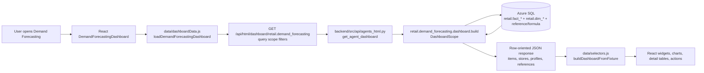
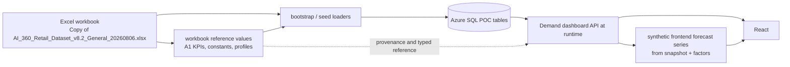
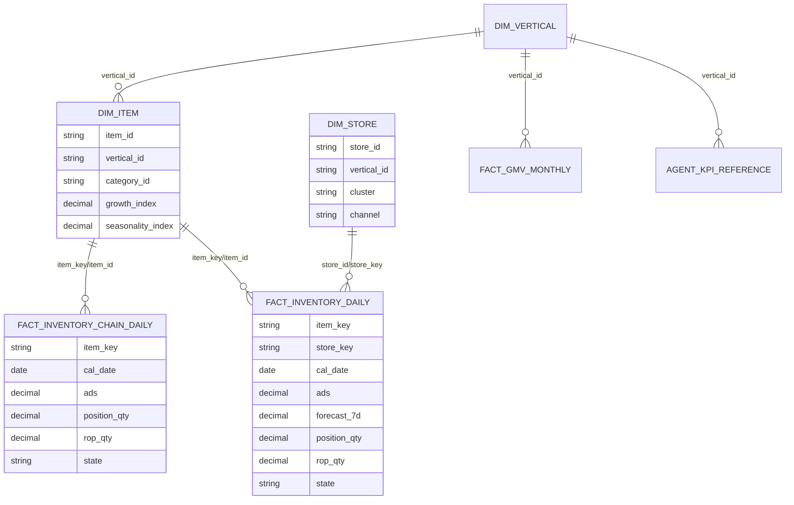
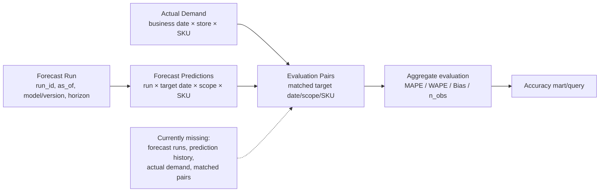
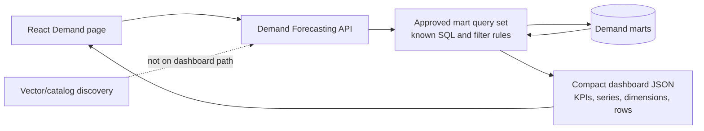
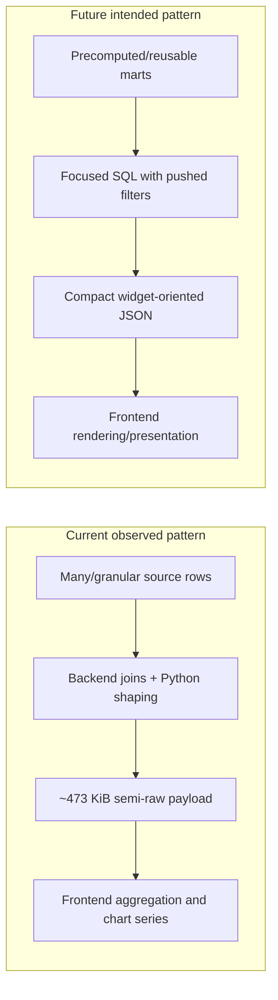
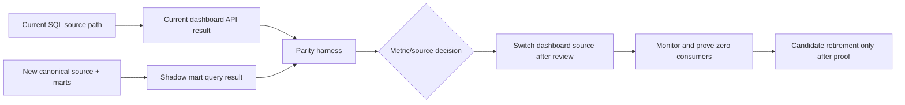

# AI Retail 360 — Demand Forecasting Mart Requirements

Status: read-only investigation and requirements design. No mart, schema,
application, vector, embedding, or dbt implementation is included in this
document.

Investigation date: 2026-08-18 UTC

## 1. Executive Summary

- Demand Forecasting is a deterministic HTTP dashboard. The browser calls
  `GET /api/html/dashboard/retail.demand_forecasting`; it does not use vector
  retrieval to discover dashboard data.
- The current runtime reads Azure SQL at request time. The workbook is the
  upstream/demo seed and reference source, not the browser's runtime query
  source.
- The dashboard primarily reads the snake_case `retail.dim_*` and
  `retail.fact_*` family. Its all-store item query reads
  `retail.fact_inventory_chain_daily`; a selected store reads
  `retail.fact_inventory_daily`.
- The populated POC is a one-day current snapshot: 16,000 store-SKU rows and
  800 chain-SKU rows at `2026-07-01`. It is not a transaction history.
- The current dashboard returns granular item and store rows, then performs
  most KPI, forecast-series, dimension, ranking, and confidence shaping in
  frontend JavaScript. The backend performs source joins, some grouped SQL,
  row shaping, fallback forecast arithmetic, and trend-membership allocation.
- `Forecast Next 7 Days`, inventory position, ROP, days of supply, and current
  stockout risk are reproducible current snapshot calculations. They are not
  evidence of historical forecast performance.
- The displayed `92.4%` accuracy, demand-trend percentages, and related
  vertical values are workbook/A1 reference values. They are explicitly not
  measured accuracy; no historical forecast runs or actual-versus-forecast
  pairs are populated.
- True MAPE, WAPE, bias, historical actual-versus-forecast charts, and
  forecast-run history cannot be built authentically from the current data.
- The minimum reusable mart design is four logical analytical contracts:
  current demand snapshot, forecast prediction history, actual demand daily,
  and forecast evaluation. Dimension/core contracts support them but should
  not become one dashboard mart per tile.
- A warm local ASGI request took approximately 3.32 seconds and returned
  484,095 bytes. The current builder took approximately 1.33 seconds, issued
  nine sequential SQL statements, and spent approximately 307 ms in those
  statements. Browser-side timing is not available from existing
  instrumentation.

## 2. Scope and Non-Goals

### Scope

This audit answers what the current Demand Forecasting dashboard actually
needs, where each displayed value currently comes from, which source grain is
available, and what minimum reusable SQL mart contracts would support a later
migration. It covers current repository code, relevant tests and plans, and
safe read-only inspection of the configured Azure SQL database.

The report uses `UNKNOWN` where the repository or bounded database inspection
does not prove a fact. Measured timings are labelled with their measurement
boundary and should not be treated as a production SLA.

### Non-goals

This task did not create or modify marts, dbt models, tables, views, indexes,
rows, APIs, frontend code, backend code, catalog entries, vector documents,
embeddings, configuration, or migrations. It did not delete either Retail
table family, install dbt, re-embed data, commit, or push.

The proposed marts below are contracts and migration requirements only. They
are not a migration plan detailed enough to execute without product decisions
about source systems, forecast production, history, retention, and evaluation
policy.

### Documentation handling

`plans/current-database-and-dataflow-audit.md` was used as the baseline and
the Demand-specific statements were independently checked against current
code and Azure SQL. Several older Demand documents describe a pre-runtime
fixture or PostgreSQL handoff and are not current runtime truth:

- `plans/demand-forecasting-backend-handoff.md` and
  `plans/demand-forecasting-dashboard-frontend.md` are useful history but
  contain pre-integration assumptions, including fixture/hand-off language
  and an older data-source configuration.
- `plans/demand-forecasting-api-example.json` is an illustrative response,
  not a captured current response. Its historical-looking series and accuracy
  values must not be used as evidence of data availability.
- `plans/retail-dashboards-status-and-next-steps.md` and PostgreSQL wording in
  the Store-filter changelog are stale relative to the current Azure SQL
  runtime.
- `plans/demand-forecasting-store-filter-changelog.md` is valuable for the
  current Store-scope behavior, but its current SQL claims were verified
  against the present Azure SQL code and database rather than copied as-is.

Where these documents disagree with current code, current tests, or live
metadata, current code/database evidence wins.

## 3. Current Demand Forecasting Runtime Flow

### 3.1 Plain-language flow

The dashboard has two distinct modes in the frontend: API mode, which is the
normal runtime default, and a fixture mode used by tests/standalone behavior.
In API mode the page requests row-oriented data from the backend. The backend
queries Azure SQL and returns item rows, store rows, reference rows, profile
rows, filter options, formulas, and metadata. The frontend then derives the
dashboard-shaped object consumed by React components.



### 3.2 Actual entry points

| Stage | Current file | Actual class/function or behavior |
|---|---|---|
| Page registration | `frontend/src/agents/retail/demand_forecasting/index.js` | Registers the Demand Forecasting UI override. |
| Page root | `frontend/src/agents/retail/demand_forecasting/DemandForecastingDashboard.jsx` | Owns query state, loading/error state, refresh, KPI drilldown, scenario actions, and the component tree. |
| API loader | `frontend/src/agents/retail/demand_forecasting/data/dashboardData.js` | `loadDemandForecastingDashboard`, `loadDemandForecastingDrilldown`, and `loadDemandForecastingScenario`. |
| Query contract | `frontend/src/agents/retail/demand_forecasting/data/contract.js` | Defaults, supported grain/horizon/levers, `serializeScope`, and response normalization. |
| HTTP helper | `frontend/src/api/dashboard.js` | `fetchDashboard` performs a `GET` to the encoded `/api/html/dashboard/{agent}` path. |
| API route | `backend/src/api/agents_html.py` | `get_agent_dashboard` parses `DashboardScope`, validates known query parameters, invokes the descriptor builder, and returns JSON. |
| Agent descriptor | `backend/src/llm/agents/retail/demand_forecasting/__init__.py` | Exposes `retail.demand_forecasting`, supported scope filters, and `dashboard.build`. |
| Dashboard builder | `backend/src/llm/agents/retail/demand_forecasting/dashboard.py` | Uses the fixed snapshot date, chooses chain/store inventory source, runs source queries, shapes rows, and adds reference/profile/formula metadata. |
| Warehouse helpers | `backend/src/llm/agents/retail/common/warehouse.py` | Opens the SQLAlchemy Azure SQL engine, applies scope predicates, and loads options, references, store sizes, and formulas. |
| Frontend selectors | `frontend/src/agents/retail/demand_forecasting/data/selectors.js` | Calculates KPIs, forecast series, confidence band, dimensions, trending rows, details, suggested actions, and simulation baseline/scenario. |
| Scenario engine | `frontend/src/agents/retail/demand_forecasting/data/engine.js` | Applies the six what-if levers with stored formulas in browser memory. |
| React widgets | `frontend/src/agents/retail/demand_forecasting/components/` | Render KPI cards, forecast charts, rankings, details, dimensions, simulation, comparison, and suggested actions. |

### 3.3 Scope and query behavior

The page's default scope is all legal entities, all categories, all stores,
and no SKU text filter. It offers Legal Entity, Category, Store, SKU, display
grain, and forecast horizon controls. The backend currently accepts and
applies `legal_entity_id`, `category_group`, and `store_id`. The frontend
serializes those three filters plus `sku` in the request helper, but the
Demand descriptor does not declare SKU as a supported backend filter; the
frontend filters SKU/name after the returned rows arrive. `grain`,
`horizon_weeks`, `detail_offset`, and `detail_limit` are used for frontend
shaping rather than sent as SQL controls by `serializeScope`.

The backend has two source branches:

1. All Stores uses `retail.fact_inventory_chain_daily` for 800 chain-SKU
   rows. That table has no `forecast_7d` column in the current query, so the
   builder uses the current ADS multiplied by the workbook week factor
   `7.45`.
2. A selected Store uses `retail.fact_inventory_daily`, joined to
   `retail.dim_store`, for 100 SKU rows for that store. This branch reads the
   stored `forecast_7d` field.

Both branches join `retail.dim_item` and `retail.dim_vertical`. A separate
store aggregation query reads `fact_inventory_daily`; it is used for the
store breakdown even when the headline item source is chain-level.

### 3.4 Workbook and runtime boundary

The workbook is read by the seed/bootstrap path and by the workbook viewer,
but the Demand dashboard's normal API request does not open the workbook. Its
runtime data is the Azure SQL snapshot seeded from workbook-derived data. The
runtime response still carries provenance notes such as `is_mock` and a
workbook/demo note, so the UI can display that the dataset is not production
history.



## 4. Dashboard Component Inventory

This audit traced 19 major visual/data components, plus six scope/period
controls and KPI drilldown behavior. The count is a reporting aid, not a
proposal for 19 marts.

### 4.1 Scope and control requirements

| Control | Current behavior | Analytical requirement |
|---|---|---|
| Legal Entity | Backend predicate on `dim_item.vertical_id`; frontend filters options and rows. | A stable legal-entity dimension and a safe entity key in every aggregate. |
| Category | Backend predicate on `dim_item.category_id`; frontend also scopes rows/options. | Category dimension with an unambiguous relationship to SKU and legal entity. |
| Store | Backend predicate only on selected-store inventory branch; all-store uses chain fact. | Store dimension, Store → Legal Entity relationship, and defined chain-net versus store-sum semantics. |
| SKU | Current request is not a backend SQL predicate for Demand; frontend filters returned rows by SKU/name. | Exact/searchable SKU dimension and SQL pushdown for production-scale detail queries. |
| Display grain | Daily, weekly, monthly, quarterly, yearly shaping happens in selectors. | Calendar/date contract and a clearly defined target-date/horizon aggregation. |
| Forecast horizon | Four, eight, twelve, or sixteen weeks controls client series/detail shaping; not a current forecast-run selector. | Forecast run and horizon dimensions, with the meaning of a horizon fixed by product policy. |

### 4.2 Visible data components

| Component | Current data needed |
|---|---|
| Forecast Next 7 Days KPI | Sum of scoped `forecast_7d` item values. |
| Forecast Accuracy KPI | Weighted average of vertical `accuracy_pct` reference values; current value is 92.4% and is not measured. |
| Demand Trend KPI | Forecast-weighted vertical `trend_pct` reference. |
| Stockout-risk SKUs KPI | Count of scoped item rows where `position < rop`. |
| Predicted to Trend KPI | Count of items marked by backend top-N allocation using vertical reference counts and item growth ranking. |
| Seasonality Index KPI | Forecast-weighted vertical `seasonality_idx` reference. |
| Forecast overview chart | Synthetic future series at selected display grain; current `actual` points are null. |
| Confidence panel/chart | Synthetic forecast band using the reference accuracy and a fixed z factor; no calibrated prediction interval. |
| Predicted-to-trend ranking | Top eight item rows ordered by growth, with modelled uplift and signal labels. |
| Forecast detail table | Up to 100 client-sliced SKU rows with ADS, seven-day forecast, selected-period forecast, trend percentage, signals, and supply state. |
| Forecast by category | Category grouping of item forecast values and shares. |
| Forecast by store | Store grouping from the separate store query and forecast values. |
| Forecast by cluster | Cluster grouping of store forecast values. |
| Seasonality curve | Twelve monthly points derived from `fact_gmv_monthly` profile values, normalized by mean. |
| By legal entity / chain total | Legal-entity grouping of store rows plus chain total. |
| KPI drilldown | A second full dashboard API load followed by client filtering/grouping; accuracy, trend, and seasonality do not have authentic lower-grain history. |
| What-If Simulator | Six local levers, browser formula execution, baseline/scenario KPIs and series; no persistence. |
| Compare Scenarios | Browser-session saved scenario metadata/series; no database source or server persistence. |
| Suggested Best Action | Client-generated reorder-zone/watch-riser counts and a top-12 preview; action buttons are presentation-only/disabled. |

The forecast visualization's `Actual` legend is therefore not proof of actual
data. `buildForecastSeries` emits `actual: null` for the current future-only
series and sets `history_count` to zero.

### 4.3 What is not a current dashboard data source

The page does not currently query `retail.fact_sales_daily`,
`retail.forecast_run`, `retail.forecast_daily`, or
`retail.forecast_accuracy`; bounded inspection found those tables empty. It
also does not call the vector retrieval service, adaptive planner, or chatbot
for dashboard data.

## 5. Complete Data-Lineage Matrix

The matrix below follows each meaningful displayed requirement to the current
field and then to the future data contract. “Current source sufficient?”
describes the metric's semantic sufficiency, not merely whether the UI can
render a number.

| Dashboard element | UI component | Frontend field / function | Backend response field / builder | Current Azure SQL table(s) and columns | Current grain / joins / filters | Current formula and calculation location | Data classification | Required future grain / dimensions / measures / history | Candidate analytical owner | Current source sufficient? |
|---|---|---|---|---|---|---|---|---|---|---|
| Forecast Next 7 Days | `DemandKpiGrid` | `kpis.forecast_next_7d`; `computeKpis` sums `item.forecast_7d` | `items[].forecast_7d`; `dashboard.build` | Store scope: `fact_inventory_daily.forecast_7d`; all scope: `fact_inventory_chain_daily.ads` plus `dim_item` | Current snapshot date × store × SKU, or chain × SKU; item joins and entity/category/store predicates | Store value is stored workbook f08 result; chain fallback is `ads × 7.45`; backend plus frontend aggregation | B. AUTHENTIC DERIVED METRIC, current snapshot only | Snapshot date × store × SKU for reusable detail; query-time legal entity/category/store/SKU aggregates; ADS and forecast units; no historical requirement for current KPI, but history is required for trend-over-time | SQL/dbt current-snapshot mart | YES — POC/SNAPSHOT ONLY |
| Forecast Accuracy | KPI card / drilldown | `kpis.forecast_accuracy_pct`; `blend` forecast-weighted reference | `reference_by_vertical[].accuracy_pct`; `agent_reference` pivot | `retail.agent_kpi_reference.accuracy_pct` | Vertical reference row; joined to `dim_vertical`; no forecast-run/actual join | Weighted average of typed `92.4` values; frontend | C. WORKBOOK / DEMO REFERENCE VALUE | Forecast run × horizon × scope; needs prediction, actual, run/as-of, model/version, target date, evaluation policy | Evaluation mart for future; reference metadata for current POC | NO — MISSING HISTORY |
| MAPE | Not shown as an authentic KPI; referenced by drilldown/requirements | No measured MAPE field; current accuracy is not MAPE | No populated evaluation response | `retail.forecast_accuracy` is empty; `fact_sales_daily` and `forecast_daily` are empty | No actual/prediction pairs | No calculation | E. FUTURE DATA REQUIRED / CURRENTLY UNAVAILABLE | Forecast run × horizon × optional legal entity/store/category/SKU scope; MAPE, observation count, policy, model/version; historical runs and actuals | SQL/dbt evaluation mart | NO — MISSING HISTORY |
| Demand Trend | KPI card / trend labels | `kpis.demand_trend_pct`; `blend` of `trend_pct` | `reference_by_vertical[].trend_pct` | `agent_kpi_reference.trend_pct` | Vertical reference; no date series or observed demand | Forecast-weighted typed percentage; frontend | C. WORKBOOK / DEMO REFERENCE VALUE | Date × legal entity/category/store/SKU actual demand or model output, with comparison window and metric definition | Actual-demand/model feature mart; not a reference constant | NO — MISSING HISTORY |
| Stockout Risk | KPI card / suggested action | Count where `item.position < item.rop`; `computeKpis` | `items[].position`, `items[].rop`, `items[].state` | `fact_inventory_daily.position_qty`, `rop_qty`, `state`; chain equivalents; dimensions | Snapshot date × store × SKU; item-to-store/item-to-SKU joins; current scope predicates | Boolean current-state rule `position < rop`; frontend after backend row retrieval | B. AUTHENTIC DERIVED METRIC over A. current snapshot facts | Snapshot date × store × SKU with position, ROP, state, risk flag; date history optional for risk trend | SQL/dbt current-snapshot mart | YES — POC/SNAPSHOT ONLY |
| Predicted to Trend | KPI card / ranking | `is_trending`, `computeTrending`; backend `allocate_trending` | `items[].is_trending`, growth/signals; `reference_by_vertical.trending_skus` | `dim_item.growth_index`, `is_viral`, `is_promo_eligible`; `agent_kpi_reference.trending_skus` | Snapshot item rows; backend ranks per vertical and marks top N from reference; frontend top eight | Membership is modelled from typed count plus growth ranking; uplift is `(growth_index - 1) × 100` | D. SYNTHETIC APPLICATION CALCULATION using C. reference inputs | If model output: forecast run × target date × store × SKU with score/classification; if descriptive: snapshot SKU growth attributes and explicit rule; model/history required for authenticity | SQL/dbt for persisted model output; API for presentation | YES — POC/SNAPSHOT ONLY |
| Seasonality Index | KPI card | `kpis.seasonality_index`; forecast-weighted `seasonality_idx` | `reference_by_vertical[].seasonality_idx` | `agent_kpi_reference.seasonality_idx`, item `dim_item.seasonality_index` | Vertical reference or item snapshot attribute; no observed time series at runtime for tile | Weighted reference value; frontend | C. WORKBOOK / DEMO REFERENCE VALUE | Date/month × legal entity/category/store/SKU profile, with source window and normalization; history required for authentic profile | SQL/dbt seasonal profile or reference metadata | YES — POC/SNAPSHOT ONLY |
| Seasonality curve | `ForecastConfidencePanel`/dimension panel | `dimensions.seasonality`; `seasonal_indices` | `seasonality` rows from `fact_gmv_monthly` | `fact_gmv_monthly.gmv`, `year_index`, `month_index`, `vertical_id` | 8 verticals × 12 months after `AVG(gmv)` over two workbook-relative years; joined to vertical | `month_gmv / mean(month_gmv) × 100`; backend then frontend shapes | B. AUTHENTIC DERIVED PROFILE, not actual calendar history | Month/date × legal entity/category/store/SKU as product requires; source window, actual demand/revenue, normalization; multiple periods of history | SQL/dbt profile mart or query over actual-demand mart | YES — POC/SNAPSHOT ONLY |
| Confidence interval | Confidence chart/panel | `forecast.band`, `interval_label`; `buildForecastSeries` | `constants.interval_z` and reference accuracy only; no band field from SQL | `agent_kpi_reference.accuracy_pct`; no interval fact | Scoped forecast series; no calibration sample | `band = forecast × 1.645 × (1 - accuracy/100) × sqrt(period)`; frontend | D. SYNTHETIC APPLICATION CALCULATION | Forecast run × target date × scope with lower/upper values and calibration method; forecast history/residuals required | Forecast production/evaluation pipeline; API only maps values | NO — MISSING HISTORY |
| Actual vs Forecast | Forecast line chart | `forecast.points[].actual`; current points all null | No actual series; `history_count: 0` | `fact_sales_daily` empty; no join to `forecast_daily` | No actual date rows; no prediction run | Frontend builds forecast-only future points and labels actual null | E. FUTURE DATA REQUIRED / CURRENTLY UNAVAILABLE | Target date × store × SKU actual plus run × target date × store × SKU forecast; date/run history | Actual and forecast marts, joined in query/evaluation | NO — MISSING SOURCE |
| Peak Day | Forecast summary | `forecast.summary.peak` | No peak supplied; frontend summary | Current constants `dow_profile` | Seven day profile only | Fixed label `Saturday × 1.35` based on workbook DOW profile, not forecast observations | D. SYNTHETIC APPLICATION CALCULATION | Forecast run × target date or weekday profile with model output; forecast series needed | SQL/dbt if it is a trusted forecast property; frontend display formatting | YES — POC/SNAPSHOT ONLY |
| Forecast Basket | Suggested-action/detail preview | `suggested_actions.plan_preview`, `forecast_7d_units` | `items` and `suggested_actions` are assembled in frontend from item rows | `fact_inventory_*` forecast/inventory fields; no basket table | Snapshot item rows, sorted by reorder/trend; top 12 client selection | A worklist preview, not order-line composition; no persistence | D. SYNTHETIC APPLICATION CALCULATION | Snapshot/run × store × SKU with demand, supply, priority, recommended quantity and rule/model provenance; actual forecast/run history not strictly required for a current recommendation, but production model contract is | SQL/dbt for reusable recommendation inputs; scenario/action service for decisions | YES — POC/SNAPSHOT ONLY |
| Category breakdown | Dimension panel | `dimensions.categories`; `computeDimensions` groups items | Item rows only; backend does not return category aggregates | `fact_inventory_*` + `dim_item.category_id/category_name` | Current snapshot item rows; category/entity predicates | Sum forecast and calculate share in frontend | B. AUTHENTIC DERIVED METRIC over snapshot | Snapshot date × legal entity × category (optionally store); forecast units/share and inventory measures | SQL/dbt snapshot mart with query-time grouping | YES — POC/SNAPSHOT ONLY |
| Store breakdown | Dimension panel | `dimensions.stores`; backend `stores` rows | `stores[]` with `forecast_7d`, `sku_count` | `fact_inventory_daily` + `dim_store` | Snapshot date × store × SKU grouped by store; entity/store filters | `COUNT(*)`, `SUM(f.forecast_7d)` in SQL; final shares frontend | B. AUTHENTIC DERIVED METRIC over snapshot | Snapshot date × legal entity × store; forecast, SKU count, inventory/risk measures | SQL/dbt snapshot mart | YES — POC/SNAPSHOT ONLY |
| Cluster breakdown | Dimension panel | `dimensions.clusters`; groups store rows by cluster | `stores[].cluster` | `fact_inventory_daily` + `dim_store` | Store snapshot rows grouped by `dim_store.cluster` | Sum and share in frontend | B. AUTHENTIC DERIVED METRIC over snapshot | Snapshot date × legal entity × cluster (with store drilldown) | SQL/dbt/query over snapshot mart | YES — POC/SNAPSHOT ONLY |
| Legal entity / chain total | Dimension panel | `dimensions.legal_entities`, `chain_total` | Store rows and item rows | `dim_store`, `dim_item`, inventory facts | Entity joins and current scope; chain item query differs from store sum | Sum/group/share in frontend; chain total is item-source sum | B. AUTHENTIC DERIVED METRIC, with source-semantic caveat | Snapshot date × legal entity; explicit chain aggregation rule | SQL/dbt snapshot mart | YES — POC/SNAPSHOT ONLY |
| Detail rows | `ForecastDetailTable` | `details.rows`; `computeDetails` sort and slice | `items[]` | `fact_inventory_*`, `dim_item`, `dim_store`, `dim_vertical` | Store-SKU or chain-SKU snapshot; current SKU filter is post-query | Selected-period units = ADS × period days; trend = growth−1; client pagination | B. AUTHENTIC DERIVED METRIC plus D synthetic period projection | Snapshot date × store × SKU; exact SKU/entity/category/store SQL filters; detail measures and stable key | SQL/dbt snapshot mart; API formats/paginates | YES — POC/SNAPSHOT ONLY |
| What-If | `DemandWhatIfSimulator` | `simulation.*`; `engine.js` formulas | No simulation endpoint in current Demand path | Baseline item fields and `retail.formula` definitions | Same current snapshot rows; six levers held in React state | Formula engine applies demand/promo/inbound/lead/safety; markdown currently has no visible formula effect; no persistence | D. SYNTHETIC APPLICATION CALCULATION | Scenario request × baseline snapshot/run, with explicit lever assumptions and outputs; no mart required for ephemeral scenarios | Scenario engine/backend API, not a dashboard mart | YES — POC/SNAPSHOT ONLY |

## 6. Current Azure SQL Sources and Grains

### 6.1 Demand runtime objects

The current Demand builder directly queries eight Azure SQL tables in the
`retail` schema. Counts below are the bounded inspection values in the
configured POC database, not production capacity:

| Object | Approximate rows | One row represents | Used by current Demand runtime? | Classification |
|---|---:|---|---|---|
| `retail.fact_inventory_chain_daily` | 800 | One chain-net item snapshot for `cal_date = 2026-07-01` | Yes, all-store item branch | Current snapshot fact; no historical population observed |
| `retail.fact_inventory_daily` | 16,000 | One item × store snapshot for `cal_date = 2026-07-01` | Yes, selected-store item branch and store breakdown | Current snapshot fact |
| `retail.dim_item` | 800 | One SKU/item master record | Yes | Reference/dimension |
| `retail.dim_store` | 160 | One store record | Yes | Reference/dimension |
| `retail.dim_vertical` | 8 | One legal-entity/vertical record | Yes | Reference/dimension |
| `retail.fact_gmv_monthly` | 192 | One vertical × workbook-relative year index × month index GMV profile row | Yes, seasonality query | Derived/reference profile, not proven calendar sales history |
| `retail.agent_kpi_reference` | 184 | One agent/metric/vertical reference value in long form | Yes, filtered to Demand and pivoted to 8 vertical records | Workbook/reference values |
| `retail.formula` | 22 | One stored named formula | Yes, builder returns 8 Demand formulas | Reference/scenario formula metadata |

Related tables were also inspected to establish missing history:

| Object | Approximate rows | Relevance |
|---|---:|---|
| `retail.fact_sales_daily` | 0 | Would be a daily sales/actual-demand source; currently empty. |
| `retail.forecast_run` | 0 | Forecast execution/run contract; currently empty. |
| `retail.forecast_daily` | 0 | Historical forecast predictions; currently empty. |
| `retail.forecast_accuracy` | 0 | Evaluation results; currently empty. |
| `retail.dim_calendar` | 1,461 | Calendar reference exists, but the current Demand builder does not use it to construct actual history. |

The exact total number of populated `retail` tables and all schemas/tables is
reported in the baseline audit. No explicit `mart`, `raw`, `staging`,
`fact`, `dim`, `analytics`, or `forecast` schema was found; the snake_case
objects use `fact_`/`dim_` prefixes inside `retail`, but this is not an
explicit analytical mart layer.

### 6.2 Current source grain and joins



The current all-store chain fact is a separately calculated source, not a
simple sum made by this endpoint. The Store-filter changelog records that the
chain source is the existing headline definition and warns that summing
rounded store rows does not reproduce the chain fact. This is a required
semantic decision for any future mart: “chain total” and “sum of stores” must
be named and tested separately.

### 6.3 Current row counts versus historical capability

The 16,000 and 800 inventory rows are one snapshot date. They support current
scope and ranking behavior but do not support an inventory trend or demand
history. `fact_gmv_monthly` has 192 rows representing two workbook-relative
year profiles for eight verticals; it is useful for the current normalized
seasonality curve but does not prove that the periods are actual calendar
months with recorded sales.

### 6.4 Direct answers about current analytical evidence

| Question | Current answer | Evidence |
|---|---|---|
| Do individual POS/transaction rows exist? | **NO** | No populated POS/transaction fact was found; `retail.fact_sales_daily` is empty and no transaction-grain table was identified. |
| What is the closest current source? | Current item/store or chain inventory snapshot | `fact_inventory_daily` and `fact_inventory_chain_daily` at `2026-07-01`; they contain ADS, inventory, ROP, and current projection fields. |
| Is `MonthlySales` actual calendar history? | **NO / not proven** | Its `period_label` is workbook-relative; matched `fact_gmv_monthly` values are a two-year seeded profile, not an observed calendar series. |
| Does `StoreSkuSnapshot` contain a baked seven-day forecast? | **YES, as a workbook-derived current field** | Its overlapping `forecast_7d` values match the Store branch's `fact_inventory_daily.forecast_7d`; this is not a historical run. |
| Are historical forecast runs populated? | **NO** | `forecast_run` and `forecast_daily` both have zero rows. |
| Are actual-versus-forecast pairs populated? | **NO** | No forecast predictions and no daily actuals exist to join. |
| Can true backtested MAPE be calculated? | **NO** | `forecast_accuracy` is empty and the prediction/actual inputs are absent. |
| Is the forecast basket historical composition? | **NO** | The UI creates a top-12 reorder/trend worklist from current rows; there is no persisted basket/run composition. |
| Which values are workbook constants/reference? | 92.4% accuracy, trend/seasonality references, DOW/week factors, profile values, and formula metadata | `agent_kpi_reference`, workbook-seeded fields, `fact_gmv_monthly`, and `retail.formula`. |
| Which values are current SQL snapshot facts? | ADS, on-hand, open PO, position, ROP, state, item/store attributes | Populated `retail.fact_inventory_*` and `retail.dim_*` rows. |

## 7. PascalCase vs snake_case Source Comparison

The database contains two parallel structured Retail families. The following
comparison uses bounded equality checks over their overlapping populated rows.
It is a field-level comparison, not a recommendation to delete either family.

### 7.1 Comparison results

| PascalCase source | snake_case source | Overlap checked | Result | Grain/date/lineage difference | Current consumer |
|---|---|---|---|---|---|
| `retail.StoreSkuSnapshot` | `retail.fact_inventory_daily` | 16,000 matched item-store rows; ADS, on-hand, open PO, position, ROP, cover, forecast, state | All compared values matched within the bounded comparison tolerance | PascalCase row is tied to `source_load_id` and has no business snapshot date; snake row is item × store × `cal_date` | PascalCase: bootstrap/retrieval; snake: Demand dashboard Store branch |
| `retail.InventorySnapshot` | `retail.fact_inventory_chain_daily` | 800 matched item-chain rows; ADS, position, ROP, cover, price, risk/order/state fields | All compared values matched within the bounded comparison tolerance | PascalCase row is SKU/source-load grain; snake row is item × `cal_date`; Pascal snapshot has stronger source lineage | PascalCase: retrieval; snake: Demand dashboard all-store branch |
| `retail.Sku` | `retail.dim_item` | 800 SKU/item rows; entity, category, name, vendor, base ADS, price, seasonality | All compared values matched for the checked overlapping attributes | PascalCase carries source-load/sheet/row lineage and explicit business FKs; snake carries application-oriented item attributes and names | PascalCase: retrieval/catalog; snake: dashboard |
| `retail.Store` | `retail.dim_store` | 160 store rows; entity, name, cluster, channel, size, health/footfall fields | All compared values matched for the checked overlapping attributes | PascalCase includes source lineage; snake has operational/application fields such as open/close/location attributes | PascalCase: retrieval; snake: dashboard |
| `retail.MonthlySales` | `retail.fact_gmv_monthly` | 192 rows after parsing `period_label` into workbook year/month indexes | All 192 values matched; no unparsed labels and zero maximum absolute value difference in the bounded check | PascalCase uses legal entity and relative period label; snake uses vertical/year_index/month_index; neither proves calendar history | PascalCase: retrieval; snake: Demand seasonality query |

### 7.2 Important non-equivalences

The row-value match does not make the families semantically interchangeable:

- `fact_inventory_daily` has an explicit `cal_date`; `StoreSkuSnapshot`
  primarily expresses the source-load snapshot. A future canonical fact needs
  both a business `snapshot_date` and ingestion/source-batch lineage.
- `fact_inventory_chain_daily` does not expose the store-level
  `forecast_7d` field used by the selected-store branch. The endpoint derives
  all-store forecast as `ads × 7.45`.
- `MonthlySales` and `fact_gmv_monthly` match the POC profile but use
  workbook-relative periods. They cannot be renamed into actual historical
  demand without a calendar/source decision.
- The PascalCase family has the strongest visible workbook lineage through
  `SourceLoad`, sheet, row, and content metadata. The snake_case family is the
  current dashboard source and has the more directly queryable current
  application grain/date columns.
- No foreign-key relationship was found that makes one family a formal
  parent of the other. The equality was established by business-key
  comparison, not by enforced cross-family referential integrity.

### 7.3 Temporary POC upstream recommendation

For a temporary dashboard POC mart, the snake_case inventory family is the
more direct upstream because it already powers the API and has an explicit
`cal_date`, store joins, and dashboard-oriented columns. The PascalCase family
should remain available for lineage and adaptive-retrieval consumers. This is
not a whole-family canonicalization decision.

The eventual canonical concepts should be selected field by field:

- snapshot measures should have an explicit business snapshot date,
  stable store/SKU keys, source batch, and defined chain-net semantics;
- item/store/legal/category dimensions should have one controlled key model;
- workbook row lineage should be retained as provenance, regardless of which
  physical seed family supplies the POC;
- monthly demand should use a real date/calendar contract if it is to support
  forecasting or accuracy evaluation.

## 8. Current Metric Trust Classification

The categories below are exclusive for the metric's displayed meaning:

- **A. AUTHENTIC CURRENT FACT** — directly observed current source state, not
  necessarily historical.
- **B. AUTHENTIC DERIVED METRIC** — deterministic derivation from authentic
  current source rows with a documented rule.
- **C. WORKBOOK / DEMO REFERENCE VALUE** — typed or seeded reference value,
  not measured from historical outcomes.
- **D. SYNTHETIC APPLICATION CALCULATION** — generated by application logic
  from factors/reference values, without the evidence required to call it a
  measured business fact.
- **E. FUTURE DATA REQUIRED / CURRENTLY UNAVAILABLE** — the UI may reserve a
  field or label, but the evidence contract is not populated.

### Authentic

The underlying current inventory quantities are A-level current snapshot
facts: `on_hand_qty`, `open_po_qty`, `position_qty`, `rop_qty`, `ads`, and
`state` come from the populated `retail.fact_inventory_*` rows. They are
authentic as of the seeded snapshot, subject to the workbook/demo provenance;
they are not a transaction history.

The current seven-day forecast is not a raw measured fact. It is classified B
because its current value is reproducible from the seeded snapshot and the
documented f08 rule. The same distinction applies to current stockout risk and
grouped totals.

### Derived

The following are B when labelled as current-snapshot outputs:

- `Forecast Next 7 Days`: stored store-level f08 forecast or chain ADS times
  the fixed week factor, summed over the scoped rows.
- `Stockout-risk SKUs`: count of current rows where `position < rop`.
- Category, store, cluster, legal-entity, and chain totals/shares: sums and
  counts over current snapshot rows.
- The twelve-point seasonality curve: monthly profile divided by its mean.
  It is a reproducible derived profile, not a measured demand history.

### Demo/reference

The following are C-level in the current response:

- `Forecast Accuracy = 92.4%`.
- Vertical demand trend percentages.
- Vertical seasonality index values used by the KPI.
- Vertical `trending_skus` counts used to allocate trend membership.
- The workbook constants `7.45`, the day-of-week profile, current month index,
  and interval z value.

The current reference payload should retain an explicit representation such as
the following semantics:

```text
accuracy_pct = 92.4
provenance = workbook reference/demo
measured = false
```

That value must not be inserted into an authentic accuracy mart as if it were
historically evaluated performance.

### Synthetic

The following are D-level application calculations:

- Future forecast series across daily/weekly/monthly/quarterly/yearly grain.
  The frontend combines ADS, a fixed day-of-week profile, the monthly profile,
  a reference trend percentage, and a selected horizon.
- Confidence bands based on `1.645`, the reference accuracy, and a period
  scaling factor. No residual sample or calibrated model interval exists.
- “Predicted to Trend” membership: the backend uses a reference count and
  ranks item growth; the frontend formats the ranked set and uplift.
- Peak-day summary `Saturday × 1.35`, derived from the fixed DOW profile.
- Forecast detail selected-period units (`ADS × period days`) and the
  suggested-action top-12 worklist.
- What-if baseline/scenario outputs, which are intentionally local formula
  simulations rather than persisted forecasts.

### Missing

E-level current gaps are:

- historical forecast runs and their as-of times;
- historical prediction rows at target date and store/SKU grain;
- actual sales/demand history at a defined grain;
- actual-versus-forecast joined pairs;
- authentic MAPE, WAPE, bias, observation count, and evaluation policy;
- a measured actual series for the forecast chart;
- an authentic confidence interval or model-calibrated uncertainty;
- persisted forecast basket/recommendation composition;
- an authentic demand trend over a declared comparison window.

The empty `retail.forecast_run`, `retail.forecast_daily`,
`retail.forecast_accuracy`, and `retail.fact_sales_daily` tables are direct
database evidence for these gaps. `MonthlySales`/`fact_gmv_monthly` is not a
substitute for sales history because its periods are workbook-relative and
its values are the seeded profile.

## 9. Current Calculation Ownership

The current architecture has a split between source retrieval, backend
shaping, and browser analytics. This split explains both the current payload
size and why a mart migration should move business definitions deliberately
instead of merely copying SQL queries.

### SQL

The current SQL layer performs:

- date, legal-entity, category, and selected-store predicates;
- joins from inventory facts to item, store, and vertical dimensions;
- the store breakdown `COUNT(*)` and `SUM(f.forecast_7d)`;
- the monthly profile `AVG(gmv)` grouped by vertical and month index;
- retrieval of long-form KPI reference rows and formula rows;
- option-list queries for legal entities, categories, and stores;
- store-size grouping by vertical.

These are a mix of source filtering, small aggregates, and reference loading.
The SQL does not currently produce a trusted dashboard KPI dataset at the
final widget grain. For a later mart, scope predicates and stable aggregate
definitions should move down to SQL/dbt. SQL should also own the expensive
grouping over large facts; the API should not return every production-level
SKU row merely so React can group it.

### Backend

`retail/demand_forecasting/dashboard.py` currently performs or controls:

- source-branch selection between chain and selected-store facts;
- fixed snapshot date selection (`2026-07-01`);
- fallback `forecast_7d = ads * 7.45` for the chain branch;
- conversion of database rows to item dictionaries;
- `position < rop` current-risk interpretation;
- signal construction from viral/promo/growth fields;
- allocation of `is_trending` membership from vertical reference counts and
  item growth ranking;
- conversion of monthly GMV profile values to normalized seasonality points;
- pivoting reference rows by vertical;
- assembling filter options and metadata.

The backend is the appropriate temporary owner for API response shaping,
scope/error handling, and compatibility fields. The following are analytical
business logic candidates for SQL/dbt: forecast units, risk flags, trend
membership once its rule is approved, group totals/shares, stable detail
ranking, and future confidence/evaluation aggregates. Hard-coded dates and
factors should become explicit source/configuration fields rather than hidden
builder constants.

### Frontend

`data/selectors.js` and related components currently perform the largest
analytical workload:

| Current frontend calculation | Classification | Future owner |
|---|---|---|
| Sum of `forecast_7d` for Forecast Next 7 Days | Analytical business logic | Snapshot mart/query, with API formatting only |
| Forecast-weighted accuracy, trend, and seasonality | Analytical business logic over reference values | SQL/dbt aggregation when the values become trusted; reference metadata while they remain demo-only |
| `position < rop` count | Analytical business logic | Snapshot mart/query |
| Category/store/cluster/legal-entity totals and shares | Analytical business logic | Snapshot mart/query |
| Detail sort, selected-period forecast units, trend percentage | Analytical business logic plus presentation | SQL/dbt for stable result/ranking; API may apply final page formatting |
| Daily/weekly/monthly/quarterly/yearly synthetic series | Analytical/modeling logic | Forecast prediction mart/query after a real forecast contract exists |
| Confidence band | Analytical/model uncertainty logic | Forecast pipeline/evaluation contract, not React |
| Fixed peak label and tooltip number formatting | Presentation logic, given a trusted series | Frontend |
| Chart label/legend layout, blank state, warning copy | Presentation logic | Frontend |
| Scenario input controls and rendering | Scenario/presentation logic | Frontend or a dedicated scenario endpoint, not a dashboard mart |

The current frontend still needs to filter SKU text client-side because the
backend does not push that filter down. That is acceptable for 800 POC chain
rows, but not a safe production design for millions of rows. The eventual API
should preserve the response contract where practical while pushing exact
scope, search, sort, and pagination to SQL.

### Workbook/reference

Workbook/bootstrap data currently supplies or seeds:

- base ADS, item attributes, growth and viral flags, item seasonality
  attributes, and inventory inputs;
- the f08 week factor `7.45` and day-of-week profile;
- vertical `accuracy_pct`, `trend_pct`, `seasonality_idx`, and trend counts;
- the two-year/month profile used by `fact_gmv_monthly`;
- named formulas in `retail.formula` used by the scenario engine.

These fields need a provenance flag in any future response. A workbook value
can be useful for continuity or a POC but must not be silently promoted to a
measured fact.

### Scenario logic

The what-if simulator is a separate scenario concern. `engine.js` applies the
six levers (`demand`, `promo`, `markdown`, `inbound`, `lead`, `safety`) to
snapshot rows using formula metadata and recomputes a local baseline/scenario.
Saved scenarios are React-session state; no current dashboard endpoint
persists them. This logic should not be materialized as a normal demand mart.
It can remain client-side while it is explicitly a POC scenario, or move to a
dedicated deterministic scenario service later if the business needs shared,
auditable scenarios.

## 10. Required Dimensions

### 10.1 Dimensions required by the dashboard

| Dimension/contract | Required role | Current evidence | Requirement before mart implementation |
|---|---|---|---|
| Date / calendar | Snapshot date, actual business date, target date, display grain, month/weekday | `dim_calendar` exists; current inventory uses fixed `cal_date`; GMV uses workbook-relative indexes | Decide business timezone, calendar key, fiscal/calendar month, week boundary, and whether `snapshot_date` differs from ingestion time. |
| Legal Entity | Top-level filter and grouping | `dim_vertical` / `LegalEntity`, eight populated IDs | Choose one canonical key and label contract; preserve source IDs. |
| Store | Store filter, store breakdown, cluster/channel | `dim_store` / `Store`, 160 populated rows | Define physical, online, fulfillment, and chain scope semantics. |
| SKU / Item | Detail and forecast grain | `dim_item` / `Sku`, 800 populated rows | Define durable SKU key, effective dating, replacements, and whether item is global or entity-specific. |
| Category | Filter and breakdown | 160 populated categories; current IDs include entity prefix patterns | Determine whether category IDs are globally unique; if not, key by legal entity + category. |
| Store cluster/channel | Store grouping and ranking | `dim_store.cluster` and `channel` | Treat as store attributes with effective dating if they change. |
| Forecast run | As-of, model/version, forecast history | `retail.forecast_run` empty | Establish run identity, status, model version, as-of timestamp, training window, and source batch. |
| Forecast horizon | Forecast selector and evaluation grouping | Only frontend `horizon_weeks` exists | Define whether horizon means target offset, total horizon, or display window. |
| Model version | Reproducibility and comparisons | Not populated in current dashboard forecast | Required on every future prediction and evaluation row. |
| Inventory scope | Preserve chain-net versus store values | Current code has separate chain and store branches | Use an explicit `scope_type`/scope key or a cleanly separated chain aggregate contract; prohibit accidental mixing. |
| Source batch / lineage | Reconciliation and audit | PascalCase `SourceLoad` and source fields exist; snake rows are seeded | Carry source system, batch ID, workbook/sheet/row where applicable, and load timestamp. |

### 10.2 Current relationships and ambiguity

The observed relationships are:

```text
Legal Entity / Vertical
    ├── Store
    │     └── Store × SKU inventory snapshot
    └── SKU / Item
          └── Category
```

The current database also carries `vertical_id` on item and store records.
That may be a useful denormalized validation attribute, but it creates a
potential inconsistency if a SKU can be sold by more than one legal entity or
if a store changes ownership. This is not resolved by the POC. The future
model needs a product decision about SKU scope and effective-dated
relationships.

Category IDs are not assumed globally unique merely because they look unique
in the current sample. The future key should either enforce global uniqueness
or include the parent legal entity. Store-to-entity is also treated as
effective-dated for production design even though the current snapshot has a
single value.

## 11. Required Measures

### 11.1 Current dashboard measures

The current POC response needs these measures or attributes at snapshot
SKU/store grain:

- `ads` / average demand rate;
- `forecast_7d_units` and, separately, the formula or model provenance;
- on-hand quantity, open purchase order quantity, and inventory position;
- reorder point, days of supply/cover, and inventory state;
- unit price where the detail/recommendation context needs it;
- growth index, viral/promotion eligibility, promotion depth, lead time,
  safety days, shelf-life/perishable indicators;
- stockout-risk flag and, if used, recommended/reorder units;
- trend score/membership and explicit rule/model version;
- normalized monthly seasonal factor and its source window;
- group totals, shares, SKU counts, and ranking position as derived query
  outputs rather than duplicate base facts.

### 11.2 Future forecasting/evaluation measures

The prediction contract needs forecast value, lower/upper interval, target
date, horizon offset, run/as-of, model version, and forecast status. The
actual contract needs demand quantity, returns/cancellations policy, revenue
if used, availability/stockout censoring fields, and source event/batch
lineage. The evaluation contract needs signed error, absolute error,
percentage-error eligibility, observation count, and explicit zero-actual and
missing-actual policy.

Do not use “accuracy” as a measure until its definition is approved. If the
product chooses `accuracy = 100 - MAPE`, that is a presentation convention,
not a replacement for storing MAPE and the evaluation denominator.

## 12. Proposed Minimum Mart Contracts

The smallest reusable set is four analytical fact contracts. A forecast-run
dimension/core table and conformed dimensions are required support contracts,
but they are not counted as one mart per dashboard widget. Seasonality,
category, store, and legal-entity panels should be aggregates over these
contracts, not separate tile-specific marts.

### `mart.demand_current_snapshot`

- **Purpose:** Serve current inventory, current seven-day projection, SKU
  detail, current risk, and scope breakdowns.
- **Grain:** One row per `snapshot_date × inventory_scope × SKU`. For a store
  row, `inventory_scope_type = STORE` and `inventory_scope_id = store_id`.
  For the authoritative chain-net row, `inventory_scope_type = CHAIN` and
  `inventory_scope_id = chain/legal-entity scope`. Scope type is mandatory so
  store rows and chain rows are never silently summed together.
- **Primary/unique key:**
  `(snapshot_date, inventory_scope_type, inventory_scope_id, sku_id)`.
- **Required dimensions:** Snapshot date, inventory scope, store where
  applicable, legal entity, SKU, category, brand/vendor where needed, source
  batch, and calendar attributes.
- **Required measures:** ADS, forecast-7d units, on-hand, open PO, position,
  ROP, days cover, inventory state, price, risk flag, growth/promotion
  attributes, lead/safety inputs, and source/model provenance.
- **Required source data:** Current snake_case inventory facts plus conformed
  item/store/legal/category dimensions; PascalCase lineage should remain
  available as source metadata. Chain-net semantics must be resolved rather
  than assumed to equal store sum.
- **Derived calculations:** Position/ROP/risk only where the source does not
  already provide the governed value; forecast-7d must retain its f08 or model
  provenance; category/store/entity totals and shares are query aggregates.
- **History requirements:** Current POC can populate one snapshot date.
  Production needs append-only or versioned snapshots if inventory trend and
  as-of analysis are required.
- **Incremental candidate:** Incremental by snapshot date, with a merge/upsert
  key of the unique key above for late corrections. A source batch ID should
  make replays idempotent.
- **Dashboard consumers:** Forecast Next 7 Days, risk, detail, category/store/
  cluster/entity panels, current forecast basket inputs, and filter-scoped
  rankings.
- **Potential future retrieval consumers:** Deterministic inventory/risk
  capabilities and planner-approved SQL; the mart itself is not a vector
  index.
- **Current population feasibility:** **YES — POC/SNAPSHOT ONLY**. The
  current values can be reproduced, but only for the observed seeded date and
  with current chain/store semantic caveats.
- **Missing upstream data:** Reliable continuous snapshot feed, source
  system/batch contract, effective dimensions, and production chain-net
  definition.
- **Expected row-count order:** Approximately 16,000 store rows plus 800
  chain rows for the current POC if both scopes are represented (about
  `1.7 × 10^4`). Production is approximately
  `snapshot_dates × active_stores × active_SKUs`, potentially millions to
  billions across retention, plus any explicitly stored chain scope.

### `mart.demand_forecast_prediction_daily`

- **Purpose:** Preserve real forecast history and provide a deterministic
  target-date series for charts, horizon totals, peak days, baskets, and
  future evaluation.
- **Grain:** One row per `forecast_run_id × target_date × store_id × sku_id`.
  A chain-level prediction, if produced independently, requires an explicit
  `scope_type = CHAIN` contract and must not be confused with the sum of store
  predictions.
- **Primary/unique key:**
  `(forecast_run_id, target_date, prediction_scope_type, prediction_scope_id,
  sku_id)`.
- **Required dimensions:** Forecast run, model version, forecast as-of time,
  target date, horizon offset, legal entity, store/scope, SKU, category, and
  calendar attributes.
- **Required measures:** Point forecast, lower/upper bounds, optional
  quantiles, horizon offset, status, and forecast provenance.
- **Required source data:** A forecast production process that emits a run
  identifier and target-date predictions. The current baked `forecast_7d`
  value is insufficient because it has no run/as-of/target-day distribution.
- **Derived calculations:** Horizon totals and peak target date can be
  aggregated from predictions; intervals must come from the forecast method
  or a governed calibration process.
- **History requirements:** At least the retained forecast runs needed for the
  selected backtest window, including predictions made before their target
  dates.
- **Incremental candidate:** Incremental by forecast run; insert/merge a
  complete run keyed by `forecast_run_id` and prediction key, with immutable
  run status after publication.
- **Dashboard consumers:** Forecast series, confidence panel, horizon total,
  next period, peak day, forecast basket inputs, and run/model selectors.
- **Potential future retrieval consumers:** Planner-approved forecast queries,
  provided the catalog describes model/version/time semantics.
- **Current population feasibility:** **NO — MISSING SOURCE**. No populated
  forecast run or prediction source exists.
- **Missing upstream data:** Forecast service/run contract, model/version
  metadata, target-date prediction output, interval policy, and retention.
- **Expected row-count order:** POC cannot be authentically populated. A
  production run is approximately
  `runs × horizon_dates × active_stores × active_SKUs`, commonly millions per
  run and potentially billions across run retention.

### `mart.demand_actual_daily`

- **Purpose:** Establish the realized demand series used by forecasting and
  actual-versus-forecast charts/evaluation.
- **Grain:** One row per `business_date × store_id × sku_id`, with a clearly
  documented channel/legal-entity treatment. If source transactions are
  retained separately, this mart is the daily store-SKU aggregate.
- **Primary/unique key:** `(business_date, store_id, sku_id)` plus source
  system/batch version if corrections are versioned rather than merged.
- **Required dimensions:** Business date/calendar, store, legal entity, SKU,
  category, channel, source system, and batch/load lineage.
- **Required measures:** Units sold/demand units, returns/cancellations,
  net units under the approved policy, revenue if needed, availability,
  stockout/censoring indicators, and data-quality flags.
- **Required source data:** POS/ERP/CRM/commerce transaction or daily demand
  source. Current `retail.fact_sales_daily` is empty; no substitute was
  accepted as actual history.
- **Derived calculations:** Net demand, calendar aggregation, and censoring
  flags under an approved policy; not synthetic backfill from ADS.
- **History requirements:** A declared retention window, historical backfill,
  corrections/late-arrival policy, timezone, returns treatment, and zero-sales
  meaning.
- **Incremental candidate:** Incremental by business date with merge/upsert
  for late-arriving corrections, keyed by business date/store/SKU/source
  grain.
- **Dashboard consumers:** Actual series, demand trend, seasonality profile,
  historical drilldown, and evaluation joins.
- **Potential future retrieval consumers:** Approved descriptive demand and
  trend capabilities through deterministic SQL.
- **Current population feasibility:** **NO — MISSING SOURCE**. No populated
  daily actual-demand table was found, and the workbook profile is not a
  substitute.
- **Missing upstream data:** Raw or trusted daily demand source, source
  ownership, calendar/timezone, returns/stockout policy, and retention.
- **Expected row-count order:** POC is zero. A daily aggregate is roughly
  `business_dates × active_stores × selling_SKUs`, from millions to billions
  with multi-year retention; raw transaction volume may be much larger.

### `mart.demand_forecast_evaluation`

- **Purpose:** Store reusable, auditable forecast-versus-actual evaluation
  pairs so MAPE/WAPE/bias and observation counts are queryable without
  recalculating policy inconsistently in every consumer.
- **Grain:** One row per
  `forecast_run_id × target_date × evaluation_scope × SKU` for which a
  prediction and a governed actual are joined. `evaluation_scope` explicitly
  identifies store or chain. This is a pair-level evaluation fact; MAPE is an
  aggregate over these rows, not a fabricated row-level accuracy value.
- **Primary/unique key:**
  `(forecast_run_id, target_date, evaluation_scope_type,
  evaluation_scope_id, sku_id)`.
- **Required dimensions:** Run, model/version, forecast as-of, target date,
  horizon, legal entity, store/scope, SKU, category, calendar, and evaluation
  policy version.
- **Required measures:** Forecast value, actual value, signed error, absolute
  error, absolute percentage error where eligible, WAPE numerator/denominator
  inputs, zero/missing-actual eligibility flags, and observation flags.
- **Required source data:** Prediction daily joined to actual daily on target
  date and scope/SKU, with effective dimensions and policy metadata.
- **Derived calculations:** MAPE, WAPE, bias, accuracy display, and counts are
  aggregate SQL/dbt queries over eligible evaluation rows. The denominator
  and zero-actual policy must be visible.
- **History requirements:** Historical runs and actuals covering the same
  target dates, plus a stable model/evaluation policy version.
- **Incremental candidate:** Incremental by completed forecast run after its
  evaluation window closes; merge by the pair-level key to support late actual
  corrections, or rebuild the affected run/date partition.
- **Dashboard consumers:** Forecast Accuracy, MAPE if exposed, confidence
  evidence, actual-versus-forecast comparisons, and KPI drilldowns.
- **Potential future retrieval consumers:** Approved accuracy/evaluation
  query capabilities; catalog descriptions should make the evaluation grain
  and denominator explicit.
- **Current population feasibility:** **NO — MISSING HISTORY**. Both source
  populations and the pair contract are absent.
- **Missing upstream data:** Historical forecast runs, predictions, actuals,
  join keys, observation policy, model/version, and evaluation-window
  retention.
- **Expected row-count order:** POC is zero. Production is approximately the
  number of evaluated prediction rows: runs × horizon × active stores ×
  active SKUs, commonly millions per evaluation window and larger across
  retained runs.

### 12.1 Deliberately not proposed as separate marts

- A category mart, store mart, legal-entity mart, and KPI mart would duplicate
  aggregates over `demand_current_snapshot` or the prediction/evaluation
  facts. They are query outputs unless measured performance proves a reusable
  aggregate is needed.
- A separate seasonality tile mart is not required for the minimum design.
  Seasonality can be a governed profile derived from actual daily demand or a
  query over an approved monthly profile contract. The current workbook
  profile should remain reference-labelled.
- A forecast-basket mart is not required until the basket's business meaning
  and persistence/approval lifecycle are defined. Current basket output is a
  worklist calculation and belongs with the scenario/recommendation logic.
- A vector mart is not proposed. Dashboard marts are deterministic SQL
  serving contracts; semantic/vector discovery is a separate future chatbot
concern.

## 13. Forecast History / Accuracy / MAPE Contract

### 13.1 Required contracts

The minimum authentic forecasting chain is:



The core `forecast_run` contract should have one row per model execution or
published forecast run, with at least:

- immutable `forecast_run_id`;
- `as_of_at` and publication/completion time;
- model name/version and feature/training-data version;
- forecast horizon and frequency;
- source batch and run status;
- optional forecast policy/calibration version.

The prediction contract should have one row per run × target date × scope ×
SKU. It must preserve the distinction between when the prediction was made
(`as_of_at`) and what date it predicts (`target_date`). A single current
`forecast_7d` value has neither a target-date distribution nor a run identity,
so it cannot be converted into a historical run by naming convention.

The actual contract should have one row per business date × store × SKU after
the source transaction/demand policy is applied. The policy must decide how
to treat returns, cancellations, stockouts, unavailable inventory, zero-sales
days, time zones, channels, and late corrections.

The pair-level evaluation contract should join prediction target date to
actual business date for the same scope and SKU. It should carry an evaluation
policy version and eligibility flags, not merely a pre-rounded “accuracy”.

### 13.2 Metric definitions that must be approved

For eligible evaluation rows `i`, with actual `a_i` and forecast `f_i`:

```text
error_i       = f_i - a_i
absolute_i    = abs(error_i)
APE_i         = abs(error_i) / abs(a_i)       when a_i is non-zero and eligible
MAPE          = average(APE_i)                over eligible non-zero actuals
WAPE          = sum(absolute_i) / sum(abs(a_i))
Bias          = sum(error_i) / sum(abs(a_i))  (or another approved definition)
n_obs         = count of eligible evaluation pairs
```

The denominator, zero-actual treatment, missing-actual treatment, negative
actual/return treatment, aggregation scope, and whether accuracy is
`100 - MAPE` must be approved before the dashboard labels a number as
accuracy. MAPE is particularly sensitive to small actuals, so WAPE and bias
should be retained even if the UI initially shows one accuracy card.

### 13.3 What the current data can and cannot do

Current status is unambiguous:

- `retail.forecast_run`: zero rows;
- `retail.forecast_daily`: zero rows;
- `retail.fact_sales_daily`: zero rows;
- `retail.forecast_accuracy`: zero rows;
- current chart actual points: `null` and `history_count = 0`;
- current `92.4%`: typed workbook/reference value, `measured = false`.

Therefore true backtested MAPE is **NO — MISSING HISTORY**. It cannot be
calculated by joining the current POC tables, by treating `MonthlySales` as
actuals, or by comparing a synthetic forecast series to itself. No history is
fabricated in this report.

## 14. Proposed Static Dashboard Query Contract

The future dashboard request should remain deterministic:



### 14.1 Response contract

The current frontend already has a schema-versioned normalized contract. A
later backend can preserve its outer shape to minimize frontend disruption:

```text
metadata / scope / limitations
filter_options
kpis
forecast
confidence
dimensions
trending_items
details
simulation
scenarios
suggested_actions
formulas / provenance
```

The migration should replace the row-oriented source behind this contract,
not make React know the physical mart names. For an authentic future response:

- `kpis.forecast_next_7d` comes from the governed snapshot/prediction query;
- `kpis.forecast_accuracy_pct` is omitted or explicitly unavailable until
  evaluation rows exist, rather than populated with 92.4 as measured data;
- `forecast.points[].actual` is populated only for dates with actuals;
- forecast lower/upper values come from the prediction contract;
- `dimensions` are compact aggregates at the selected scope;
- `details` is SQL-filtered and SQL-paginated with a stable key/order;
- `simulation` remains a separate baseline/scenario result with assumption
  metadata.

### 14.2 Filter pushdown and aggregation boundary

Push these filters to SQL:

- legal entity;
- category;
- store/scope;
- exact SKU and approved SKU/name search;
- snapshot/as-of date;
- forecast run/model version;
- target-date range and horizon;
- stable detail pagination/order.

The marts or SQL query set should own joins, current KPI sums, inventory risk,
group totals, shares, trend rankings, and forecast/evaluation aggregation.
The API may perform cheap final shaping: field naming, response envelopes,
label formatting, feature flags, and compatibility aliases. React should
retain presentation work such as number formatting, chart layout, tooltip
format, loading/error states, and scenario control rendering.

### 14.3 Existing API compatibility assessment

The existing endpoint and outer response can likely be preserved while the
builder changes its source, because the frontend already consumes a normalized
schema and does not need to know whether rows came from current tables or
marts. This is an assessment, not an implementation guarantee. The following
contract issues must be resolved during implementation:

- current `sku` filtering occurs after the API query, so SQL pushdown must be
  added without changing visible filter behavior;
- `grain` and `horizon_weeks` currently shape a synthetic series in the
  browser, but a real prediction series needs an explicit run/target-date
  query;
- current metadata uses a generated snapshot value while the frontend has an
  `as_of` concept; the field semantics should be normalized;
- `scope_limitations` must continue to say when accuracy/trend/seasonality
  are reference-only at a selected Store scope;
- the current chain-net versus store-sum distinction must be preserved in
  metadata and parity tests.

No vector lookup belongs in this dashboard request. If the chatbot later uses
the same marts, retrieval/planner access should be a separate capability with
its own catalog and policy path.

## 15. Current Performance Baseline

The measurements below were obtained with safe read-only execution against
the current configured environment. They are a baseline, not a production
SLA and not a promise of a future load time.

### SQL

For one all-store `dashboard.build` invocation, the builder issued nine
sequential SELECT statements. SQLAlchemy event timing measured approximately
307.3 ms total database execution time:

| Query purpose | Result rows | Approx. execution time |
|---|---:|---:|
| Chain item snapshot query | 800 | 37.6 ms |
| Store grouping query | 160 | 46.8 ms |
| Monthly GMV profile grouping | 96 | 32.2 ms |
| Demand KPI reference rows after filter/pivot input | 8 | 31.6 ms |
| Legal-entity option query | 8 | 31.7 ms |
| Category option query | 160 | 32.1 ms |
| Store option query | 160 | 31.5 ms |
| Store-size grouping | 8 | 31.8 ms |
| Formula rows | 22 | 31.8 ms |
| **Total** | **1,422 result rows** | **approximately 307.3 ms** |

The 1,422 figure is the sum of rows returned by the nine SELECTs, not a
physical database scan count or logical-read count. Exact logical reads and
query plans were not collected in this audit. The queries ran sequentially;
no parallel query orchestration or dashboard result cache was identified.

The current DDL provides a composite primary key on the inventory facts and a
date index on `fact_inventory_daily`; the chain fact has a composite key and
the dimensions have primary keys. No partitioning or columnstore design was
verified. These indexes are adequate evidence for the small POC but are not a
large-fact performance design.

### Backend

| Boundary | Observation |
|---|---:|
| Direct `retail.demand_forecasting.dashboard.build` | Approximately 1,333.6 ms |
| SQL time inside that builder | Approximately 307.3 ms |
| Builder time not accounted for by SQL event time | Approximately 1,026.3 ms, inferred; includes connection/driver overhead and Python shaping, not a pure Python profile |
| Warm local ASGI `GET` after TestClient lifespan | Approximately 3,321.9 ms |
| Cold TestClient/lifespan request | Approximately 5,927.8 ms; not comparable because startup/workbook prewarm is included |

The warm HTTP result matched the observed “approximately three seconds”
behavior, but this was a local ASGI/TestClient measurement rather than a real
browser measurement. The endpoint boundary includes framework serialization
and local request overhead. A separate production network breakdown is
UNKNOWN.

### Payload

The all-store response was 484,095 bytes, approximately 472.75 KiB, measured
as the serialized JSON response from the current builder/endpoint. Major
collections were:

| Collection | Count |
|---|---:|
| Item rows | 800 |
| Store rows | 160 |
| Reference-by-vertical rows | 8 |
| Seasonality verticals | 8 |
| Legal-entity options | 8 |
| Category options | 160 |
| Store options | 160 |
| Returned formula rows | 8 |

The payload is therefore a semi-raw row payload, not a compact widget result.
The browser receives enough item/store data to recompute many aggregates.

### Frontend

No browser performance instrumentation or production trace was found. The
repository's tests verify selector behavior and response contracts, not
browser CPU time or React commit duration. Therefore the following are
**UNKNOWN** for this audit:

- selector transformation milliseconds;
- JSON parse time in a real browser;
- React render/commit time;
- chart rendering time;
- time spent in browser scenario calculations during initial load.

The code shows that `computeKpis`, `buildForecastSeries`,
`computeDimensions`, `computeTrending`, `computeDetails`, and scenario setup
run over the returned rows. That establishes work exists, but not its time
cost.

### Network

The direct SQL and local ASGI measurements do not isolate Azure SQL network
round-trip time from driver execution, nor browser-to-API latency. The SQL
portion is material within the builder measurement, but the relative share of
the total three seconds attributable to Azure network, API serialization,
browser transfer, and rendering is **UNKNOWN**.

### What marts are likely to improve



| Current cost | Likely mart effect |
|---|---|
| Scanning/returning granular production source rows | **LIKELY REDUCED BY MARTS**, if the mart grain and indexes match dashboard scope. |
| Nine sequential reference/source queries | **LIKELY REDUCED BY MARTS**, if the query contract consolidates reusable dimensions/aggregates; not automatic. |
| Backend row shaping and repeated grouping | **LIKELY REDUCED BY MARTS** for analytical calculations; API compatibility shaping remains. |
| Frontend KPI/dimension/ranking calculations | **LIKELY REDUCED BY MARTS** if compact aggregate/series fields are returned. |
| React bundle load | **UNCHANGED BY MARTS**. |
| Browser rendering/chart commit | **UNKNOWN**; fewer points may help, but no measurement proves the effect. |
| Backend-to-browser network RTT | **UNCHANGED BY MARTS** as a latency category, though a smaller payload may reduce transfer time. |
| Azure SQL network/driver latency | **UNKNOWN** until equivalent mart queries are benchmarked. |
| Current source semantics (chain net versus store sum) | **UNCHANGED BY MARTS** unless explicitly resolved in the contract. |

The correct outcome of the migration benchmark is a measured reduction in
rows and transformation work, not a promised absolute dashboard time.

## 16. Future Performance Benchmark Plan

The later mart implementation should be benchmarked as a controlled before/
after experiment. The current implementation must remain available while the
new query path is tested.

### 16.1 Same-request comparison

Use the same:

- Azure SQL environment and connection driver;
- legal entity, category, store, SKU, grain, and horizon scopes;
- data snapshot or forecast run;
- API serialization format where compatibility is being measured;
- cold/warm/cache state labels;
- client/browser and network path for end-to-end measurements.

Capture at least:

| Measurement | Current baseline | Later mart measurement |
|---|---|---|
| Number of SQL statements | 9 for the measured all-store builder | Same boundary; explain any intentional change |
| SQL execution time per statement | Event timing, approximately 307.3 ms total | Same instrumentation and query labels |
| Physical/logical reads and execution plan | Not collected in this audit | Capture safely for representative scopes; do not run intentionally huge workloads |
| Rows returned by each query | 1,422 total result rows in current baseline | Same definition |
| Backend builder duration | Approximately 1,333.6 ms | Same function boundary |
| API endpoint duration | Approximately 3,321.9 ms warm local ASGI/TestClient | Same endpoint/client boundary |
| JSON bytes | 484,095 bytes / approximately 472.75 KiB | Same response contract and compression assumptions |
| Item/store/series/detail counts | 800 items, 160 stores in all-store POC | Same scope and contract counts |
| Frontend parse/selector time | UNKNOWN currently | Browser Performance API or existing test harness, without changing production behavior solely for the audit |
| React render/commit time | UNKNOWN currently | Browser profiler/performance trace, labelled by browser/version |
| Total user-visible data-load time | UNKNOWN in a real browser | Real browser trace, with API/network/render segments |

### 16.2 Representative scopes

Run at least all-store, one selected store, one legal entity, one category,
one SKU, and a large multi-store/category scope. Include a horizon with a
short and long target-date window once forecast history exists. Test both
fresh and repeated requests so caching is not accidentally attributed to the
mart.

### 16.3 Acceptance evidence

Do not set arbitrary latency targets in this audit. The engineering review
should approve targets based on the product's dashboard latency requirement.
The migration evidence should show:

- unchanged or explained metric values for authentic current measures;
- fewer or deliberately justified rows transferred;
- payload size and SQL/API time changes;
- no loss of filter scope or chain/store semantic distinctions;
- explicit unavailable states for metrics whose history is still absent;
- browser transformation/render measurements if the goal includes frontend
  simplification.

## 17. dbt Readiness

**DBT STATUS: NOT PRESENT.**

Repository inspection found no `dbt_project.yml`, dbt profiles/templates,
dbt package declarations, `dbt-core` dependency, SQL Server/Fabric adapter,
models, tests, macros, snapshots, seeds, or CI/deployment integration. The
backend requirements contain SQLAlchemy/ODBC database dependencies but no dbt
runtime. No dbt package was installed or initialized during this audit.

Given the current target is Azure SQL, the next phase should investigate the
compatibility and operational fit of a SQL Server/Azure SQL dbt adapter (often
referred to as `dbt-sqlserver`) before adding dependencies. If the platform
decision changes to Microsoft Fabric, a Fabric-specific adapter and execution
target would be a separate investigation. This report does not select,
install, or configure either adapter.

The next phase should also decide where dbt runs, how it receives credentials
without exposing them, how source freshness is tested, how incremental models
are deployed, and how model lineage is published. None of those mechanisms
exist in the current repository.

## 18. Candidate Refresh Strategies

These are candidate strategies only. The workbook snapshot is treated as a
POC input, not as the permanent production source.

| Contract | Current POC refresh | Future candidate | Candidate unique/incremental key | Notes |
|---|---|---|---|---|
| `mart.demand_current_snapshot` | Workbook batch snapshot; current loaded date is fixed | INCREMENTAL BY SNAPSHOT, with MERGE/UPSERT for corrections | `snapshot_date, inventory_scope_type, inventory_scope_id, sku_id` | Retain source batch and make snapshot idempotent. Decide whether snapshots are append-only or restated. |
| `mart.demand_forecast_prediction_daily` | No authentic source | INCREMENTAL BY FORECAST RUN | `forecast_run_id, target_date, scope_type, scope_id, sku_id` | Publish complete immutable runs; late model corrections require explicit versioning. |
| `mart.demand_actual_daily` | Empty actual fact | INCREMENTAL BY DATE with MERGE/UPSERT | `business_date, store_id, sku_id, source_system` | Handle late transactions, returns, cancellations, and corrections. |
| `mart.demand_forecast_evaluation` | No pairs | INCREMENTAL BY FORECAST RUN after evaluation window closes; rebuild affected dates for late actuals | Pair-level evaluation key | Evaluation is not ready when a target date has not closed or actuals are incomplete. |

### 18.1 POC versus production source

The POC path is workbook snapshot ingestion into Azure SQL with a source-load
lineage record. A production path is expected to receive continuous or batched
ERP/POS/CRM/commerce updates. The mart contracts should therefore carry
source-system, source-batch, effective-date, load-time, and correction
metadata even if the first POC population has only one workbook batch.

Do not design incremental logic that assumes a workbook filename is the
permanent business key. A workbook replacement is a source batch; it is not a
forecast run and not a transaction history.

## 19. Migration / Parity Plan

The safe later pattern is coexistence and validation:



### 19.1 Parity checks for authentic current measures

| Requirement | Current source | Future source | Scope | Comparison |
|---|---|---|---|---|
| Current Forecast Next 7 Days | Chain fact ADS×7.45 or store fact `forecast_7d` | Snapshot mart governed forecast field/query | All, legal entity, category, store, SKU | Exact equality after agreeing decimal/rounding policy; otherwise a documented numeric tolerance. |
| Inventory position | `fact_inventory_* .position_qty` | Current snapshot mart | Same scopes | Exact/tolerance equality; preserve chain versus store source semantics. |
| ROP | `fact_inventory_* .rop_qty` | Current snapshot mart | Same scopes | Exact/tolerance equality. |
| Stockout-risk count | Current rows and `position < rop` | Snapshot mart risk flag/query | Same scopes | Exact count equality; investigate any row-level mismatch. |
| ADS and days cover | `fact_inventory_*` fields or current formula | Snapshot mart | Same scopes | Exact/tolerance equality with formula/provenance. |
| SKU/store/category/entity filters | Current backend + frontend scope behavior | SQL-pushed mart filters | Each filter alone and combinations | Row/key set equality, not just KPI equality. |
| Dimension option lists | `dim_vertical`, `dim_item`, `dim_store` | Conformed dimensions/mart query | All and selected entity | Exact key/label comparison where the source contract is unchanged. |
| Seasonality profile | `fact_gmv_monthly` profile | Approved profile contract | Each legal entity/vertical/month | Exact/tolerance only if intentionally preserving POC profile semantics; label remains reference/profile. |

### 19.2 Metrics that must not have fake parity

Current `Forecast Accuracy = 92.4%` is a workbook reference and is not an
authentic current metric. The future authentic evaluation mart is unavailable
until forecasts and actuals exist. The migration should compare provenance
and explicit unavailable/reference status, not force a numeric equality.

If visual continuity temporarily requires displaying 92.4, keep it in a
reference field with `provenance = workbook_reference` and `measured = false`.
Do not put it in `mart.demand_forecast_evaluation` as a measured result.

### 19.3 Cutover controls

Before changing the API source, engineering should:

1. establish row/key and metric parity at fixed POC scope;
2. compare SQL statement count, timing, rows, and payload;
3. test unsupported/ignored filter behavior deliberately;
4. verify unavailable metrics remain unavailable;
5. run shadow queries for a period of source updates;
6. switch through a reversible configuration/feature mechanism;
7. monitor errors, freshness, counts, and metric drift;
8. prove zero consumers before any legacy retirement decision.

## 20. Candidate Legacy Retirement Map

No object should be removed as part of this audit. The following is a
candidate disposition after a future cutover, subject to consumer proof.

| Current table/process | Candidate disposition | Reason / retirement proof required |
|---|---|---|
| `retail.fact_inventory_daily` | KEEP during migration; MIGRATE semantics to snapshot mart; POTENTIALLY RETIRE AFTER CUTOVER | Current dashboard and Store scope use it. Prove API, tests, retrieval, and operational jobs have no consumers. |
| `retail.fact_inventory_chain_daily` | KEEP during migration; MIGRATE chain-net semantics; POTENTIALLY RETIRE AFTER CUTOVER | Current all-store headline uses it. Must prove the new chain contract preserves its independent semantics. |
| `retail.dim_item`, `dim_store`, `dim_vertical` | KEEP; MIGRATE/conform dimensions | Used directly by dashboard and possibly other Retail capabilities. Prove all consumers and key parity first. |
| `retail.fact_gmv_monthly` | KEEP as POC/reference until an approved actual-demand profile exists; POTENTIALLY RETIRE AFTER CUTOVER | Current seasonality panel uses it; its workbook-relative meaning must not be lost. |
| `retail.agent_kpi_reference` | KEEP as explicit reference metadata; POTENTIALLY RETIRE only after product replaces demo values | Supplies 92.4, trend, seasonality, and trend-count references. Zero-consumer proof is not enough if visual continuity is still required. |
| `retail.formula` and formula repository path | KEEP while scenario formulas are used; POTENTIALLY RETIRE only after a governed scenario service has parity | It is reference/scenario logic, not a dashboard fact. |
| PascalCase `StoreSkuSnapshot`, `InventorySnapshot`, `Sku`, `Store`, `MonthlySales` | KEEP during migration; MIGRATE field by field; POTENTIALLY RETIRE only after adaptive-retrieval/catalog consumers are removed or migrated | Baseline audit identifies this family as an adaptive-retrieval source with lineage. Do not delete the family as a dashboard cleanup. |
| Workbook seed/bootstrap scripts | KEEP for POC/reproducibility; MIGRATE to production ingestion; POTENTIALLY RETIRE only after source replacement | Current POC source and lineage path. Prove no deployment/test/recovery dependency. |
| `dashboard.py` Python aggregates | MIGRATE analytical definitions to mart/query; KEEP API compatibility shaping temporarily | Move business logic only after parity tests exist. |
| `selectors.js` analytical aggregation | MIGRATE trusted metric logic to mart/query; KEEP presentation/normalization | Preserve UI behavior while reducing browser reconstruction. |
| `engine.js` scenario calculation | KEEP as scenario logic; UNKNOWN for later retirement | No evidence that a server scenario replacement is approved or required. |
| Frontend fixture JSON/path | KEEP for tests/standalone fixtures; POTENTIALLY RETIRE as runtime path after API/mart parity | Tests and offline behavior may still depend on it. |

Deletion is outside this task. Every “potentially retire” entry requires a
repository consumer search, database dependency review, deployment review,
and a reversible cutover.

## 21. Confirmed Data Gaps

### CONFIRMED GAP

- No populated raw POS/transaction fact was found.
- No populated daily actual-demand history was found.
- No populated forecast run, forecast prediction, or forecast evaluation
  history was found.
- No actual-versus-forecast pair exists; true backtested MAPE cannot be
  calculated.
- No explicit SQL mart schema/layer exists today.
- Current inventory is a one-date snapshot, not historical time series.
- `MonthlySales`/`fact_gmv_monthly` uses workbook-relative profile periods and
  cannot establish calendar sales history.
- The 92.4% accuracy value is a workbook/reference constant, not measured
  history.
- Important analytical logic is split between SQL, backend Python, and
  frontend JavaScript.
- SKU filtering is not pushed into the Demand SQL query in the current API
  path.
- No dbt project, model, test, macro, snapshot, or CI integration is present.
- No verified large-fact partitioning or columnstore design exists; whether
  this becomes a production bottleneck depends on future volume and access
  patterns.
- Two populated structured source families duplicate much of the POC content
  without a formal canonical cross-family relationship.

### NOT A GAP

- Runtime access to Azure SQL exists and was verified; the dashboard is not
  currently workbook-only.
- A deterministic Demand dashboard endpoint exists.
- Legal entity, category, store, SKU/item, and calendar reference objects
  exist in the current POC, although their future effective/key semantics
  need decisions.
- Store scope is now applied to the selected-store SQL branch; the remaining
  issue is preserving/deciding chain-net versus store-sum semantics, not the
  absence of a Store predicate.
- The dashboard does not use vector discovery in its runtime path. This is
  correct for a static dashboard and should remain so.
- A local formula engine exists for POC what-if behavior; a scenario engine
  is not a normal analytical mart requirement.

### UNKNOWN / NEEDS PRODUCT DECISION

- Expected production transaction volume, active stores/SKUs, and retention.
- ERP/POS/CRM/commerce source of truth and whether it is available at
  transaction or daily aggregate grain.
- Update frequency, late-arrival/correction policy, and freshness target.
- Whether chain-net inventory/forecast is authoritative or should become a
  derived store aggregate.
- Whether SKU is global, legal-entity-specific, or effective-dated.
- Whether online, marketplace, fulfillment, and physical locations share the
  same Store dimension or require a channel/location hierarchy.
- Whether transaction-level drilldown is needed or daily store-SKU is enough.
- Forecast model owner, model/version lifecycle, run retention, and interval
  calibration method.
- Forecast accuracy definition, zero-demand/stockout rules, and required
  evaluation horizon.
- Actual frontend parse/render/network timing in a real browser.
- Whether ADLS/Fabric is planned in addition to or instead of Azure SQL.
- Whether Azure Foundry embeddings must replace local BGE for chatbot use;
  this is outside dashboard mart scope.
- What “CRM queries the Vector DB” is intended to mean and which mart/catalog
  concepts should later be semantically searchable.

## 22. Decisions Required Before Implementation

Before creating staging/core models or marts, the engineering/product review
needs decisions on:

1. **Business source and volume:** What system owns transactions, inventory,
   forecasts, and dimensions; what row volume and update pattern must be
   supported?
2. **Canonical grains:** Is the authoritative current inventory scope store,
   chain, or both; how should chain-net differ from store-sum; is daily
   store-SKU actual demand sufficient?
3. **Forecast history contract:** What run/as-of/model/version fields are
   mandatory, how long are runs retained, and which horizon/frequency is
   evaluated?
4. **Accuracy policy:** How are zero actuals, stockouts, returns, missing
   actuals, and late corrections treated; which of MAPE, WAPE, and bias are
   displayed?
5. **Dashboard latency/shape:** What product latency target and drilldown
   behavior are required, and can the existing response contract be
   preserved while SQL pushes filtering and aggregation down?
6. **Platform/tooling:** Is Azure SQL the durable mart target, or is ADLS/
   Fabric planned; which dbt execution/adapter/security pattern is approved?
7. **Chat and semantic scope:** Which metric/table descriptions may later be
   exposed to retrieval/planner capabilities, while keeping the dashboard
   deterministic and independent of Vector DB discovery?

## Appendix A — Relevant Code Entry Points

### Current runtime

- `frontend/src/agents/retail/demand_forecasting/DemandForecastingDashboard.jsx`
  — page lifecycle, query changes, drilldown and scenario actions.
- `frontend/src/agents/retail/demand_forecasting/data/dashboardData.js` — API
  versus fixture loading and scenario/drilldown reloads.
- `frontend/src/agents/retail/demand_forecasting/data/contract.js` — query
  defaults, filter serialization, response validation/normalization.
- `frontend/src/agents/retail/demand_forecasting/data/selectors.js` —
  `computeKpis`, `buildForecastSeries`, `computeDimensions`,
  `computeTrending`, `computeDetails`, and `buildDashboardFromFixture`.
- `frontend/src/agents/retail/demand_forecasting/data/engine.js` — local
  scenario formulas and lever application.
- `frontend/src/api/dashboard.js` — `fetchDashboard` HTTP helper.
- `backend/src/api/agents_html.py` — `get_agent_dashboard` and
  `DashboardScope` handling.
- `backend/src/llm/agents/retail/demand_forecasting/__init__.py` — descriptor
  and supported dashboard filters.
- `backend/src/llm/agents/retail/demand_forecasting/dashboard.py` —
  `build`, `allocate_trending`, fixed snapshot date, source SQL and response
  assembly.
- `backend/src/llm/agents/retail/common/warehouse.py` — Azure SQL engine,
  scope clauses, options, references, store sizes, and formula retrieval.
- `backend/src/llm/agents/retail/demand_forecasting/tools/demand_data.py` —
  normal Demand chat data tool; it also uses the current chain snapshot and
  `ads × 7.45`, and is not the dashboard endpoint.

### Relevant tests and data contracts

- `frontend/src/agents/retail/demand_forecasting/data/dashboardData.test.js`
  — HTTP query and data-loader behavior.
- `frontend/src/agents/retail/demand_forecasting/DemandForecastingDashboard.test.jsx`
  — rendered dashboard behavior and component presence.
- `backend/tests/test_demand_forecasting_store_scope.py` — Store predicate,
  bound parameter, builder, and HTTP scope behavior.
- `backend/tests/test_retail_dashboard_builders.py` and related dashboard
  scope tests — backend builder contracts.
- `frontend/src/agents/retail/demand_forecasting/data/fixture.json` — useful
  test/demo contract and provenance text; not current Azure SQL runtime data.

## Appendix B — Relevant SQL Objects

### Direct Demand runtime sources

```text
retail.fact_inventory_chain_daily
retail.fact_inventory_daily
retail.dim_item
retail.dim_store
retail.dim_vertical
retail.fact_gmv_monthly
retail.agent_kpi_reference
retail.formula
```

### Investigated missing-history sources

```text
retail.fact_sales_daily       -- empty in inspected database
retail.forecast_run           -- empty
retail.forecast_daily         -- empty
retail.forecast_accuracy      -- empty
retail.dim_calendar           -- populated reference; not used by current builder
```

### Parallel PascalCase sources compared

```text
retail.SourceLoad
retail.LegalEntity
retail.Store
retail.Category
retail.Sku
retail.InventorySnapshot
retail.StoreSkuSnapshot
retail.MonthlySales
```

The full current schema/table inventory, including the `ai`, `audit`,
`chat`, and `dbo` schemas, is in the baseline audit. No schema or row was
changed for this report.

## Appendix C — Read-Only Queries Used

The inspection used safe metadata/count/comparison shapes only. Credentials,
connection strings, and secret values were never printed.

### Metadata

```sql
SELECT name FROM sys.schemas ORDER BY name;

SELECT s.name AS schema_name, o.name AS object_name, o.type_desc
FROM sys.objects AS o
JOIN sys.schemas AS s ON s.schema_id = o.schema_id
WHERE o.type IN ('U', 'V')
ORDER BY s.name, o.name;

SELECT s.name, o.name, c.name, t.name, c.max_length,
       c.precision, c.scale, c.is_nullable
FROM sys.columns AS c
JOIN sys.objects AS o ON o.object_id = c.object_id
JOIN sys.schemas AS s ON s.schema_id = o.schema_id
JOIN sys.types AS t ON t.user_type_id = c.user_type_id
WHERE o.type = 'U'
ORDER BY s.name, o.name, c.column_id;

SELECT ... FROM sys.key_constraints ...;
SELECT ... FROM sys.foreign_keys ...;
SELECT ... FROM sys.indexes ...;
```

The abbreviated catalog forms above were expanded with the relevant key,
foreign-key, and index columns during inspection; no DDL was executed.

### Bounded counts and grains

```sql
SELECT COUNT_BIG(*) FROM retail.fact_inventory_daily;
SELECT COUNT_BIG(*) FROM retail.fact_inventory_chain_daily;
SELECT COUNT_BIG(*) FROM retail.fact_sales_daily;
SELECT COUNT_BIG(*) FROM retail.forecast_run;
SELECT COUNT_BIG(*) FROM retail.forecast_daily;
SELECT COUNT_BIG(*) FROM retail.forecast_accuracy;

SELECT cal_date, COUNT_BIG(*)
FROM retail.fact_inventory_daily
GROUP BY cal_date
ORDER BY cal_date;

SELECT year_index, month_index, COUNT_BIG(*), AVG(gmv)
FROM retail.fact_gmv_monthly
GROUP BY year_index, month_index;
```

### Source-family comparisons

The comparison queries joined bounded business-key projections of the
PascalCase and snake_case tables, then counted unmatched keys and numeric/text
differences for the overlapping fields. Monthly labels were parsed into the
workbook year/month index before comparing `MonthlySales` to
`fact_gmv_monthly`. No update, insert, delete, merge, migration, or schema
operation was executed.

### Performance measurement

The dashboard builder was invoked through the existing read-only code path
with SQLAlchemy event listeners recording statement count and elapsed database
execution time. A local ASGI/TestClient request recorded endpoint response
duration and serialized response bytes. The cold measurement was retained only
to identify startup/prewarm effects; the warm measurement is the comparison
baseline. No intentionally expensive query-plan or profiling workload was
run.

### Validation and worktree safety

Relevant current Demand tests and their assertions were inspected. The
Store-filter changelog records the implementation's earlier seeded-environment
results (58 backend tests and 30 frontend tests passed); those results are
historical evidence from that change, not a new test run performed by this
audit. No application test was rerun because this task changes no executable
behavior and the live read-only measurements were sufficient for the current
requirements baseline. `git diff --check` passed for the report. The only new
intentional file is this report; pre-existing untracked `.python-version` and
`plans/current-database-and-dataflow-audit.md` were preserved.

## Required Decision Tables

### Demand requirement decision table

| Requirement | Current Source | Current Trust Level | Required Grain | Proposed Mart | Can Build Now? |
|---|---|---|---|---|---|
| Legal Entity filter | `dim_vertical` / `dim_item` | A. AUTHENTIC CURRENT FACT / reference dimension | Dimension key + scoped snapshot/prediction | Conformed legal-entity dimension + current snapshot | YES — AUTHENTIC |
| Category filter | `dim_item.category_id` | A. AUTHENTIC CURRENT FACT / reference dimension | Category key with legal-entity relationship | Conformed category dimension + current snapshot | YES — AUTHENTIC |
| Store filter | `dim_store` + `fact_inventory_daily` | A. AUTHENTIC CURRENT FACT | Snapshot date × store × SKU | `mart.demand_current_snapshot` | YES — AUTHENTIC |
| SKU filter/detail | `dim_item` + inventory fact | A. AUTHENTIC CURRENT FACT | Snapshot date × scope × SKU | `mart.demand_current_snapshot` | YES — POC/SNAPSHOT ONLY |
| Forecast horizon selector | Frontend horizon control; no run history | D. SYNTHETIC APPLICATION CALCULATION | Forecast run × target date × scope × SKU | `mart.demand_forecast_prediction_daily` | NO — MISSING SOURCE |
| Forecast Next 7 Days | `forecast_7d` or chain ADS × 7.45 | B. AUTHENTIC DERIVED METRIC | Snapshot date × scope × SKU aggregate | `mart.demand_current_snapshot` | YES — POC/SNAPSHOT ONLY |
| Forecast Accuracy | `agent_kpi_reference.accuracy_pct = 92.4` | C. WORKBOOK / DEMO REFERENCE VALUE | Run × horizon × scope evaluation aggregate | `mart.demand_forecast_evaluation` | NO — MISSING HISTORY |
| MAPE | Empty forecast/actual/evaluation tables | E. FUTURE DATA REQUIRED / CURRENTLY UNAVAILABLE | Pair-level evaluation, aggregated by run/horizon/scope | `mart.demand_forecast_evaluation` | NO — MISSING HISTORY |
| WAPE | Same missing inputs | E. FUTURE DATA REQUIRED / CURRENTLY UNAVAILABLE | Pair-level evaluation | `mart.demand_forecast_evaluation` | NO — MISSING HISTORY |
| Bias | Same missing inputs | E. FUTURE DATA REQUIRED / CURRENTLY UNAVAILABLE | Pair-level evaluation | `mart.demand_forecast_evaluation` | NO — MISSING HISTORY |
| Demand Trend | Typed vertical `trend_pct` | C. WORKBOOK / DEMO REFERENCE VALUE | Date/window × legal entity/category/store/SKU | `mart.demand_actual_daily` plus query/model feature | NO — MISSING HISTORY |
| Stockout-risk SKUs | `position_qty`, `rop_qty` | B. AUTHENTIC DERIVED METRIC | Snapshot date × scope × SKU | `mart.demand_current_snapshot` | YES — POC/SNAPSHOT ONLY |
| Predicted to Trend | Growth fields + typed trend counts | D. SYNTHETIC APPLICATION CALCULATION | Snapshot or forecast run × target × scope × SKU | Current snapshot initially; prediction/model output later | YES — POC/SNAPSHOT ONLY |
| Seasonality Index KPI | Typed vertical `seasonality_idx` | C. WORKBOOK / DEMO REFERENCE VALUE | Month/profile × legal entity/category/scope | Current profile query; future actual-demand profile | YES — POC/SNAPSHOT ONLY |
| Seasonality curve | `fact_gmv_monthly` profile | B. AUTHENTIC DERIVED PROFILE | Month × legal entity/profile scope | Query/profile contract over actual demand | YES — POC/SNAPSHOT ONLY |
| Confidence interval | Fixed z + reference accuracy | D. SYNTHETIC APPLICATION CALCULATION | Forecast run × target date × scope × SKU | `mart.demand_forecast_prediction_daily` | NO — MISSING HISTORY |
| Actual vs Forecast | Forecast points with `actual: null` | E. FUTURE DATA REQUIRED / CURRENTLY UNAVAILABLE | Target date × scope × SKU joined to run | Prediction + actual marts | NO — MISSING SOURCE |
| Peak day | Fixed DOW profile label | D. SYNTHETIC APPLICATION CALCULATION | Forecast run × target date or weekday | Prediction mart/query | YES — POC/SNAPSHOT ONLY |
| Forecast basket | Top-12 reorder/trend worklist | D. SYNTHETIC APPLICATION CALCULATION | Snapshot/run × scope × SKU recommendation row | Snapshot inputs; scenario/recommendation service | YES — POC/SNAPSHOT ONLY |
| Category breakdown | Frontend grouping of item rows | B. AUTHENTIC DERIVED METRIC | Snapshot date × legal entity × category | Current snapshot | YES — POC/SNAPSHOT ONLY |
| Store breakdown | SQL store grouping | B. AUTHENTIC DERIVED METRIC | Snapshot date × legal entity × store | Current snapshot | YES — POC/SNAPSHOT ONLY |
| Cluster breakdown | Frontend grouping of stores | B. AUTHENTIC DERIVED METRIC | Snapshot date × legal entity × cluster | Current snapshot/query | YES — POC/SNAPSHOT ONLY |
| Legal-entity/chain total | Frontend grouping; chain source branch | B. AUTHENTIC DERIVED METRIC with chain caveat | Snapshot date × scope/entity | Current snapshot with explicit scope type | YES — POC/SNAPSHOT ONLY |
| Forecast detail table | Current item rows, client sort/page | B. AUTHENTIC DERIVED METRIC | Snapshot date × scope × SKU | Current snapshot | YES — POC/SNAPSHOT ONLY |
| What-if simulation | `engine.js` and formula rows | D. SYNTHETIC APPLICATION CALCULATION | Scenario request × baseline snapshot | Scenario engine, not a mart | YES — POC/SNAPSHOT ONLY |

### Proposed mart summary

| Proposed Mart | Grain | Primary Consumers | Build Status | Missing Inputs |
|---|---|---|---|---|
| `mart.demand_current_snapshot` | Snapshot date × explicit inventory scope × SKU | Current KPIs, risk, detail, category/store/entity views | YES — POC/SNAPSHOT ONLY | Continuous snapshot feed, canonical keys, chain-net decision, effective dimensions |
| `mart.demand_forecast_prediction_daily` | Forecast run × target date × scope × SKU | Forecast series, horizon, peak, confidence, basket inputs | NO — MISSING SOURCE | Forecast run/prediction producer, model/version, interval policy, retention |
| `mart.demand_actual_daily` | Business date × store × SKU | Actual series, trend, seasonality, evaluation | NO — MISSING SOURCE | POS/ERP/CRM/commerce demand source, returns/stockout/calendar policy |
| `mart.demand_forecast_evaluation` | Forecast run × target date × scope × SKU evaluation pair | MAPE, WAPE, bias, measured accuracy | NO — MISSING HISTORY | Historical predictions, actuals, matched pairs, evaluation policy |
